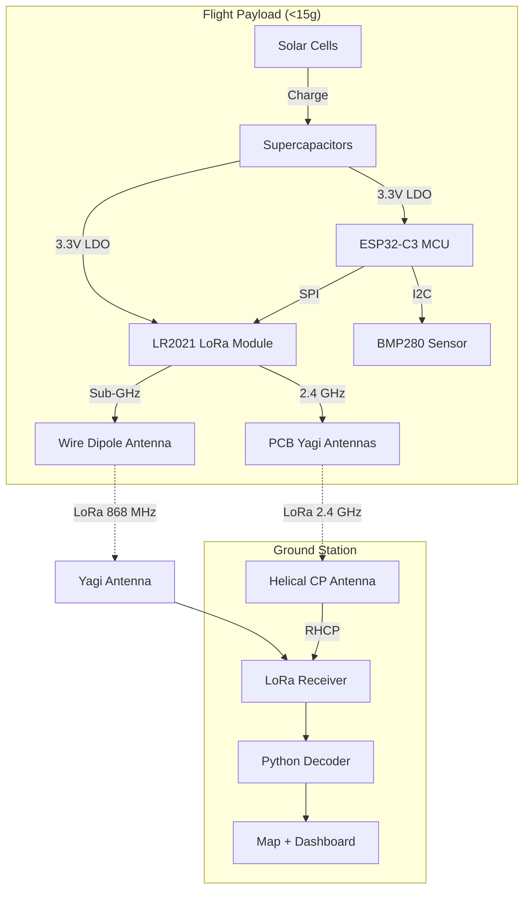
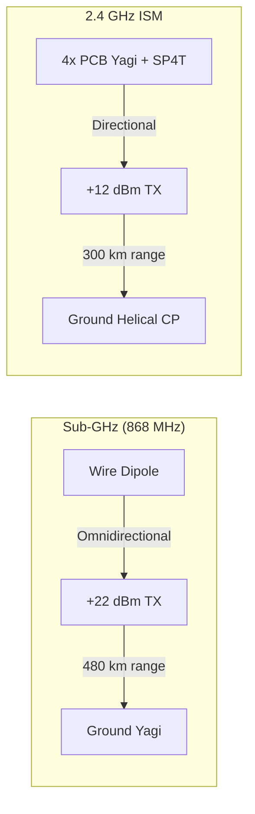
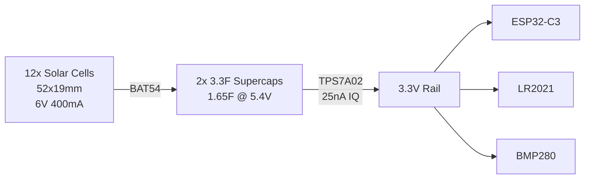

# Building an Ultra-Lightweight Pico Balloon Tracker with LoRa

> We're building a <15g solar-powered balloon tracker that transmits telemetry via LoRa from the stratosphere at 18km altitude, reaching ground stations up to 480 km away.

date: 2026-05-20

## The Challenge

Pico balloons are small helium-filled Mylar balloons that float at ~18km altitude in the stratosphere. The payload must be extremely light (<15g), survive -60°C temperatures, and operate for days or weeks on solar power alone.

Commercial solutions exist but cost $200+. We're building one from scratch for under $100.

## Our Approach



## Key Components

| Component | Why | Weight |
|-----------|-----|--------|
| **ESP32-C3** | Ultra-low power RISC-V MCU | 1.0g |
| **NiceRF LoRa2021** | Sub-GHz + 2.4 GHz, FLRC, LoRa, LR-FHSS | 1.8g |
| **BMP280** | Pressure/temperature for altitude | 0.5g |
| **Supercapacitors** | 1.65F energy buffer, works at -40°C | 3.0g |
| **Solar cells** | 12x 52x19mm cells, 2.4W peak | 6.0g |
| **PCB Yagi antennas** | 4 directional antennas, 6-9 dBi each | ~2g |

## Frequency Strategy

We use two bands with different characteristics:



- **Sub-GHz (868 MHz)**: +22 dBm, wire dipole (omnidirectional), ~480 km range. Primary long-range link.
- **2.4 GHz**: +12 dBm, PCB Yagis (directional), ~300 km range. Uses "lighthouse mode" - transmits on each of 4 antennas in sequence.

## Power Architecture



The supercaps provide **73 hours of deep sleep reserve** - enough to survive the dark part of each orbit around Earth.

## Wiring Diagram (DIY Prototype)

```
XIAO ESP32C3          NiceRF LoRa2021
┌──────────┐          ┌──────────────┐
│ 3V3      ├──────────┤ VCC (Pin 1)  │
│ GND      ├─────┬────┤ GND (Pin 2)  │
│          │     │    │              │
│ D7 GPIO7 ├─────┼────┤ MISO (Pin 3) │
│ D6 GPIO6 ├─────┼────┤ MOSI (Pin 4) │
│ D5 GPIO5 ├─────┼────┤ SCK  (Pin 5) │
│ D10      ├─────┼────┤ NSS  (Pin 6) │
│ D4 GPIO4 ├─────┼────┤ BUSY (Pin 7) │
│ D3 GPIO3 ├─────┼────┤ RST  (Pin 14)│
│ D2 GPIO2 ├─────┼────┤ DIO9 (Pin 15)│
│          │     │    │              │
│          │     │    │ Pin 9  ANT───┤─── 16.4cm wire (868 MHz)
│          │     │    │ Pin 10 2.4G──┤─── 3.1cm wire (2.4 GHz)
└──────────┘     │    └──────────────┘
                 │
                GND
```

## What's Next?

We're starting with the **DIY prototype** using parts we already have:
- 20x XIAO ESP32C3 boards
- 4x NiceRF LoRa2021 modules
- 100x 52x19mm solar cells
- 50x 78x39mm solar cells

Step 1: Wire up a XIAO + LoRa2021 on a breadboard and test SPI communication.
Step 2: First LoRa TX/RX test between two boards.
Step 3: Balloon pressure testing (we have a pump and pressure sensor).

Follow along as we build this from breadboard to stratosphere!

## Links

- [Full Component Guide](../docs/component-guide.md)
- [Plan Variants (DIY to Komfort)](../docs/plan-variants.md)
- [Antenna Strategy](../docs/antenna-strategy.md)
- [Bill of Materials](../bom/BOM.md)
