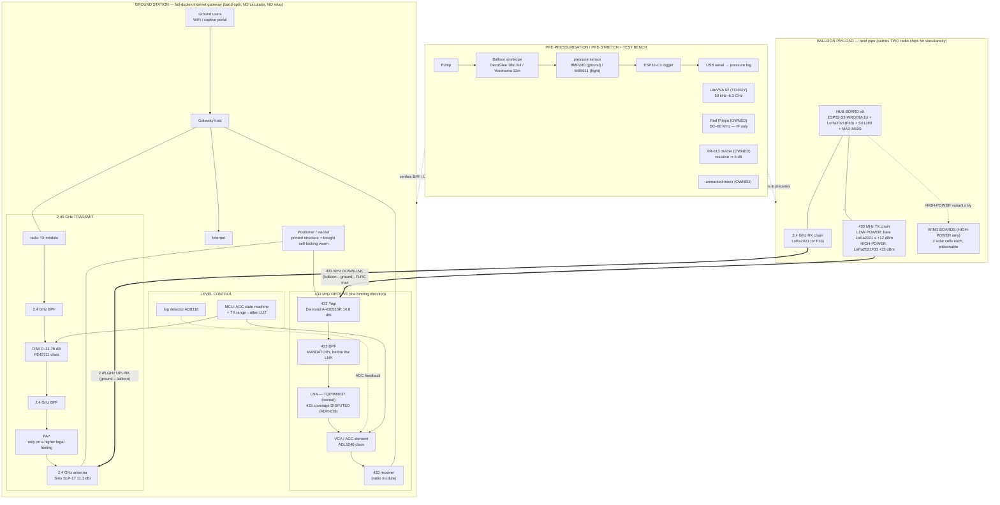

# Program gap analysis — the pico-balloon Internet gateway

**Date:** 2026-10-08
**Branch:** `docs/program-gap-analysis` (off `github/main` @ `09e1b69`)
**Author:** Hermes subagent (manager-delegated), read-only on every other branch.
**Scope:** what the complete program *is*, the status of every workstream with evidence, three
end-to-end gap analyses, the decisions the operator still has to make, and exactly what is
consolidated vs living only on a branch.

> **How to read this.** §1 is plain language and a block diagram. §2 is a status ledger. §3 is the
> deep dive on the three workstreams the operator named. **§4 is the point of the document** — the
> decisions that are still open, each with options, a recommendation and a consequence. §5 is the
> consolidation ledger.
>
> **Sourcing rule.** Every external number carries a URL. Anything I could not source is marked
> **`TODO(unverified)`** and is **never** filled with an invented part, spec or price. Where this
> document measures the repo itself (branch SHAs, counts), the measurement is stated as mine.

---

## §1 — What the complete setup comprises

The program is **three physical things bolted together by two radio links**: a balloon payload that
acts as a **bent pipe**, a **ground station** that is a full-duplex Internet gateway, and a **bench**
that prepares the balloon and verifies the RF before anything flies.

The operator has confirmed **two flight boards are being built** and the **same experiment runs on
both**:

- a **LOW-POWER LR2021 variant** (no wing/solar boards) — the *accessible, licence-exempt baseline*;
  and
- a **HIGH-POWER F33 variant** (+33 dBm, **with** wing boards) — the *range multiplier*.

The ground station must **close the worst case (low-power)** on its own and **exploit** the F33
when it is present. That single sentence is why the ground receive chain is `amplifier-led` and why
the tier ladder is sized for the low-power board (ADR-074 D3, ADR-075 D3, ADR-081).

### 1.1 The block diagram



### 1.2 One line per block

| Block | What it does |
|---|---|
| **Balloon payload (bent pipe)** | Receives 2.45 GHz from the ground and re-transmits on 433 MHz (and vice-versa), turning the balloon into a relay that the ground station treats as an Internet access loop. Two radio chips are needed because the LR2021 is half-duplex (ADR-071 D2). |
| **LOW-POWER flight board** | Bare LoRa2021, no wing boards. The licence-exempt baseline; the ground station is designed for it. |
| **HIGH-POWER flight board (F33)** | LoRa2021F33-2G4 at +33 dBm on 433 MHz, **with** wing solar boards. A ~3.55× range multiplier when flown (on the +22 dBm baseline — see §4). |
| **Hub board v9** | The flight computer + radios: ESP32-S3-WROOM-1U, LoRa2021F33-2G4, SX1280 (2.4 GHz ranging), MAX-M10S (GNSS), on a 4-layer board. |
| **Wing boards** | Skeletonised frame carrier + double-sided solar cells (ADR-065), jettisonable, HIGH-POWER variant only. |
| **Ground 433 RX chain** | Yagi → 433 BPF → owned LNA → VGA/AGC → receiver. The **binding direction**. |
| **Ground 2.45 GHz TX chain** | radio → BPF → DSA → BPF → (PA only if the licence footing allows and a PA is needed) → antenna. **Attenuated, not amplified**, on the ISM footing. |
| **Level control** | RX: digital AGC (VGA + log detector). TX: precomputed range→attenuation table. Manual/commanded is the baseline; automation is the enhancement (ADR-084). |
| **Positioner / tracker** | One az/el mount carrying both band antennas, boresighted. Printed structure, **bought** self-locking worm gearing (ADR-077). |
| **Pre-pressurisation / pre-stretch bench** | Pump + balloon + pressure sensor + ESP32-C3 logs a temperature-compensated leak rate and the pre-stretch cycle. Decides whether a balloon is flight-ready. |
| **Test / measurement chain** | LiteVNA 62 (to buy) for passives at both bands; the owned Red Pitaya is an **IF** tool only; the owned XR-613 and unmarked mixer are bench items. |

### 1.3 The two links, in one breath

- **433 MHz downlink** (balloon → ground): **FLRC at maximum throughput** (2.6 Mbps). **LoRa is
  rejected** as too slow and survives only as the licence-exempt accessible tier (ADR-073, ADR-082).
- **2.45 GHz uplink** (ground → balloon): the bands are 5.65× apart, which is *why* there is no
  circulator — duplexing is by **band separation** with two antennas (ADR-072).

---

## §2 — Status of every workstream

Status words used below: **PLANNED** (intended, nothing designed), **IN FLIGHT** (work ongoing),
**DESIGNED** (a written design + ADR exists), **BUILDABLE** (parts/prices/fab path identified),
**BLOCKED** (a named gate stops progress).

| # | Workstream | Status | Evidence |
|---:|---|---|---|
| 1 | Ground-station architecture & duplex | **DESIGNED, UNMERGED** | ADR-071…082 on `design/adr-set-groundstation` @ `c07bd868`; `docs/analysis/plan-review-consultant.md` |
| 2 | Ground 433 RX chain (BPF→LNA→VGA) | **DESIGNED, UNMERGED; one part DISPUTED** | ADR-079, ADR-084 (`design/level-control-architecture` @ `35683a54`); TQP3M9037 433 MHz coverage CONDITIONAL |
| 3 | Ground 2.45 GHz TX chain | **DESIGNED, UNMERGED; PA MISSING** | ADR-072, ADR-084; `docs/analysis/rf-shopping-list-and-duplex-architecture.md` (`design/rf-shopping-list` @ `eea1cbc`) |
| 4 | Ground-station BOM / shopping list | **BUILDABLE (partly), UNMERGED** | `docs/BASE-STATION-BOARD-CHECKLIST.md` + `docs/analysis/ground-station-bom-candidates.md` (`design/ground-station-bom` @ `283cad72`) |
| 5 | Level control (AGC + TX LUT) | **DESIGNED, UNMERGED** | ADR-084 on `design/level-control-architecture` @ `35683a54`; `docs/analysis/ground-station-level-control-design.md` |
| 6 | Positioner / tracker mechanics | **DESIGNED, UNMERGED** | ADR-076/077/078 on `design/adr-set-groundstation`; `docs/analysis/positioner-lowcost-3dprinted.md` (`design/positioner-lowcost` @ `b74bf5f6`) |
| 7 | Antenna right-sizing / tier ladder | **DESIGNED, UNMERGED** | ADR-078, ADR-081, ADR-082; `design/gain-per-dollar` @ `f0f1e08a`, `design/gain-per-dollar-cliff` @ `dd4104ad`, `design/tier0-accessible` @ `9fb023e6` |
| 8 | 2.4 GHz dish / reflector | **DESIGNED, UNMERGED; purchase deferred** | ADR-083 on `design/rf-gaps-harmonics-diy` @ `3dbcdb8c` |
| 9 | Flight board v9 (hub) | **DESIGNED; fab GATED** | `tracker/hardware/hub_board_v9.kicad_pcb`; ADR-029/034/037/040/041 (main); ADR-063/065 (main) |
| 10 | Wing boards | **DESIGNED; 3D models UNMERGED** | ADR-046/048/049/065; `feat/3d-models-wing`, `feat/3d-models-hub`, `feat/board-view-renderer` (unmerged) |
| 11 | Pre-pressurisation / pre-stretch **board** | **PLANNED — NOT DESIGNED** | Protocol + firmware exist on main (`docs/PRE-STRETCHING-PROTOCOL.md`, `docs/PRESSURE-TEST-PLAN.md`, `tools/balloon_pressure_test/`); **no board design anywhere**. Kanban card `t_c561ea2d` could **not** be located in any readable kanban store — see §3a. |
| 12 | Regulatory / legal basis | **RESOLVED for both bands; cross-border OPEN** | `docs/REGULATORY-AMATEUR-LICENCE.md` (main) |
| 13 | Test / measurement chain | **PLANNED** | No RF bench gear; LiteVNA 62 is a TO-BUY row; Red Pitaya is IF-only (ADR-080) |
| 14 | Consolidation of the design program | **IN FLIGHT (concurrent task)** | ~16 unmerged `design/*` branches, §5 |

### 2.1 Measured repo truth (this session)

- **~16 ground-station `design/*` branches are UNMERGED** (my count: 16 branches, **62 commits**
  ahead of `github/main` in total, **136 changed files** measured as the per-branch sum of
  `git diff --name-only main..<branch>`). The task brief framed this as *~17 branches / ~100 commits
  / ~180 files*; my measured numbers differ slightly and I report **mine** — 16 branches, 62
  commits, 136 file-touches. Two further `design/*` branches (`design/433-lna-and-licence`,
  `design/ground-station-shared-dish-lowpower`) **are already merged**.
- **ADR-file count:** `github/main` has **78** `.md` files under `docs/adr/`; `design/adr-set-groundstation`
  has **90** (`git ls-tree -r --name-only <ref> -- docs/adr/ | grep -c '\.md$'`). The ADR *index*
  on main reports **76 distinct numbers** and the adr-set branch adds **071…084**.
- **The design program is essentially NOT consolidated.** All of the ground-station ADRs live only
  on branches; main carries the flight-board ADR line (up to 065) and nothing of the ground station.
- **The main/ngit lag** is real and is being fixed by the concurrent task: this session measured
  `github/main` = `09e1b69` while `ngit/main` = `da53dcc` — **ngit is 2 commits behind**.
- **All `adr/*`, all `analysis/*`, and all but three `feat/*` branches are MERGED** into `github/main`
  (`git merge-base --is-ancestor`). The unmerged non-design refs are `feat/3d-models-hub`,
  `feat/3d-models-wing` (both 1 ahead, 25 behind) and `feat/board-view-renderer` (2 ahead, 2 behind).

---

## §3 — Gap analysis for the three named workstreams

### 3a. Base-station balloon PRE-PRESSURISATION / PRE-STRETCH board

**What this workstream is.** Before a pico balloon can fly it must be (i) checked for leaks and (ii)
— for the stretchable Yokohama envelope — **pre-stretched** so it does not burst at altitude. Today
this is done with an ad-hoc bench rig.

**What exists.**

- A full written protocol: `docs/PRE-STRETCHING-PROTOCOL.md` (nine-step Yokohama pre-stretch;
  circumference is the control variable, **not** pressure) and `docs/PRESSURE-TEST-PLAN.md`.
- Working firmware: `tools/balloon_pressure_test/` (ESP-IDF project, `main/main.c`) logging
  `BMP280` **or** `MS5611` over USB serial, auto-detected at boot, plus a plot/analysis script
  (`tools/balloon_pressure_test/plot_pressure.py`) that prints the temperature-compensated leak
  rate and a verdict.
- A wiring table (SDA=GPIO8, SCL=GPIO9, 3.3 V) and acceptance thresholds (<0.5 mbar/h very good;
  >5 mbar/h reject).
- The operator's equipment list (Section G of the protocol): Yokohama + 30× DecoGlee balloons, heat
  sealer, Kapton tape, pressure sensor + pump, MS300 scale (⚠ cannot weigh neodymium magnets),
  calipers, GPS, supercaps. **Needs:** helium (party for DecoGlee, He 4.6 for Yokohama), a BMP280
  breakout, non-magnetic calibrated weights, measuring tape, humidifier, freezer access.

**What is missing — this is why it is "not designed".**

1. **There is no BOARD.** The rig is an ESP32-C3 dev board plus a bare sensor breakout on a
   breadboard. A purpose-built **pre-pressurisation / pre-stretch board** does not exist anywhere in
   the repo — no schematic, no footprint, no layout, no BOM (checked across `github/main` and every
   unmerged `design/*`, `adr/*`, `analysis/*`, `feat/*` branch).
2. **No valve / pump control design.** The protocol assumes a pump and suction but there is no
   driver (relay/MOSFET), no reverse-polarity protection, no soft-start, and no defined
   fill/deflate automation.
3. **No over-pressure protection or safety interlock** — nothing in the design would stop an
   over-inflation, which is exactly the failure mode the protocol calls out (Ruthroff's JR01–JR06).
4. **No enclosure / sensor-port mechanical design** (a pressure tap that seals to the balloon neck).
5. **Sensor-class inconsistency.** The bench uses BMP280 (300–1100 mbar, ground only); the flight
   board carries **MS5611** (10–1200 mbar). A single bench design should use the **same part the
   balloon flies** so the calibration transfers.

**Gap list.**

| | Item | State |
|---|---|---|
| exists | protocol (9-step stretch + leak test) | `docs/PRE-STRETCHING-PROTOCOL.md` (main) |
| exists | logging firmware + analysis script | `tools/balloon_pressure_test/` (main) |
| exists | acceptance thresholds, wiring, equipment list | same docs |
| missing | **the board** (schematic / layout / BOM) | none anywhere — a real gap |
| missing | pump/valve driver + automation | none |
| missing | over-pressure relief / interlock | none |
| missing | enclosure + sealed pressure tap | none |
| missing | sensor-class decision (BMP280 vs MS5611) | undecided |
| unverified | kanban card `t_c561ea2d` (prio 8) | **not found** in any readable kanban store — `TODO(unverified)` |

> **On the kanban card.** The brief states card `t_c561ea2d` exists at priority 8 and is not
> designed. I could not locate that id in the on-disk kanban JSON store (8,555 task files across
> every board) nor in the readable `kanban.db` files, and the `hermes kanban` CLI refuses to open a
> board from a delegated subagent context. **I therefore report the card as `TODO(unverified)`** and
> derive the gap from the repo documents — which is unambiguous: the *board* does not exist.

### 3b. Base-station RX & TX path — full BOM + assembly plan

This **extends, and does not duplicate**, `docs/BASE-STATION-BOARD-CHECKLIST.md` on
`design/level-control-architecture` @ `35683a54` (18 rows; OWNED/TO-BUY/TODO; TO-BUY ≈ **€274.58**,
≈ **€441.57** with the LiteVNA; **4 owned** items). Prices below are that document's, which cites
vendor URLs; **I add no new part or price.**

#### The two signal chains, stated

```
RX (433 MHz, the BINDING direction):
  antenna → 433 BPF → LNA(TQP3M9037) → VGA/AGC → receiver
            └ mandatory, first ┘        └ after the LNA (Friis) ┘
  (+ optional PIN limiter as insurance; + log detector AD8318 tapping after the BPF/LNA for AGC)

TX (2.45 GHz):
  radio → 2.4 GHz BPF → DSA(0–31.75 dB) → 2.4 GHz BPF → antenna
                     └ range→attenuation LUT from balloon GNSS ┘
  (a PA/FEM is OPTIONAL and only on a higher legal footing)
```

#### Full BOM (extends the checklist)

| # | Block | Function | Part | Status | Qty | Price (EUR) + source | Interface / notes |
|---:|---|---|---|---|---:|---|---|
| 1 | RX 433 | antenna | Diamond A-430S15R, 430–440 MHz, 15-el Yagi, 14.8 dBi | **TO-BUY** | 1 | **74.50** · `funktechnik-bielefeld.de/diamond-a-430s15r-uhf-15-element-richtantenne-70cm-band` | Needs PL→SMA adapter (row 12) |
| 2 | RX 433 | **BPF before the LNA** | 433 MHz BPF, FBP-433s class | **TO-BUY** | 1 | **24.19** (alt 9.29) · `aliexpress.com` item `1005012493261239` | ADR-072 INV-3; must reject 2.45 GHz ≥ 40 dB |
| 3 | RX 433 | LNA (masthead) | **Qorvo TQP3M9037** | **OWNED** | 1 | — · `qorvo.com/products/p/TQP3M9037` (via Wayback) | Gain 20 dB, NF 0.4 dB; **433 coverage DISPUTED (ADR-079 D5)** |
| 4 | RX 433 | input protection (insurance) | PIN-diode RF limiter, SMA, 10 MHz–6 GHz | **TO-BUY** | 1 | **4.39** · `aliexpress.com` item `1005012328874838` | Insurance only; optional |
| 5 | RX 433 | level control (AGC element) | **ADL5240** digital VGA (100 MHz–4 GHz) | **TO-BUY** | 1 | **≈ 2.09** · `aliexpress.com` item `1005006722641749`; `analog.com/.../ADL5240.pdf` | After the LNA (ADR-084 D2). Alt ADL5330 |
| 6 | LEVEL | DSA (RX alt / TX path) | **pSemi PE43711**-class SMA DSA, 0–31.75 dB, 0.25 dB | **TO-BUY** | 1 | **18.89** · `aliexpress.com` item `1005012321787574`; `psemi.com/products/digital-step-attenuators/pe43711` | TX range→atten LUT element |
| 7 | LEVEL | log detector (AGC feedback) | **AD8318** (1 MHz–8 GHz, 70 dB) | **TODO(unverified)** | 1 | price not confirmed · `analog.com/.../AD8318.pdf` | Needs a 433 BPF at its input |
| 8 | LEVEL | ADC + MCU | RP2040 board or ESP32-S3 (ADC + SPI) | **TODO(unverified)** | 1 | ~4 (unverified listing) | AGC state machine + TX LUT |
| 9 | TX 2.4 | antenna | Sirio SLP-17 log-periodic, 1700–2500 MHz, 11.1 dBi | **TO-BUY** | 1 | **59.00** · `funktechnik-bielefeld.de/sirio-slp-17-1800-2500-mhz-richtantenne` | Boresighted with row 1 |
| 10 | TX 2.4 | BPF | 2.4 GHz BPF | **TO-BUY** | 1 | **17.79** (alt 23.99) · `aliexpress.com` item `1005012653486194` | Uplink spectrum clean-up |
| 11 | TX 2.4 | **PA / FEM — MISSING** | 2.4 GHz FEM w/ gain pin (SKY66112-11) or discrete PA | **TODO(unverified)** | 1 | price/topology not decided | Only on a higher legal footing (see §4) |
| 12 | interconnect | coax + connectors | Airborne 10 (LMR-400 class) 15 m + 4 N-male + PL→SMA | **TO-BUY** | 15 m/4/1 | **64.50 / 5.74 / 3.49** · `kabel-kusch.de/produkt/airborne-10/2`; AliExpress `32875381213`, `1005006143199910` | 0.76 dB (433) / 1.92 dB (2.4) per 10 m |
| 13 | bench | **VNA to verify passives at both bands** | **LiteVNA 62** (50 kHz–6.3 GHz) | **TO-BUY** | 1 | **166.99** · `aliexpress.com` item `1005003536382606` | This is what the Red Pitaya cannot do |
| 14 | power/bias | bias tee + rails | LNA/DSA/detector bias (5 V) | **TODO(unverified)** | 1 set | not priced | ADL5240 = 4.75–5.25 V @ 93 mA |
| 15 | bench (owned) | IF instrument | **Red Pitaya** STEMlab 125-14 | **OWNED** | 1 | — · `redpitaya.com/product/stemlab-125-14/` | DC–60 MHz analog — **IF only** (ADR-080) |
| 16 | bench (owned) | divider | **XR-613** resistive divider | **OWNED** | 1 | — | Resistive ⇒ ~6 dB, **no array gain** (ADR-080) |
| 17 | bench (owned) | mixer | unmarked RF/LO/IF mixer | **OWNED** | 1 | — | Model unknown — `TODO(unverified)` |
| 18 | mechanical | masthead mount / enclosure | clamps, weatherproof box, glands | **TODO(unverified)** | 1 set | not priced | Electronics box only |

**Roll-ups (verbatim from the checklist):** OWNED = 4 rows, €0 outlay. TO-BUY excluding the VNA =
8 priced rows = **€274.58**. Including the VNA = **€441.57**. Required-but-unpriced = rows 7, 8, 11,
14, 18 (**`TODO(unverified)` — real gaps, counted as €0**). Optional = RF2126 PA ≈ €7.69.

#### JLCPCB PCBA plan (control / bias / telemetry board)

The operator's stated intent: **JLCPCB PCBA for the control/bias/telemetry board**, and the **RF
path as connectorized modules**. That maps cleanly onto the BOM:

- **On the PCBA board (SMD-populated):** the level-control brain — the MCU (row 8), the detector's
  supporting passives (row 7), the VGA/DSA *silicon* if a chip form is chosen (rows 5/6), and the
  **bias/rail** network (row 14: LDOs, bias tee, decoupling). These are all low-frequency, no RF
  matching, no special stackup — ideal for a standard 2-layer PCBA order.
- **Connectorized modules (NOT on the PCBA):** LNA (row 3, owned, SMA), BPF (rows 2/10, SMA),
  DSA module (row 6, SMA), detector eval/module (row 7), limiter (row 4), and the antennas + coax
  (rows 1/9/12). Keep every RF element outside the board so it can be **measured, swapped and
  upgraded** (the operator wants the station upgradeable after build).
- **This is a real gap, not a plan on paper:** rows 7, 8, 14 are all `TODO(unverified)`. **No
  schematic, netlist or gerber for the control/bias/telemetry board exists on any branch** — the
  checklist is explicitly "a document, NOT a KiCad layout".

#### Assembly sequence (proposed — none exists in-repo)

Ordered so that **every RF purchase is gated by a measurement**, not by hope:

1. **Bench-first, buy-nothing.** With the **owned** items, do the **TQP3M9037 band-edge sweep** on
   the LiteVNA (once bought) or Red-Pitaya-plus-downconverter: S21 from 400–500 MHz. *If the lower
   edge is ≤ 0.4 GHz the record stands; if it collapses below ~0.7 GHz, reopen ADR-079.*
2. **Buy the 433 BPF + limiter** (rows 2, 4) **only after step 1**, and measure the BPF's **2.45 GHz
   rejection (≥ 40 dB)** and in-band insertion loss.
3. **Assemble the 433 RX chain as connectorized modules** on a bench: antenna → BPF → LNA →
   (limiter) → VGA → receiver. Measure NF and gain; then run the **desense test** (PER/sensitivity
   with the 2.45 GHz TX at max permitted output) — the ADR-072 acceptance criterion.
4. **Assemble the 2.45 GHz TX chain**: radio → BPF → DSA → BPF → antenna. Confirm the DSA's 0.25 dB
   LSB and ≥ 6 GHz on the part; sweep the chain.
5. **Fit the control/bias/telemetry PCBA** once rows 7/8/14 are selected: populate SMDs at JLCPCB,
   hand-solder the connectors, mate the connectorized RF modules.
6. **Level control commissioning**: start in **manual/commanded** mode (mode 1); enable TX LUT
   (mode 2) when GNSS telemetry is present; enable RX AGC (mode 3) only after bench validation, and
   verify the **latch-to-fixed-gain** bypass works.
7. **Mount on the positioner**, boresight both antennas (ADR-071 D3), then run ADR-078 D7's
   measurement campaign **before** buying the tracker/dish.

### 3c. HIGH-POWER and LOW-POWER flight boards, with and without wings

| | **LOW-POWER variant** | **HIGH-POWER variant (F33)** |
|---|---|---|
| Radio | bare NiceRF LoRa2021 | NiceRF LoRa2021F33-2G4 |
| 433 TX | ≤ +12 dBm class | **+33 dBm (2 W)** |
| Wing boards | **none** | **yes** (3 solar cells each, jettisonable) |
| Mass note | minimal | **+2.8 g module mass**, gated (ADR-074 D2 / ADR-075 D2) |
| Power | 3.3 V chain | adds the **F33 5 V PA rail** (ADR-044 / ADR-047) |
| Legal | licence-exempt | **amateur 70 cm band** (ADR-075 D4) |
| ADR refs | ADR-029, ADR-034, ADR-037, ADR-040, ADR-041, ADR-074 | ADR-029, ADR-034, ADR-044, ADR-047, ADR-074, ADR-075 |
| Role | the baseline the ground station is designed for | a **range multiplier** when flown |
| Both | ESP32-S3-WROOM-1U + SX1280 + MAX-M10S on the same hub board; **band split 433 TX / 2.4 GHz RX** (ADR-034) | same |

**Designed on `main` vs unmerged.**

- **On `main`:** the v9 hub schematic + the generated `tracker/hardware/hub_board_v9.kicad_pcb`;
  ADR-029 (v9 tri-band basis), ADR-034 (band split), ADR-037 (no FEM on v9), ADR-040 (radio-site
  optionality), ADR-041 (RF front end under the regime), ADR-044/047 (F33 5 V rail), and the wing
  interface/architecture ADRs (046, 048, 049) plus **ADR-063** (decouple board area from array
  overhang), **ADR-064** (102 mm trim, **SUPERSEDED by ADR-063**), **ADR-065** (wing skeletonised
  frame + double-sided cells, **Accepted**).
- **Unmerged:** the **3D-model** work — `feat/3d-models-hub` (19 parametric hub models),
  `feat/3d-models-wing` (the 3 wing cells now render), `feat/board-view-renderer` (board-view
  renders). These are the fix for the render-fidelity problem and are **not on main**.

**What remains (the fab-readiness gates).**

1. **ADR-063 is gated on an unimplemented `S_crack` coupon test.** ADR-063 D4 requires the operator
   to load a real cell end-supported over a growing gap and **record `S_crack` at ≈ −55 °C**; then
   `pitch ≤ S_crack`. *"Until `S_crack` is measured, no number in D4 is frozen, and no pitch may be
   laid out from this record."* (ADR-063, lines 190–195). ADR-065 repeats the same dependency for the
   rib pitch. **This benchmark has not been run** — no `S_crack` value exists in the repo.
2. **`${KIPRJMOD}` / 3D-model resolution is an open defect.** The hub board's 3D references resolve
   to a model directory that is **not installed** (the hub render needs `kicad-packages3d`, 4.77 GB,
   which "is not installed here and must not be", per `docs/3d-model-coverage-wing.md` on
   `feat/3d-models-wing`), and the library tables / schematic builder use `${KIPRJMOD}`-relative URIs
   (`tracker/hardware/schematics/flight_board/build_flight_sch.py`; `.../v_c3_rp2040/sym-lib-table`).
   The self-contained-VRML fix exists **only** on the unmerged 3D-model branches.
3. **ADR-063's placement gate has not been re-run.** Per ADR-063 D5, "the outline is set only after
   the placement is re-run — and the placement gate (ADR-030) governs"; the 103 mm placement is
   superseded and the re-placed, hash-re-frozen placement is **not yet on main**.
4. **No fab package for the post-ADR-063 board.** `hub_board_v9.kicad_pcb` is the *pre-overhang* board.
   There is no gerber set for the overhang design because its outline/pitch are gated on `S_crack`.

**Fab-readiness verdict:** **neither flight-board variant is fab-ready today.** The low-power board
is closer (no wing gate), but both sit behind (i) the `S_crack` coupon test, (ii) the ADR-030
placement re-run, and (iii) the 3D-model/render resolution. See §4 for the decisions that unblock
this.

---

## §4 — Decisions the operator must still make

> **First, what is already settled (do not re-litigate).** The ADR index on `main` plus ADR-071…084
> lock a lot: **duplex by band separation, no circulator** (ADR-072); **FLRC-max on 433, LoRa
> rejected** (ADR-073); **two flight-board variants** (ADR-074); **stow-on-wind + mechanical latch**
> (ADR-076); **print the structure, buy the gearing, self-locking worm** (ADR-077); **small dish /
> wide beam over big dish / narrow beam** (ADR-078); **XR-613 is a resistive bench tool** (ADR-080);
> **rate adaptation sized for the minimum useful rate at max range** (ADR-082); and a **printed
> tracker with metal load path**. **The unfrozen legal power basis is now RESOLVED:** the operator
> holds an amateur licence and `docs/REGULATORY-AMATEUR-LICENCE.md` establishes that the ISM PSD cap
> **does not apply** — 2 W on 433 MHz is legal (AFuV Anlage 1 entry 18: Klasse A 750 W PEP / Klasse E
> 75 W PEP), and 2.4 GHz 2400–2450 MHz is **also** licensed (entry 23: Klasse A 75 W PEP / Klasse E
> 5 W PEP). Bandwidth per rate is therefore "the maximum" (FLRC 2.6 Mbps), and the consultant's
> flat-20 dBm-vs-14.26 dBm ceiling defect (plan-review F2/F3) **dissolves** — but it has **not yet
> been written out of ADR-081/082**, which still carry the ISM-footing arithmetic. That re-baselining
> is decision 1.

Each decision below is a genuine open item found in the evidence, with the options, my
recommendation, the consequence of each option, and what it blocks.

**D1 — Re-baseline the ground-station ADR set (071…082) on the amateur footing.**
- *Options:* (a) re-open ADR-081/082 and recompute the ladder with one bandwidth per rate and no PSD
  ceiling; (b) leave the ADRs on the ISM footing and carry the amateur numbers only in this document.
- *Recommendation:* **(a).** The consultant's one most-important change was to freeze one legal
  power/PSD interpretation (plan-review §3.1); the licence has now frozen it, so the records must
  say so.
- *Consequence:* (a) the 150 km / 532 km rungs become recomputable on a single, legal baseline and
  the range multipliers are honest — *some effort*; (b) leaves a known contradiction in the records,
  which the project's own ADR-first rule calls a **defect**.
- *Blocks:* every ground-station range claim, the tier prices, and the antenna/dish sizing that
  rides on them.

**D2 — Does the owned TQP3M9037 stay on the 433 MHz receive path? (ADR-079 D5, CONDITIONAL).**
- *Options:* (a) **bench-sweep it** (400–500 MHz) and keep it if the lower edge is ≤ ~0.4 GHz;
  (b) replace it with a verified 433 MHz LNA; (c) add a separate 433 MHz gain block in front;
  (d) omit the LNA and accept the range penalty.
- *Recommendation:* **(a) — measure before buying anything else.** The part is owned; the sweep is
  the cheapest possible decider and it also produces the BPF's required verification (row 2).
- *Consequence:* (a) confirms or reopens ADR-079 in one measurement; (b)–(c) add a purchase and a
  new part risk; (d) costs real range at the far edge.
- *Blocks:* the **433 BPF + limiter purchase** and the whole 433 RX chain's noise figure and range.

**D3 — Pre-pressurisation / pre-stretch board specification (the named gap in §3a).**
- *Options:* (a) build the purpose-made board (MCU + sensor + pump/valve driver + relief + enclosure)
  and PCBA it; (b) keep the ad-hoc ESP32-C3 + breakout rig and only add a valve driver; (c) log-only
  board with no pump control (manual pumping, electronic sensing only).
- *Recommendation:* **(a), sized to the flight sensor.** The board should carry **MS5611** (the part
  the balloon flies, 10–1200 mbar) not BMP280 (ground-only, 300–1100 mbar), so calibration transfers.
- *Consequence:* (a) one small PCBA order + hand-soldered sensor port and pump driver; (b) is fastest
  but keeps the breadboard risk and the sensor-class mismatch; (c) loses the automation the operator
  has said he wants.
- *Blocks:* the flight-readiness gate (no balloon flies without a passed leak test) and the operator's
  decision to **automate**.

**D4 — Pre-stretch target and control variable (are we stretching, and by what rule?).**
- *Options:* (a) adopt the protocol verbatim (two-stage air inflation to 100–116", 105" preferred,
  hold 12–48 h, **circumference** as the control variable); (b) a fixed-pressure rule; (c) skip
  pre-stretch and fly the DecoGlee foil envelope only for the first flights.
- *Recommendation:* **(a) for Yokohama, and fly DecoGlee foil for the first shakedown flights** — the
  protocol is explicit that foil does **not** stretch and that pressure-as-control caused the JR01–JR06
  failures.
- *Consequence:* (b) repeats a documented failure mode; (c) caps the mission at 3–5 days but removes
  the whole pre-stretch risk for flight one.
- *Blocks:* envelope selection, and the leak-test acceptance table the board must serve.

**D5 — Which envelope for which flight board.**
- *Options:* (a) DecoGlee 18" foil + party He (short shakedown; ~4.8 g net lift; 30 owned);
  (b) Yokohama 32" + He 4.6 (long duration; needs pre-stretch); (c) both, sequenced.
- *Recommendation:* **(c) — DecoGlee to validate the two new flight boards, then Yokohama for the
  long-duration mission.**
- *Consequence:* (a) needs a helium purchase and is short-duration; (b) needs a helium purchase, the
  pre-stretch rig and He 4.6; (c) needs both but de-risks the boards first.
- *Blocks:* the first-flight plan and the pre-stretch board's duty cycle.

**D6 — Build the printed tracker now, or run the ADR-078 D7 measurement campaign first?**
- *Options:* (a) **build the cheap Tier-0 platform first** (hand-aimed / two omnis, ≈ €90–245) and
  measure; (b) build the full option-B tracker (≈ €735) now; (c) buy the dish/rotator first.
- *Recommendation:* **(a).** ADR-078 D7 says in terms: *"Run the measurement campaign BEFORE any
  dish/rotator purchase."* ADR-081 D4 adopts Tier 0 as the accessible floor.
- *Consequence:* (a) small spend, real numbers, and the option-B/Yagi decision becomes evidence-led;
  (b) commits ≈ €735 against unvalidated performance; (c) is explicitly the thing the consultant
  said to do last.
- *Blocks:* the tracker spend, the tier choice, and the dish question.

**D7 — Used vs new Ku dish — and whether to buy one at all.**
- *Options:* (a) new Gibertini 75 SE 0.75 m, **€94.90**; (b) **used production Ku DTH offset dish,
  ~€50 (ESTIMATE)**, larger aperture, surface verified on receipt (ADR-083 D5); (c) **no dish** —
  the 2.4 GHz dish is justified only for the low-power case (ADR-078 D5) and above ~8 dBi ground
  gain is EIRP-inert (ADR-081 D1).
- *Recommendation:* **(c) now, (b) later if — and only if — a validated budget shows a 2.4 GHz
  uplink shortfall.** When it is time, prefer **(b)** over the new dish.
- *Consequence:* (a) spends €94.90 for gain that is inert above the cap; (b) is the only
  cost-beater per the rf-gaps analysis but needs inspection; (c) keeps ~€95–360 unspent until the
  measurement says otherwise.
- *Blocks:* the positioner class. *"The 2.4 GHz dish is the sole cause of the positioner class"*
  (plan-review §1.3) — removing it drops the pointing requirement to the forgiving 433 Yagi (~4°).

**D8 — When to add a second Yagi / go to an array.**
- *Options:* (a) single Diamond A-430S15R as baseline; add an array only if a **validated** budget
  shows a specific shortfall; (b) build the 4-bay array now.
- *Recommendation:* **(a).** The array's advantage is 5.2 dB ≈ 1.82× range, but it brings a narrower
  beam, more wind moment, and it is dwarfed by the F33's contribution where the downlink limits
  (plan-review F5).
- *Consequence:* (a) defers spend and pointing difficulty; (b) risks over-building against an
  unvalidated need.
- *Blocks:* the antenna purchase list and the tracker's wind/pointing budget.

**D9 — Uplink: attenuation-only, or fit the missing 2.4 GHz PA/FEM?**
- *Options:* (a) attenuation-only (checklist row 11 stays unpopulated); (b) fit a PA/FEM now;
  (c) decide from the balloon RX sensitivity (ADR-081 D5: balloon RX −136/−137 dBm).
- *Recommendation:* **(a) with (c) as the test.** On the ISM footing the uplink needs attenuation,
  not amplification; under the amateur licence a high-power uplink is *legal* but ground gain above
  ~8 dBi is EIRP-inert (ADR-081 D1), so a PA only helps if the **balloon's** receiver is the limit.
  Confirm the balloon RX sensitivity first; add the PA only if the budget demands it.
- *Consequence:* (a)/(c) avoids buying and biasing a PA that changes nothing; (b) adds cost, heat and
  a new failure mode for no measured gain.
- *Blocks:* the TX-chain BOM freeze and the 2.4 GHz EIRP arithmetic.

**D10 — Level-control automation timing (ADR-084).**
- *Options:* (a) ship **manual/commanded** (mode 1) for flight one and add the **TX LUT (mode 2)**
  when GNSS telemetry is present, **RX AGC (mode 3)** only after bench validation; (b) automate RX and
  TX before flight one; (c) skip automation entirely.
- *Recommendation:* **(a)** — the operator's own words in ADR-084: manual/commanded gain "gets you
  most of the benefit for none of the complexity". Whether the RX detector is **shared with a TX
  power monitor** (level-control open item 10) is part of this call.
- *Consequence:* (a) needs rows 5–8 in the BOM but not before flight one; (b) delays the station on
  an unvalidated loop; (c) forfeits up to ~4× data rate at the far edge.
- *Blocks:* the BOM scope for the control/bias/telemetry PCBA and the first-flight build.

**D11 — The pre-pressurisation board's pump and safety spec (decomposes D3).**
- *Options:* (a) manual pump + electronic sensing + a relief valve; (b) electric pump with
  MOSFET/relay control and a closed loop; (c) electric pump with **no** relief and no interlock.
- *Recommendation:* **(a) or (b), never (c)** — an over-pressure event is the documented
  balloon-killer; any automated fill must have a mechanical relief plus a firmware ceiling.
- *Consequence:* (a) is simplest and safest; (b) automates but needs a fail-safe; (c) is the
  JR01–JR06 failure mode re-created.
- *Blocks:* the board's BOM and the safety-review sign-off before the first automated pre-stretch.

**D12 — Cross-border regulatory cover (REGULATORY-AMATEUR-LICENCE.md open item 1).**
- *Options:* (a) pursue written confirmation from BNetzA and expected overflight regulators that a
  German amateur licence covers an unmanned, automatically-transmitting balloon payload abroad;
  (b) restrict the mission to a radius that keeps transmissions inside Germany; (c) fly and accept the
  ambiguity.
- *Recommendation:* **(a) plus a note toward (b) for flight one** — the doc records this as
  **not settled** and it is a pre-flight item.
- *Consequence:* (a) is a paperwork/lead-time cost; (b) constrains duration but is immediately safe;
  (c) risks an unlicensed transmission over a foreign border.
- *Blocks:* any long-duration flight; the flight-one radius decision.

**D13 — Callsign interval and the specific 433 centre frequency (REGULATORY open items 2, 3).**
- *Options:* (a) hourly floor with a ≤10-minute engineering margin; more often on lossy links;
  (b) the commonly-quoted 10 minutes only; (c) no callsign in the frame.
- *Recommendation:* **(a)** — hourly is the ITU floor (ITU RR Art. 19.17), 10 minutes is practice,
  and the callsign must be recoverable ASCII in the frame. Pick the centre frequency inside
  **430.000–431.975 MHz** (the no-bandwidth-limit segment) and keep the occupied bandwidth inside it.
- *Consequence:* (c) is non-compliant; (b) is defensible but weaker than the margin; (a) costs a few
  bytes per frame.
- *Blocks:* the firmware frame format and the telemetry protocol freeze.

**D14 — Which missing BOM rows get selected before the PCBA order (rows 7, 8, 11, 14, 18).**
- *Options:* (a) select all five now so the control/bias/telemetry board can be laid out and PCBA'd;
  (b) select only 7/8/14 (the board's own parts) and defer 11/18; (c) defer all and keep hand-building.
- *Recommendation:* **(b)** — the detector (7), MCU (8) and bias/rails (14) are the board; the uplink
  PA (11) is D9 and the enclosure (18) is mechanical.
- *Consequence:* (a) front-loads cost and freezes mechanical details early; (b) gets the board made;
  (c) keeps the station in breadboard limbo.
- *Blocks:* the JLCPCB PCBA order and the shift from bench to field.
 
**D15 — The F33 flight gate (ADR-074 D2 / ADR-075 D2/D4).**
- *Options:* (a) fly the F33 board only once the amateur-band basis + the +2.8 g module mass + the
  5 V rail are all signed off; (b) fly it as-is; (c) fly the low-power board only and shelve the F33.
- *Recommendation:* **(a)** — the record deliberately **gates** the F33; the licence now clears the
  band, leaving the mass and rail gates to close.
- *Consequence:* (a) clean, legal, auditable first high-power flight; (b) risks an illegal/unbalanced
  flight; (c) leaves the cheapest dB in the system unflown.
- *Blocks:* the high-power flight, and the wing-board fab (wings only exist on this variant).

---

## §5 — Consolidation status, and what is still unpublished

**What is safe on `main` (this is what an outsider cloning the repo sees):** the flight-board program
— the v9 hub schematic and `tracker/hardware/hub_board_v9.kicad_pcb`, ADR-001…065, the pressure /
pre-stretch protocol and firmware, the amateur-licence regulatory analysis, and the mass/array/wing
analyses. **None of the ground-station program is on `main`.**

**What lives only on a branch (unpublished):** the entire ground-station design set. Measured
`github/main` = `09e1b69`; every branch below is not an ancestor of it.

| Branch | Tip | Ahead | Files changed | What it holds |
|---|---|---:|---:|---|
| `design/adr-set-groundstation` | `c07bd868` | 2 | 18 | **ADR-071…082 (the canonical renumbered set)** + `docs/analysis/plan-review-consultant.md` |
| `design/level-control-architecture` | `35683a54` | 3 | 13 | ADR-084, level-control design, **the 18-row BOM checklist** |
| `design/rf-shopping-list` | `eea1cbc0` | 2 | 6 | ADR-070 (pre-renumber), RF shopping list + duplex architecture |
| `design/rf-gaps-harmonics-diy` | `3dbcdb8c` | 4 | 10 | **ADR-083** (2.4 GHz dish), harmonics + DIY-dish analysis |
| `design/gain-per-dollar` | `f0f1e08a` | 5 | 9 | ADR-068 (pre-renumber), €/dB metric |
| `design/gain-per-dollar-cliff` | `dd4104ad` | 7 | 10 | ADR-068 (pre-renumber), antenna-class cliff |
| `design/tier0-accessible` | `9fb023e6` | 4 | 8 | ADR-069 (pre-renumber), Tier-0 accessible floor |
| `design/amplifier-substitution` | `9a33f987` | 3 | 9 | ADR-068 (pre-renumber), amp-vs-antenna |
| `design/amplifier-hypothesis-check` | `148578c3` | 5 | 8 | ADR-070 (pre-renumber), amplifier-hypothesis check |
| `design/ground-station-bom` | `283cad72` | 7 | 3 | BOM candidate analysis |
| `design/ground-station-lowpower-link` | `4b90be94` | 4 | 8 | ADR-066 (pre-renumber), low-power link + shared dish |
| `design/ground-station-flrc-max` | `4ecbf5ca` | 7 | 10 | ADR-066/067 (pre-renumber), FLRC-max throughput |
| `design/positioner-lowcost` | `b74bf5f6` | 3 | 9 | ADR-067 (pre-renumber), printed positioner |
| `design/dualband-single-dish` | `1564c211` | 4 | 4 | single-dish dual-band study |
| `design/ground-station-dish` | `64c82b17` | 1 | 10 | early dish study |
| `design/ground-station-rf` | `3040f637` | 1 | 1 | early RF study |
| `feat/3d-models-hub` | (unmerged) | 1 | — | 19 parametric hub 3D models (25 behind main) |
| `feat/3d-models-wing` | (unmerged) | 1 | — | wing 3D models — the 3 cells render (25 behind) |
| `feat/board-view-renderer` | (unmerged) | 2 | — | board-view renderer + committed VRML models |

**Measured totals:** **16 unmerged `design/*` branches**, **62 commits** ahead of `main`, **136**
file-touches (per-branch `git diff --name-only` sum). *(The brief's framing was ~17/≈100/≈180; my
measured numbers are these and I report mine.)*

### 5.1 The ADR-number collision a consolidator must resolve

The individual `design/*` branches carry **pre-renumber** ADR numbers that **collide**, because they
were written concurrently before `design/adr-set-groundstation` reconciled them:

| number | claimed by |
|---|---|
| 066 | `ground-station-flrc-max`, `ground-station-lowpower-link` (same filename) |
| 067 | `ground-station-flrc-max`, `positioner-lowcost` |
| **068** | `amplifier-substitution`, `gain-per-dollar`, `gain-per-dollar-cliff` **(three files)** |
| 070 | `amplifier-hypothesis-check`, `rf-shopping-list` |
| 071–082 | `adr-set-groundstation` (**the reconciled set — this is the one to keep**) |
| 083 | `rf-gaps-harmonics-diy` |
| 084 | `level-control-architecture` |

**Consequence for consolidation:** merging the per-branch numbers as-is would create duplicate ADR
numbers and trip `tests/test_adr_numbering.py`. The `adr-set-groundstation` branch is the
**canonical 071…082** set; the consolidator should keep **its** numbers and treat the per-branch
066–070 files as superseded by their 071–082 equivalents, then land 083 and 084 after.

### 5.2 The main/ngit lag

`github/main` = `09e1b69`; `ngit/main` = `da53dcc` (**2 commits behind**). The concurrent task is
fixing this; this document does **not** touch `main`, `github/main`, or `ngit/main`.

### 5.3 This document

`docs/analysis/PROGRAM-GAP-ANALYSIS.md` on `docs/program-gap-analysis`, pushed to **github first,
then ngit separately** (never `--atomic`). SHAs are recorded in `REPORT.md` (gitignored,
force-added on this branch only).

---

## Appendix — provenance and reproduction

- Branch truth: `git rev-parse github/main`; `git merge-base --is-ancestor <b> github/main`;
  `git rev-list --count github/main..<b>`; `git diff --name-only github/main..<b>`.
- ADR counts: `git ls-tree -r --name-only <ref> -- docs/adr/ | grep -c '\.md$'`.
- Ground-station designs read with `git show <branch>:<path>` — **read, never merged**.
- Consultant verdict (plan-review, model `gpt-6-astra`, verbatim `independent VERDICT: QUALIFY`)
  is reproduced in `docs/analysis/plan-review-consultant.md` on `design/adr-set-groundstation`.
- **Unverified items carried forward:** kanban card `t_c561ea2d`; the `S_crack` value; the
  TQP3M9037 433 MHz band edge; the LR2021 max input level and 433 FLRC sensitivity rows; AliExpress
  "from" prices; the unmarked mixer's model; the F33 mass gate's final number; cross-border CEPT
  cover; the used-Ku-dish ~€50 price (marked ESTIMATE at source).
