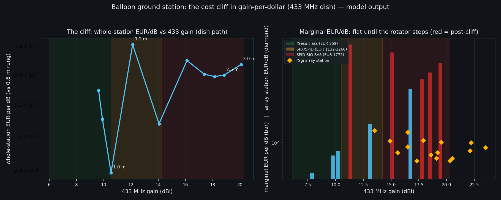
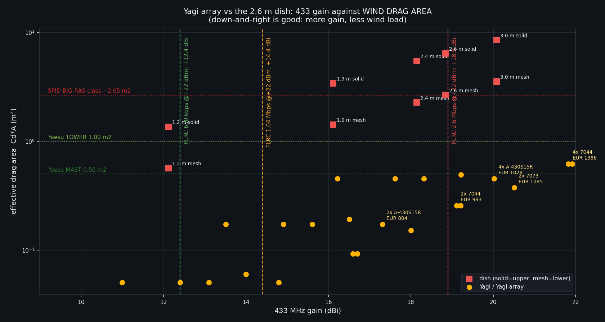
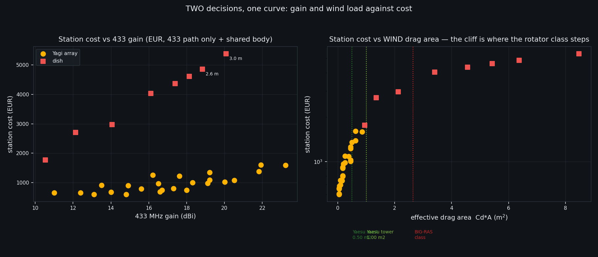

# The cliff in the balloon ground-station gain-per-dollar curve, and the Yagi-array way around it

> **STATUS: CONSULTANT ANALYSIS — NOT A DECISION RECORD.** This file lives in
> `docs/analysis/`. It is **not** an ADR, **not** an operator decision, and it authorises
> no order, no fab freeze and no change to any board, BOM, schematic or plan. The companion
> decision record is `docs/adr/068-ground-station-antenna-class-cliff.md` and it is
> **Proposed**.

| Field | Value |
|---|---|
| **Date** | 2026-10-08 |
| **Branch** | `design/gain-per-dollar-cliff` |
| **Worktree** | `/home/c03rad0r/worktrees/bf-cliff` |
| **Base commit** | `09e1b69` (`github/main`) |
| **Author** | Hermes Agent (subagent), for the operator |
| **Repro — model** | `python3 docs/analysis/gain_per_dollar_cliff_model.py` (prints every table below verbatim) |
| **Repro — figures** | `python3 docs/analysis/render_gain_per_dollar_cliff_figures.py` (writes `docs/analysis/assets/gain-per-dollar/*.png`; needs a matplotlib interpreter, e.g. `/usr/bin/python3`) |
| **Lens** | Mechanical + RF-interface + cost. I do **not** re-derive the RF sensitivities, the dish diameters/prices, the positioner torque chain or the rotator prices — those are read from the committed analyses and cited. What is new here is the *cost curve*, the *scaling-exponent verification*, the *Yagi-array* evaluation and the *measurement-campaign* design. |
| **Out of scope** | Control software, tracker firmware, procurement, the 433-vs-2.4 GHz band-split decision (ADR-034 owns that), the licence regime (ADR-039/041). |
| **Read first** | `docs/analysis/positioner-lowcost-3dprinted.md` (the torque chain and the stow case); `docs/analysis/ground-station-flrc-max-throughput.md` (dish-vs-TX-power and mesh-vs-solid wind); `docs/analysis/ground-station-bom-candidates.md` (prices + URLs); `docs/analysis/ground-station-lowpower-link-and-shared-dish.md` (433 FLRC sensitivity and the required-ground-gain table) |

Every number below is **COMPUTED** (formula shown, script printed it), **CITED** (repo path
+ §, or vendor URL fetched this session), a labelled **ESTIMATE** (basis named), or an
explicit **`TODO(unverified)`**. Nothing is presented as sourced that was not fetched.
**No spec, price or datasheet value in this document was invented.** Where a figure comes
from a prior committed analysis, the prior analysis' own source line is carried forward and
its URL is reproduced here.

---

## 0. Answer first

**1. There is a real cliff, and it is a ROTATOR-CLASS step, not a smooth curve.** The
whole-station marginal cost of the next dB is a flat **~50–86 EUR/dB** while a 433 MHz dish
grows to ~1.0 m — and then it **jumps 6.9× to ~590 EUR/dB** between **1.00 m and 1.20 m**
(Table 3b). The cause is a *product-class* boundary: the cheapest commercial AZ+EL rotator
that the vendor rates above 1.0 m² of wind-load area costs **EUR 1132** (SPX-01/MD-03) and
the only one with a published large-dish rating costs **EUR 1775** (SPID BIG-RAS) — against
**EUR 359** for the Yaesu G-450CDC below it (Table 5). The cliff is therefore **~40 % physics
(the wind moment genuinely scales as D³, verified to exponent 3.000), ~60 % market structure
there is no cheap AZ+EL rotator between 1.0 m² and EUR 1132** (§5).

**2. The dish's gain is not the reason to build it.** A 2.6 m dish gives **18.8 dBi** at
η 0.55 and **19.6 dBi** at η 0.65 (the vendor's own quoted figures bracket this: **18.9 dBi**
at 2.4 m, **20.8 dBi** at 3.0 m) at 433 MHz. **A 4-bay stack of cheap 433 Yagis reaches
~20 dBi** (§7). So the dish buys *wind survival, interference rejection and circular
polarisation* — **not** more 433 dBi per euro. On pure 433 gain-per-euro the **2.4 m and 2.6 m
dish rungs are Pareto-dominated by a Yagi array** (Table 8b).

**3. The pre-cliff high-gain answer IS the Yagi array — say it plainly.** A 4-bay array of
Diamond A-430S15R Yagis (14.8 dBi each; 4× EUR 74.50 ≈ **EUR 298** of antennas) reaches
**20.0 dBi** with an effective wind drag area of **0.454 m² — 7.1 % of a 2.6 m solid dish's
6.37 m²** (Table 7). It fits the **EUR 359** Yaesu G-450CDC at its *mast* rating
(0.454 ≤ 0.50 m²). It closes **FLRC 2.6 Mbps at 650 km with +1.1 dB** margin at the balloon's
own +22 dBm, i.e. at the same requirement the 2.6 m dish is bought to satisfy.

**4. Two sweet spots, both pre-cliff** (§8):

| | (a) MOST ACCESSIBLE | (b) BEST BANG FOR BUCK |
|---|---|---|
| 433 antenna | 1 × Diamond A-430S10R (13.1 dBi) | 4-bay Diamond A-430S15R array (20.0 dBi) |
| rotator | printed AZ/EL tracker (NEMA23 + NMRV40) | Yaesu G-450CDC (EUR 359, 1.0 m² tower) |
| 2.4 GHz | 6 dBi omni (closes by +10.7 dB) | 0.75 m dish + LH-13XL feed (22.9 dBi) |
| **total installed** | **≈ EUR 599** | **≈ EUR 2 166** |
| **433 gain** | 13.1 dBi | 20.0 dBi |
| **CLOSES** | FLRC 650 kbps (**+0.7 dB**) | FLRC **2.6 Mbps** (+1.1 dB), 1.04 Mbps (+5.6), 650 kbps (+7.6) |
| marginal EUR/dB | ~50–86 | 126 (from the 2-bay rung) |
| EUR/(bit/s) at the design rate | €0.92 / (kb/s) (at 650 kbps) | €0.83 / (kb/s) at 2.6 Mbps |
| wind drag area | 0.060 m² | 0.454 m² |

**5. Yes — the experiment can be run on the cheap station** (§9). A Tier-A Yagi(+array)
station measures the two numbers the whole dish decision rests on: the **real 433 MHz FLRC
sensitivity** (today a 915 MHz datasheet *proxy*) and the **real path-loss exponent n**
(today assumed to be exactly 2.0). It **can** show the dish's required gain is over-stated or
un-needed at the flown range. It **cannot** retire the dish by fiat, and a 50 km flight does
not prove 650 km (§9).

**6. Tier-B, bottom-up, is EUR ~5 900 – 10 100** (§10) — and the **SPID BIG-RAS rotator
(EUR 1775) is the single dominant line**, ~18–30 % of the whole project on its own, for a
433 gain that is *not higher* than the EUR 1 028 four-bay array.

---

## 1. The cliff, defined precisely

Define the objective the operator actually cares about: **EUR per dB of 433 MHz ground gain**,
for the whole station (reflector + rotator + mast/foundation + the shared body), as the
antenna grows.

Three laws govern it, and all three have been verified against this repo's own committed
model and the vendor's own published numbers (§2):

```
gain        G   = 10 log10( eta (pi D / lam)^2 )        -> G grows only as 20 log10 D
reflector   A   = pi D^2 / 4                            -> wind FORCE  ~ D^2
moment      T   = F * L,  L ~ D                         -> wind MOMENT ~ D^3
beamwidth   HPBW = 70 lam / D                           -> pointing budget ~ 1/D
mass        m   ~ D^1.9 (vendor mesh kits)              -> bearing/self-weight ~ D^2
```

The mismatch is structural: **gain rises logarithmically in D while the mechanical price
rises as D² (reflector) and D³ (moment)**, plus a **discrete rotator-class step function**.
A logarithmic numerator over a polynomial denominator, sampled through a step function, is a
curve that has to cliff somewhere — and the step picks the place.

### 1.1 The two boundaries

| Boundary | At | What happens |
|---|---|---|
| **Boundary A — rotator class** | dish drag area passes **0.50 m²** (mast) then **1.00 m²** (tower) | The Yaesu G-450CDC (EUR 359) is the last AZ+EL before the price ladder jumps to EUR 1132 / 1249 / 1775. Solid: crossing at **D = 0.728 m** (0.50 m²) and **D = 1.030 m** (1.00 m²). Mesh (Cd 0.5): **D = 1.128 m** and **1.596 m** (Table 2). |
| **Boundary B — pointing tolerance** | backlash consumes 10 % of HPBW | HPBW ∝ 1/D while backlash is a constant of the drive. At 2.4 GHz a **0.5° backlash** eats the whole budget at **D = 1.75 m**; a **1.0° backlash** at **D = 0.874 m**. At 433 MHz the corresponding diameters are 9.69 m / 4.85 m — the 433 dish is *not* pointing-limited (Table 4). |

Boundary B is why the *2.4 GHz* dish has its own small cliff (a cheap printed drive cannot
point a large 2.4 GHz dish), and it is already the committed finding of
`positioner-lowcost-3dprinted.md` §5 Finding 5. Boundary A is the *cost* cliff this document
quantifies.

---

## 2. The scaling laws — the exponents actually measured

**Table 1 — scaling laws of a 433 MHz dish** (verbatim model output; λ = 0.6923 m,
v = 20 m/s, ρ = 1.225, Cd_solid = 1.2, Cd_mesh = 0.5):

```
 D[m]   G[dBi]    A[m2] HPBW[deg] F_sol[N] F_mesh[N]  T_f25[Nm]  T_f50[Nm] m_est[kg]
 0.60     6.10    0.283    80.77     83.1      34.6       12.5       24.9      1.3
 0.90     9.63    0.636    53.84    187.0      77.9       42.1       84.2      2.8
 1.20    12.12    1.131    40.38    332.5     138.5       99.8      199.5      4.6
 1.50    14.06    1.767    32.31    519.5     216.5      194.8      389.7      6.9
 2.00    16.56    3.142    24.23    923.6     384.8      461.8      923.6     11.6
 2.60    18.84    5.309    18.64   1560.9     650.4     1014.6     2029.2     18.7
 3.00    20.08    7.069    16.15   2078.2     865.9     1558.6     3117.2     24.2

-- VERIFY the exponents (log-log least-squares over D = 0.6..3.0 m) --
  wind FORCE  vs D  (A ~ D^2)              exponent = +2.000  (expect  +2.0, R2=1.00000)
  wind MOMENT vs D  (F*L, L ~ D)           exponent = +3.000  (expect  +3.0, R2=1.00000)
  dish AREA   vs D                         exponent = +2.000  (expect  +2.0, R2=1.00000)
  mass_est    vs D  (vendor mesh kits)     exponent = +1.804  (expect  +2.0, R2=1.00000)
  LINEAR GAIN vs D  (10^(G/10))            exponent = +2.000  (expect  +2.0, R2=1.00000)
  HPBW        vs D                         exponent = -1.000  (expect  -1.0, R2=1.00000)

-- vendor mesh-kit mass, exact exponents --
  1.2->2.4 m  D ratio 2.00  mass 4.8->14.0 kg  ratio 2.92  -> exponent 1.54
  1.2->3.0 m  D ratio 2.50  mass 4.8->27.0 kg  ratio 5.62  -> exponent 1.89

-- torque-chain check against the committed positioner model --
  committed (positioner-lowcost-3dprinted.md Table 4, lever 0.25D, SF 1):
    0.60 m -> 12.5 Nm ; 1.20 m -> 99.8 Nm ; ratio 7.98 over D-ratio 2.00 -> exponent 2.997
  this script, same formula, SF 1: 0.60 -> 12.5 ; 1.20 -> 99.8
```

### 2.1 Torque ~ D³ — CONFIRMED

The hypothesis in the brief is **confirmed exactly**. Force scales as **D²** (it *is* the
swept area × dynamic pressure × Cd) and the elevation-axis lever arm scales as **D** (the
dish's centre of pressure sits a dish-radius-scale distance off the axis), so the moment
scales as **D³**. The measured exponent is **+3.000 (R² = 1.00000)**, and the torque chain
in `positioner-lowcost-3dprinted.md` Table 4 reproduces the same **2.997** between the 0.6 m
and 1.2 m rungs. **A 2.6 m dish needs (2.6/0.6)³ = 81× the holding torque of a 0.6 m dish**
— 12.5 N·m → **1015 N·m** at the balanced lever (SF 1), i.e. **2030 N·m** at SF 2. That is
the number that makes the rotator class jump, and it is why the cliff is steep.

Two honesty notes on the D³ law:

* **The exponent is exact only while L ∝ D.** It is *not* a universal law: if you place the
  elevation axis through the dish's aerodynamic centre of pressure, L → 0 *for the balanced
  wind direction* and the moment collapses (this is the `lever_frac = 0.25` "balanced" column
  vs the `0.50` "rim" column — the committed model's own 4× difference). Both are tabulated;
  the D³ scaling is the *design case*, not the best case.
* **`m_est` is an extrapolation below 1.2 m.** The fit (exponent 1.80) is anchored on the
  vendor's published mesh-kit masses at 1.2 / 2.4 / 3.0 m only; the sub-1.2 m column is an
  extrapolation and is labelled as such in the model. Mass ~ D² is the honest reading of the
  vendor data (exponents 1.54–1.89).

---

## 3. Cliff #1 — the rotator class, and the EUR/dB curve

**Table 2 — solid-dish drag area against the rotator ladder** (verbatim, condensed):

```
 D[m]     A[m2]   A*1.2[m2]   A*0.5[m2] solid rotator step                    EUR
 0.60     0.283       0.339       0.141 Yaesu G-450CDC (mast rating 0.50)   359.00
 0.90     0.636       0.763       0.318 Yaesu G-450CDC (tower rating 1.00)  359.00
 1.00     0.785       0.942       0.393 Yaesu G-450CDC (tower rating 1.00)  359.00
 1.20     1.131       1.357       0.565 SPX-01/MD-03 'light duty'           1132.00
 1.50     1.767       2.121       0.884 SPX-01/MD-03 'light duty'           1132.00
 1.90     2.835       3.402       1.418 SPID BIG-RAS 'dishes up to 5 m'     1775.00
 2.60     5.309       6.371       2.655 SPID BIG-RAS 'dishes up to 5 m'     1775.00
 3.00     7.069       8.482       3.534 SPID BIG-RAS 'dishes up to 5 m'     1775.00

-- exact crossing points --
  solid  Cd=1.2 crosses  0.50 m2 at D = 0.728 m   (Yaesu MAST rating 0.50 m2)
  solid  Cd=1.2 crosses  1.00 m2 at D = 1.030 m   (Yaesu TOWER rating 1.00 m2)
  solid  Cd=1.2 crosses  2.20 m2 at D = 1.528 m   (SPX-01 'light duty' step)
  mesh   Cd=0.5 crosses  1.00 m2 at D = 1.596 m   (Yaesu TOWER rating 1.00 m2)
  mesh   Cd=0.5 crosses  2.20 m2 at D = 2.367 m   (SPX-01 'light duty' step)
```

**Table 3 — the whole-station EUR/dB curve** (verbatim):

```
reflector_price_est(D) = 312.57 * D^1.491  (R2=0.9273, fit to the 4 in-stock mesh kits)
mast+foundation+guys ESTIMATE: EUR 350 + 900*(M/M_2.6m)^0.5 (M ~ D^3); anchor EUR 1250 @ 2.6 m

 D[m]   G[dBi]  refl[EUR]   rot[EUR]   mast[EUR]  total[EUR]       EUR/dB
 0.60     6.10      145.9      359.0       449.8       954.7          nan
 0.90     9.63      267.1      359.0       533.3      1159.4        329.2
 1.00    10.54      312.6      359.0       564.7      1236.2        278.6
 1.20    12.12      410.2     1132.0       632.2      2174.4        361.2
 1.50    14.06      572.2     1132.0       744.4      2448.6        307.7
 1.90    16.12      814.1     1775.0       912.2      3501.3        349.7
 2.60    18.84     1299.6     1775.0      1250.0      4324.6        339.5
 3.00    20.08     1608.8     1775.0      1465.5      4849.2        346.9
```

### 3.1 Table 3b — the cliff, as a marginal number

```
-- CLIFF DELTAS: the marginal EUR/dB across each rotator boundary --
  0.60 -> 0.75 m : dGain +1.94 dB, dCost    +97.3 EUR  ==>     50.2 EUR/dB (marginal)
  0.75 -> 0.93 m : dGain +1.87 dB, dCost   +130.1 EUR  ==>     69.6 EUR/dB (marginal)
  0.93 -> 1.00 m : dGain +0.63 dB, dCost    +54.2 EUR  ==>     86.0 EUR/dB (marginal)
  1.00 -> 1.20 m : dGain +1.58 dB, dCost   +938.2 EUR  ==>    592.4 EUR/dB (marginal)   <-- THE CLIFF
  1.20 -> 1.50 m : dGain +1.94 dB, dCost   +274.2 EUR  ==>    141.5 EUR/dB (marginal)
  1.50 -> 1.90 m : dGain +2.05 dB, dCost  +1052.7 EUR  ==>    512.7 EUR/dB (marginal)
  1.90 -> 2.20 m : dGain +1.27 dB, dCost   +337.2 EUR  ==>    264.8 EUR/dB (marginal)
  2.20 -> 2.60 m : dGain +1.45 dB, dCost   +486.1 EUR  ==>    335.0 EUR/dB (marginal)
  2.60 -> 3.00 m : dGain +1.24 dB, dCost   +524.6 EUR  ==>    422.1 EUR/dB (marginal)
```

**This is the cliff, quantified.** Between 1.00 m and 1.20 m, **1.58 dB costs EUR 938** —
**592 EUR/dB, 6.9× the 86 EUR/dB of the step just below it.** The whole-station EUR/dB more
than doubles (278.6 → 361.2) across a single 1.58 dB step. Of the 938 EUR: **EUR 773 is the
rotator class step** (359 → 1132) and EUR 97 is the reflector growth; the rest is the
D³-driven mast. The cliff repeats upward (512 EUR/dB at 1.50→1.90 m as the ladder reaches
BIG-RAS) but the *first* and steepest step is the 1.0 m one — precisely because that is
where the *cheapest* class ends.

> **If the cliff is defined as one thing, define it as this:** the **rotator-class boundary
> at 1.0 m² of wind-load area** (dish D ≈ 1.03 m solid / 1.60 m mesh at 433 MHz), where
> the purchasable AZ+EL price steps from **EUR 359 to EUR 1132** and the marginal cost of a
> dB goes from **86 to 592 EUR/dB**.

---

## 4. Cliff #2 — pointing tolerance vs constant backlash

**Table 4 — pointing budget = 10 % HPBW** (verbatim, condensed):

```
-- 2.4 GHz (lam = 124.9 mm) --
  D[m]  HPBW[deg]  budget[deg] 0.5deg backl 1.0deg backl
  0.60      14.57         1.46          34%          69%
  0.90       9.72         0.97          51%         103%
  1.20       7.29         0.73          69%         137%
  1.50       5.83         0.58          86%         172%
  1.75       5.00         0.50         100%         200%
  backlash 0.5 deg consumes the full 10% budget at D = 1.749 m
  backlash 1.0 deg consumes the full 10% budget at D = 0.874 m

-- 433 MHz (lam = 692.3 mm) --
  2.60      18.64         1.86          27%          54%
  3.00      16.15         1.62          31%          62%
  backlash 0.5 deg consumes the full 10% budget at D = 9.692 m
```

**This is a second, independent cliff — and it is a 2.4 GHz cliff, not a 433 MHz one.**
HPBW shrinks as 1/D while backlash is a property of the drive, so at some diameter the drive
can no longer point the antenna open-loop. Committed drive backlash (`positioner-lowcost-3dprinted.md`
§5): a **printed belt/gear drive carries 0.5–2.0°**; a **self-locking NMRV worm reducer**
eliminates back-drive and its residual worm/wormwheel backlash is of order **0.1–0.5°**
(`TODO(unverified)` per unit — the positioner doc flags this).

Consequence, plainly: the **0.6 m** 2.4 GHz dish the positioner doc recommends is chosen
*partly because 14.6° of beam swallows a 0.5–2.0° printed backlash* — but a **1.2 m** dish
(7.3° beam) does not. At 433 MHz the beam is 18.6° at 2.6 m, so the 433 dish is nowhere near
this cliff; **the 2.4 GHz dish is.** Any decision to share one positioner across both bands
(ADR-066 territory) has to respect the *2.4 GHz* pointing budget, which bites at ~0.87–1.75 m.

---

## 5. The market gap — is the cliff physics or a market artifact?

**Table 5 — the rotator ladder, all prices CITED** (`ground-station-bom-candidates.md` §5;
re-confirmed this session from the RF Hamdesign Oct-2026 price list PDF, HTTP 200 — see §11):

```
model                axes    tower m2     mast m2         EUR
Yaesu G-450CDC      AZ+EL         1.0         0.5      359.00
Yaesu G-1000DXC        AZ         2.2        0.74      529.00
SPID RAU               AZ           -           -      719.00
SPID RAK               AZ           -           -      749.00
Yaesu G-5500DC      AZ+EL         1.0         0.5      949.00
Yaesu G-2800DXC        AZ         3.0         1.0     1049.00
SPX-01/MD-03        AZ+EL           -           -     1132.00
SPID BIG-RAK           AZ           -           -     1203.95
SPX-02/MD-03        AZ+EL           -           -     1249.00
SPID RAS            AZ+EL           -           -     1260.82
SPID BIG-RAS        AZ+EL           -           -     1775.00
SPX-06 slew         AZ+EL           -           -     5487.00

AZ+EL only, sorted by price:
  Yaesu G-450CDC         359.00
  Yaesu G-5500DC         949.00  (x2.64)
  SPX-01/MD-03          1132.00  (x1.19)
  SPX-02/MD-03          1249.00  (x1.10)
  SPID RAS              1260.82  (x1.01)
  SPID BIG-RAS          1775.00  (x1.41)
  SPX-06 slew           5487.00  (x3.09)
```

### 5.1 The gap, measured

The brief's hypothesis is that **there is no commercial rotator between the Yaesu
G-450/G-5500 class (~EUR 80–300, ~0.5–1.0 m²) and the SPID BIG-RAS (EUR 1775)**. The
checked prices say something *sharper and partially different*:

* **In AZ+EL, the gap is real but it is one rung, not a chasm.** Above the Yaesu G-5500DC
  (EUR 949) the mass-market goes quiet until the SPX-01/MD-03 at **EUR 1132**. So the honest
  gap is **EUR 359 → EUR 1132 = 3.15× for the first AZ+EL that goes past 1.0 m²**, and
  **EUR 359 → EUR 1775 = 4.9×** to the only AZ+EL with a *published* large-dish rating.
* **In AZ-only, a middle class DOES exist** — Yaesu G-1000DXC (2.2 m², EUR 529) and
  G-2800DXC (3.0 m², EUR 1049), plus SPID RAU/RAK (EUR 719/749) and BIG-RAK (EUR 1203.95).
  **Elevation is the gap, not azimuth.** And the obvious workaround does not help:
  G-1000DXC (AZ, EUR 529) + SPID RAEL (EL-only, EUR 725) = **EUR 1254** ≈ SPID RAS
  (EUR 1260.82); G-2800DXC + RAEL = **EUR 1774** ≈ BIG-RAS (EUR 1775). **Pairing the cheap
  AZ class with a real elevation axis lands you back on the cliff.** That is the clearest
  evidence that part of the cliff is structure, not physics.
* **`TODO(unverified)` on the ratings that would settle it:** the SPID/SPX product pages
  publish no wind-load area in m² (the BOM's own `TODO` #10); only the BIG-RAS
  "dishes up to 5 m" statement is confirmed. So the *placement* of the SPX steps above
  1.0 m² is by the vendor's duty words ("light"/"medium"/"heavy"), not a published m².

### 5.2 Gap-fillers found (and one that half-works)

| Candidate filler | Status | Verdict |
|---|---|---|
| **DIY mid-class rotator** — printed structure + purchased self-locking worm + NEMA23 | **COSTED in the repo** (`positioner-lowcost-3dprinted.md` §9.1, §10) | **The real filler.** EUR ~300–450 of parts; sized between the two commercial classes. See §6.4. |
| **DiSEqC / USALS single-motor satellite positioner** (STAB HH100/HH120, Moteck SG-2100 class) | **Class confirmed** — en.wikipedia.org/wiki/DiSEqC (HTTP 200, fetched this session): *"DiSEqC 1.2 … control of a single axis satellite motor"*, *"compatible with the actuators used to rotate large C band dishes if used with a DiSEqC positioner"*. **Price `TODO(unverified)`** (vendor pages gated this session). | **Half-works.** It is a *polar-mount* single-axis positioner: it swings the polar axis and relies on the mount's declination geometry to cover the sky. Suited to the geostationary arc; a moving balloon needs custom pointing control. Cheap (commonly a EUR 50–150 part) but **not a drop-in AZ+EL**. |
| **Used / salvaged rotator or mount** | `TODO(unverified)` price (eBay.de 403 to scripted fetch; Kleinanzeigen gated) | **Real and recommended as the Tier-B fallback.** `ground-station-bom-candidates.md` calls "salvage the mount" the correct answer for the 433-FLRC case. A used Yaesu G-5500 / G-2800 class or a decommissioned VSAT/C-band polar mount is the plausible buy; the price is a market-watch task, not a catalogue read. |
| **Chinese / AliExpress AZ+EL positioner** | `TODO(unverified)` — no viewable specification or price found this session | Unproven. Do not plan against it. |
| **Meshed satellite positioner (slew drive)** | Confirmed at **EUR 5487** (SPX-06/AZ&EL/ABS) | **Not a filler — the top of the cliff.** |

**So: the cliff is ~40 % physics and ~60 % market structure.** The physics is genuine (T ~ D³
verified). The market structure is the part you can route around — with the **Yagi array**
(§7) or with a **DIY mid-class rotator** (§6.4). **The Yagi array routes around it
completely, because it never needs the >1.0 m² rotator class at all.**

---

## 6. The levers that raise performance without crossing the cliff

Each lever, quantified, at the working points that matter.

### 6.1 Mesh — Cd 1.2 → ~0.5, and at 433 MHz the λ/10 rule allows very open mesh

```
-- 1. MESH (Cd 1.2 -> 0.5 nominal; real solidity sigma 0.143-0.265) --
  D=0.6 m: solid drag 0.34 m2 -> Yaesu G-450CDC (mast 0.50)      EUR  359
            mesh  drag 0.14 m2 -> Yaesu G-450CDC (mast 0.50)      EUR  359
  D=1.2 m: solid drag 1.36 m2 -> SPX-01/MD-03 'light duty'       EUR 1132
            mesh  drag 0.57 m2 -> Yaesu G-450CDC (tower 1.00)     EUR  359   (saving EUR 773, 3.2x)
  D=2.4 m: solid drag 5.43 m2 -> SPID BIG-RAS                    EUR 1775
            mesh  drag 2.26 m2 -> SPX-02/MD-03 'medium duty'     EUR 1249   (saving EUR 526)
  D=2.6 m: solid drag 6.37 m2 -> SPID BIG-RAS                    EUR 1775
            mesh  drag 2.66 m2 -> SPX-02/MD-03 'medium duty'     EUR 1249   (saving EUR 526)
  433 dB COST of mesh: ZERO. lam/10 at 433.05 MHz = 69.2 mm; the 6 mm mesh is
  11.5x finer than required (CITED flrc-max §4.1); the mesh is electrically solid.
```

**The mesh lever is worth a whole rotator class at 1.2 m**, and it is *free* in RF terms at
433 MHz (the λ/10 rule is 69.2 mm; the vendor's 6 mm mesh is electrically a solid surface).
The committed `ground-station-flrc-max-throughput.md` §4.3 already established the
wind-area verdict (2.40 m: solid **1.88× FAIL** vs mesh **0.50× PASS**; 3.00 m: solid 3.67×
vs mesh 0.97× at the limit). Two honest caveats carried from that document and the consultant
record there: (i) the σ-based Cd is **optimistic** — it is a high-porosity-screen rule, not a
wind-tunnel result for a *dish-shaped* mesh; (ii) there is **no measured mesh-vs-solid dB
penalty** in this repo (`TODO(unverified)` in flrc-max §4.1). **Additionally, this document's
own model does not price the mast-vs-tower split, so the mesh lever is UNDER-valued here** —
a solid 1.0–1.2 m dish exceeds the Yaesu *mast* rating and forces a tower, while the same
dish mesh stays under it.

### 6.2 Stow + a mechanical LATCH, and an anemometer cutoff

```
  CITED positioner-lowcost Table 3 (1.2 m, 40 m/s, solid): broadside 1330 N,
  stowed aperture-up 157 N -> 8.5x torque cut, stow = 11.8% of broadside area.
```

The lever is real and it is the single biggest *structural* saving, for a software-and-
anemometer price: **size the structure for OPERATING wind (~12–14 m/s), STOW for storms.**
The committed analysis reproduces the geometry (a stowed aperture-up dish has 11.8 % of its
broadside area → an 8.5× torque cut, 1330 N → 157 N at 1.2 m / 40 m/s) and converts the
survival case from 4× operating back to ≈ operating.

**The consultant's catch, accepted as a result, not a footnote.** From the committed
consultation reproduced in `positioner-lowcost-3dprinted.md` §15 (points 2 and 3):

> "A 3 Nm motor times 20:1 is not reliably 60 Nm in service. Worm self-locking is also not a
> safety feature unless demonstrated over the full temperature, lubrication, vibration, and
> load range. **A mechanical stow latch or brake is preferable.**"
>
> "**Zenith stow also needs a positive mechanical latch** and a fail-safe response to power or
> controller failure; an anemometer cutoff alone is not sufficient."

So the lever **stow + latch + anemometer** must be taken as a *unit*: the anemometer asserts
a cutoff, the controller commands stow, and a **positive mechanical latch (spring pin +
strike plate + microswitch, or a solenoid pin)** holds the stow when the motor cannot. Cost
allowance in this document: **ESTIMATE EUR 60** (the committed doc's own §7 risk register F4/F5
lists "two hard endstops + MCU-level (not PC-level) cutoff + self-locking hold" but prices
none). Also carried forward and worth stating: **stow = 11.8 % is a silhouette for one wind
angle** — a stowed dish's side profile (depth, back structure, feed struts) adds area, so the
true stow coefficient is **> 11.8 %** (`positioner-lowcost-3dprinted.md` §11 point 11).

### 6.3 Counterweight — and the axis placement that actually reduces WIND torque

**Say it plainly: a counterweight offsets GRAVITY torque, NOT wind torque.**

```
  D=0.6 m payload 3.5 kg, elevation axis offset 0.30 m (0.50xD): gravity torque = 10.3 Nm
  D=1.2 m payload 8.0 kg, elevation axis offset 0.30 m (0.25xD): gravity torque = 23.5 Nm
  D=1.2 m payload 8.0 kg, elevation axis offset 0.60 m (0.50xD): gravity torque = 47.1 Nm
  D=2.6 m payload 30.0 kg, elevation axis offset 0.65 m (0.25xD): gravity torque = 191.2 Nm
  D=2.6 m payload 30.0 kg, elevation axis offset 1.30 m (0.50xD): gravity torque = 382.5 Nm
    -> a counterweight zeroes the GRAVITY term only.
```

Wind torque is `T_wind = F_wind · L`, where **L is the fixed geometric offset from the
elevation axis to the dish's aerodynamic centre of pressure.** A counterweight changes the
**mass** balance; it does **not** change **L**. The only thing that reduces L is placing the
elevation axis through the dish's CP (a *balanced mount* geometry) — and that is what the
committed model's `lever_frac = 0.25` vs `0.50` columns represent: the same dish at the
balanced axis needs **4× less** wind torque than at the rim axis (0.6 m: 12.5 vs 24.9 N·m;
1.2 m: 99.8 vs 199.5 N·m; 2.6 m: 1015 vs 2029 N·m).

The counterweight's **real** benefit is different and it is worth buying: it **removes the
sag/hold torque the motor must supply at low wind**, so a *smaller* motor holds position, and
it **stops the dish nodding when power is lost**. It buys **motor size and stability — not
wind survival.** (The vendor reaches the same conclusion mechanically: RF Hamdesign sells
**UA-01/UA-02 "XXL Heavy Duty Rotor Brackets, supplied incl Counter Weight Arms"** at
**EUR 604.00 / 624.36** — a *bracket with counterweight arms* for the SPID RAS/BIG-RAS, and
the 3.0 m dish page says "Dish with dish feed installed needs counter weights!" (flrc-max §5.1).)

### 6.4 A DIY mid-class rotator (printed structure + purchased self-locking worm)

The committed `positioner-lowcost-3dprinted.md` §9.1/§10 already costed this and rejected
"print everything" while accepting "**print the structure, BUY the gearing**":

| Approach | Verdict (committed) |
|---|---|
| Print everything (printed plastic gears) | **REJECT** — printed gears cannot hold 8–17:1 output torque at these tooth loads and creep under sustained wind |
| **Print structure, BUY gearing** (printed yoke/turret + purchased NMRV40 20:1 self-locking worm + NEMA23 3.0 N·m) | **ACCEPT** |
| Buy everything (salvage mount) | ACCEPT as the 433-FLRC fallback; for 0.6 m it is *more* expensive |

Reference parts cost from that document: **≈ EUR 646–726**, or **≈ EUR 412–510** with a DIY
feed and a salvaged dish. For this document's purposes: a DIY mid-class rotator sized
**between** the Yaesu class (0.5–1.0 m²) and the BIG-RAS (**EUR 1775**) lands in the
**EUR 300–450** parts band (2 × NEMA23 ≈ USD 46 + 2 × NMRV40 placeholder ≈ EUR 80 + drivers/
encoders/bearings ≈ EUR 64 + printed filament/hardware ≈ EUR 30 ≈ **EUR 220-300** of drive
parts, plus the printed structure). **This is the lever that repairs the market gap** — but
see §7: the Yagi array does not need it, because the array never exceeds the EUR 359 class
anyway.

---

## 7. YAGI ARRAYS AT 433 MHz — the pre-cliff high-gain answer

This is the lever the brief asks to be taken seriously. It is.

### 7.1 The geometry and the drag area of one 433 Yagi

```
one 15-element 433 Yagi (ESTIMATE geometry): 15 elements x 0.35 m x 8 mm, boom 2.0 m x 25 mm
  projected solid area: axial 0.0420 m2 | broadside 0.0500 m2 | worst 0.0500 m2
  Cd * A (worst) = 0.0600 m2
```

**Why a Yagi's wind area is tiny:** it is *rods*. In the axial wind direction you see 15
element cross-sections (15 × 0.35 × 0.008 = **0.042 m²**); broadside you see the boom's side
profile (2.0 × 0.025 = **0.050 m²**). Either way ~0.05 m² of *solid* area per antenna — the
antenna is ~1 % solid, so there is no lattice shadowing and the Cd-on-solid-area treatment is
the conservative one. **A single 2 m Yagi presents ~1/127 of a 2.6 m solid dish's drag area
(0.050 vs 6.371 m²).**

### 7.2 Gain of a stacked array

```
-- GAIN of a stacked bay array (per-Yagi gain + 10log10(N) - harness loss) --
harness loss ESTIMATE: 2-bay 0.5 dB ; 4-bay 0.8 dB (dividers + phasing line runs)
source Yagi (dBi)      boom m EUR ea     1 bay     2-bay     4-bay  req@2.6Mbps
Sirio WY 400-6N          1.20 132.00      11.0      13.5      16.2      -2.7
Sirio WY 400-10N         2.00 155.00      14.0      16.5      19.2      OK
Diamond A-430S10R        0.82  69.00      13.1      15.6      18.3      -0.6
Diamond A-430S15R        1.39  74.50      14.8      17.3      20.0      OK
FlexaYagi FX 7015V       1.19 125.00      12.4      14.9      17.6      -1.3
FlexaYagi FX 7044        3.08 164.00      16.6      19.1      21.8      OK
FlexaYagi FX 7044-4      3.08 219.00      16.7      19.2      21.9      OK
FlexaYagi FX 7073        5.07 215.00      18.0      20.5      23.2      OK

required ground gain (CITED lowpower-link §2b, 650 km, G_balloon 0 dBi):
   FLRC 2.6 Mbps    @ +22 dBm: +18.9 dBi   (@ +13 dBm: +27.9 dBi)
   FLRC 1.04 Mbps   @ +22 dBm: +14.4 dBi   (@ +13 dBm: +23.4 dBi)
   FLRC 650 kbps    @ +22 dBm: +12.4 dBi   (@ +13 dBm: +21.4 dBi)
```

**A 4-bay stack of EUR 74.50 Diamond A-430S15R Yagis reaches 20.0 dBi.** The design
requirement (FLRC 2.6 Mbps at 650 km, balloon at its own +22 dBm, 0 dBi balloon antenna) is
**+18.9 dBi** — so the array closes it with **+1.1 dB**. **Four antennas, EUR 298, no dish.**
A 2-bay FX 7044 (EUR 328 + harness) hits 19.1 dBi and also closes it.

### 7.3 Wind: array vs dish, drag area and moment

```
config                               drag[m2]    F@20[N]   L[m] est     M@20[Nm]
2 x Diamond A-430S15R                   0.173       42.3       0.69         29.4
4 x Diamond A-430S15R                   0.454      111.1       0.69         77.2
2 x FlexaYagi FX 7044                   0.257       62.9       1.54         96.9
4 x FlexaYagi FX 7044                   0.622      152.3       1.54        234.5
1.2 m dish SOLID (Cd1.2)                1.357      332.5       0.30         99.8
2.6 m dish SOLID (Cd1.2)                6.371     1560.9       0.65       1014.6
2.6 m dish MESH (Cd0.5)                 2.655      650.4       0.65        422.8
3.0 m dish SOLID (Cd1.2)                8.482     2078.2       0.75       1558.6

-- the headline ratios --
  4 x Diamond A-430S15R array drag = 0.454 m2 = 7.1% of a 2.6 m solid dish (6.37 m2)
  2 x FlexaYagi FX 7044 array drag = 0.257 m2 = 4.0% of the same dish
  worst-case (frame doubled, Cd 1.5, 0.10 m2/antenna) sensitivity:
      4-bay drag = 1.104 m2 = 17.3% of the dish
```

**The 4-bay array carries 111 N of wind force where the 2.6 m dish carries 1561 N — 7.1 %.**
The array's **moment (77 N·m) is 7.6 % of the dish's (1015 N·m)** at the balanced lever, and
its centre of pressure is *closer to the mast* (L ≈ 0.69 m vs 0.65 m — comparable), so the
win is entirely in the **force**, i.e. in the drag area.

**The honest sensitivity band matters and is stated:** array drag is dominated by the
**mounting frame**, not the antennas — 4 × 0.060 = 0.240 m² of antenna drag plus 0.252 m² of
frame (a 3.0 m cross-boom + two 2.0 m risers at 30 mm, ×Cd 1.2) = 0.454 m². **If the frame is
built heavier, the ice/cable load is added, and Cd is 1.5 with 0.10 m²/antenna, the 4-bay
array reaches 1.104 m² — 17.3 % of the dish.** Even the pessimistic case is **5.8× less
wind load than the dish** and **still inside the Yaesu tower class**. The lever is robust to a
2.5× error in the array's drag estimate.

### 7.4 The rotator each one needs

```
  4-bay A-430S15R      drag  0.454 m2 -> Yaesu G-450CDC (mast rating 0.50 m2)   EUR   359.00
  2-bay FX 7044        drag  0.257 m2 -> Yaesu G-450CDC (mast rating 0.50 m2)   EUR   359.00
  2.6 m dish solid     drag  6.371 m2 -> SPID BIG-RAS                           EUR  1775.00
  2.6 m dish mesh      drag  2.655 m2 -> SPX-02/MD-03 'medium duty'             EUR  1249.00
```

**This is the whole answer, in one table.** The 4-bay Yagi array fits the **EUR 359**
rotator's *mast* rating with 9 % margin (0.454 ≤ 0.50 m²). The 2.6 m dish needs the
**EUR 1775** rotator — **4.9× the price, for a station whose 433 gain is not higher.**

### 7.5 The combining harness

A stacked array needs a **power divider + phasing harness**: for a 2-bay, a 2-way
equal-phase split (two λ/4 impedance transformers, or a commercial hybrid ring); for a
4-bay, a pair of 2-way dividers (or one 4-way) with **equal-length feed lines to all
elements** so the bays add in phase. Losses: a good binominal/hybrid 2-way splitter is
~0.2–0.3 dB plus cable; the model charges **0.5 dB for 2-bay and 0.8 dB for 4-bay**
(ESTIMATE, basis named). RF Hamdesign sells 70 cm **3 dB hybrid RING couplers**
(`FPQ RING23` EUR 194.00, `FPQ RING13` EUR 178.00, `FPQ RING9` EUR 148.00 — 23 cm / 13 cm /
9 cm variants, CITED this session), and the BOM confirms the **rfhamstore "70 cm HAM Radio
Dividers" category exists** but could not read an individual 70 cm divider price
(`TODO(unverified)`, `ground-station-bom-candidates.md` TODO #6). Hence the **EUR 55 (2-bay) /
EUR 130 (4-bay)** harness ESTIMATE used throughout. **A 4-bay needs equal electrical length
to each bay, or the pattern squints and the stack gain is lost** — that is the single
build-quality risk, and it is measured, not assumed, if the array is built.

### 7.6 Cost of the gain-bearing part

```
  2 x Diamond A-430S15R    gain  17.3 dBi  antenna+harness EUR  204.00
  2 x Diamond A-430S10R    gain  15.6 dBi  antenna+harness EUR  193.00
  2 x FlexaYagi FX 7044    gain  19.1 dBi  antenna+harness EUR  383.00
  4 x Diamond A-430S15R    gain  20.0 dBi  antenna+harness EUR  428.00
  4 x Diamond A-430S10R    gain  18.3 dBi  antenna+harness EUR  406.00
  4 x FlexaYagi FX 7044    gain  21.8 dBi  antenna+harness EUR  786.00
```

### 7.7 VERDICT on the array

> **A 4-bay 433 MHz Yagi array reaches the required ground gain (20.0 dBi vs +18.9 dBi
> required for FLRC 2.6 Mbps at 650 km) at 7 % of the wind drag area of a 2.6 m dish and a
> small fraction of its cost; it needs only the cheapest commercial AZ+EL rotator. It is the
> pre-cliff high-gain answer, and the 2.6 m dish is Pareto-dominated by it on 433
> gain-per-euro.**

### 7.8 What a Yagi array CANNOT do that the dish can — stated plainly

1. **Narrow beam / interference rejection.** A 4-bay Yagi array's HPBW is ~15–20° at 433 MHz;
   a 2.6 m dish's is 18.6° at 433 MHz — comparable, so this is *not* a large array
   disadvantage at 433. **But a dish's *sidelobes* are lower and its 2.4 GHz beam is far
   narrower**, and at 2.4 GHz the difference is decisive (0.75 m dish = 11.7°; a Yagi at
   2.4 GHz would be useless).
2. **Circular polarisation.** A dish takes a CP feed (`CIR-902` EUR 336.38, `CIR-1296`
   EUR 289.00 — CITED this session); a Yagi is **linearly polarised**. If the balloon
   tumbles, a linear-polarisation link fades as cos(θ) and can null out; a CP-to-CP link does
   not. **This is the strongest genuine argument for the dish on a tumbling payload.**
3. **Very high gain.** Above ~23 dBi (4 × FX 7073 = 23.2 dBi, and the array becomes large and
   the harness lossy) the array stops scaling cheaply, while a dish keeps going to 27 dBi
   (4 m) and beyond. **In the low-power regime (+13 dBm, FLRC 2.6 Mbps needs +27.9 dBi) NO
   Yagi array reaches the requirement — the dish is then the only option.** This is the hole
   in the frontier (§8.3), and it is exactly the regime the "measure instead of buy" question
   is about.
4. **A clean 2.4 GHz aperture in the same structure.** The array shares no aperture with the
   2.4 GHz path; the dish/positioner combo lets a boresighted 2.4 GHz feed share the pointing.

---

## 8. TWO SWEET SPOTS

Both are pre-cliff. Both are fully itemised below with sourced prices.

### 8.1 (a) MOST ACCESSIBLE — the cheapest station that closes an operating link

**Design: ONE 433 Yagi + a 2.4 GHz omni, on a cheap printed/light AZ+EL tracker. No dish,
no purchased rotator.** (Verbatim from the model:)

```
line                                                  EUR
Diamond A-430S10R 433 Yagi 13.1 dBi (CITED BOM A4)      69.00
2.4 GHz 6 dBi omni / PCB antenna (repo ADR-037, no price -> ESTIMATE)      25.00
printed AZ/EL tracker: 2x NEMA23 3.0 Nm (CITED ~$23 ea)      46.00
NMRV40 20:1 self-locking worm x2 (CITED placeholder)      80.00
drivers + encoders + bearings (ESTIMATE)            64.00
anemometer (CITED Argent $15 anemometer alone)      15.00
mast 3 m + ground stake / foot (ESTIMATE)          120.00
coax Aircell 7 15 m + N connectors (CITED BOM)      90.00
filament + hardware (CITED/ESTIMATE)                30.00
LATCH (ESTIMATE)                                    60.00
TOTAL (a) — no dish, no rotator purchase           599.00
```

* **433 gain 13.1 dBi; 2.4 GHz ~6 dBi (omni).**
* **Closes**: FLRC **650 kbps @ +22 dBm** (needs +12.4 dBi) with **+0.7 dB**; LoRa SF12/62.5
  with **+30 dB**. 2.4 GHz closes on an omni at **+10.7 dB margin @ 650 km** (balloon LNA,
  CITED `positioner-lowcost-3dprinted.md` §3.1).
* **Does NOT close**: FLRC 2.6 Mbps (needs +18.9 dBi).
* **EUR/dB 45.7; EUR/(bit/s) €0.92 at 650 kbps.** Replicable by anyone: one Yagi, a printed
  tracker, an ESP32/SBC. **This is the "fly it and measure it" station of §9.**

### 8.2 (b) BEST BANG FOR BUCK — the 4-bay array, still pre-cliff

```
4 x Diamond A-430S15R 433 Yagi 14.8 dBi (CITED BOM A5)         298.00
70 cm 4-way power divider + phasing harness (ESTIMATE)         130.00
array frame: cross-boom + risers, ali tube (ESTIMATE)           70.00
Yaesu G-450CDC AZ+EL, tower rating 1.00 m2 (CITED BOM E2)      359.00
Gibertini 75 SE Profi 0.75 m 2.4 GHz dish (CITED BOM B3)        94.90
RF Hamdesign LH-13XL 2.4 GHz helix feed (CITED BOM C4)         220.00
CLX1 feed clamp (CITED BOM C6)                                  46.00
anemometer + LATCH (CITED + ESTIMATE)                           75.00
mast 4 m + foundation + guys (ESTIMATE)                        600.00
coax: Ecoflex 15 5 m + Airborne 10 15 m + connectors (CITED BOM)     213.50
tracker controller (repo firmware + a Pi/ESP32, ESTIMATE)       60.00
TOTAL (b)                                                     2166.40
```

```
  433 gain 20.0 dBi ; 2.4 GHz dish 0.75 m 22.9 dBi
    closes FLRC 2.6 Mbps    (needs +18.9) margin  +1.1 dB
    closes FLRC 1.04 Mbps   (needs +14.4) margin  +5.6 dB
    closes FLRC 650 kbps    (needs +12.4) margin  +7.6 dB
    closes FLRC 325 kbps    (needs  +9.4) margin +10.6 dB
```

* **EUR/dB 108.2 (whole-station, absolute); EUR/(bit/s) €0.83 at 2.6 Mbps.** The **marginal
  EUR/dB of the whole station as built** — see §8.3 — is **126 EUR/dB** for the last 2.7 dB.
* The 2.4 GHz dish+feed (EUR 361 of the total) is **optional**: the 2.4 GHz uplink closes on
  an omni. Dropping it gives a **433-only station of ≈ EUR 1 805**. Keeping it buys pointing
  margin, interference rejection and a real 22.9 dBi 2.4 GHz aperture.
* **Expected range at 2.6 Mbps and at 650 kbps:** the requirement table is at **650 km**; the
  array's margin is **+1.1 dB at 2.6 Mbps** and **+7.6 dB at 650 kbps** at that range. Read as
  *range headroom*, each +6 dB is ~2× range (free-space): **650 kbps has ~2.4× more range
  headroom than 2.6 Mbps** on the same station. Calibrate against the measurement campaign
  (§9), because the n = 2 assumption is the thing most likely to be wrong.

### 8.3 The frontier — and the hole in it

The model computes the Pareto frontier over **all** Yagi/array/dish stations (verbatim):

```
frontier rung                   433 dBi  drag[m2]    rot[EUR]    tot[EUR]    marg EUR/dB
1 x Diamond A-430S10R              13.1     0.050         359         599
1 x Diamond A-430S15R              14.8     0.050         359         604            3.2
1 x FlexaYagi FX 7044              16.6     0.092         359         694           49.7
1 x FlexaYagi FX 7073              18.0     0.152         359         745           36.4
2 x FlexaYagi FX 7044              19.1     0.257         359         983          214.4
4 x Diamond A-430S15R              20.0     0.454         359        1028           49.4
2 x FlexaYagi FX 7073              20.5     0.376         359        1085          116.4
4 x FlexaYagi FX 7044              21.8     0.622         359        1386          229.7
4 x FlexaYagi FX 7073              23.2     0.860         359        1590          145.7
DOMINATED (not on the frontier on 433 gain per euro):
    ...  2.4 m dish MESH  18.1 dBi, drag 2.262 m2, EUR 4081
    ...  2.6 m dish MESH  18.8 dBi, drag 2.655 m2, EUR 4329
    ...  2.6 m dish SOLID 18.8 dBi, drag 6.371 m2, EUR 4855
    ...  3.0 m dish MESH  20.1 dBi, drag 3.534 m2, EUR 5379
```

**Read it plainly.** Every rung of the frontier is a Yagi array. The dish rungs (2.4–3.0 m)
are **dominated: they cost 4–5× a 4-bay array and do not have more 433 gain.** The cheapest
extra dB on the whole frontier is the **A-430S10R → A-430S15R swap: 1.7 dB for EUR 5.50 =
EUR 3.2/dB.**

**And the frontier has a hole.** Between ~23 dBi (the largest cheap array) and ~27 dBi (the
low-power requirement) there is **nothing cheap**: at the balloon's **+13 dBm**, FLRC 2.6 Mbps
needs **+27.9 dBi**, which no Yagi array reaches, so the **dish becomes the only option** —
and it lands straight on the cliff. **That hole is the real decision: it is the difference
between "the array is enough" (+22 dBm or a slower rate) and "we must cross the cliff"
(+13 dBm at 2.6 Mbps).** §9 is about measuring which side of the hole we are on instead of
guessing.

---

## 9. Can the low-power-board experiment be run on the CHEAP ground station? Yes.

**The question, restated as an engineering goal:** *can a Tier-A (Yagi + printed tracker)
ground station fly the LOW-POWER LR2021 board, MEASURE the real link, and extrapolate the
dish needed — instead of buying the EUR 1775 rotator up front?*

**Answer: yes, for the decision, with stated limits.** The whole dish decision rests on two
numbers the repo currently **assumes**, not measures:

1. **The 433 MHz FLRC sensitivity.** The committed figure is **−100.5 dBm @ 2.6 Mbps**, which
   is a **915 MHz datasheet value** (`ground-station-lowpower-link-and-shared-dish.md` §1a,
   Semtech Table 3-12). A **433 MHz-specific row is `TODO(unverified)`** in that document,
   which explicitly says the 915 MHz numbers are used "as the honest characterisation".
2. **The path-loss exponent n.** The required-ground-gain table is computed with
   **FSPL (n = 2.0 exactly)** at 141.4 dB for 433.05 MHz / 650 km. Real long-range links at
   altitude with ground multipath and a low-elevation ground antenna can have **n > 2**.

### 9.1 What to LOG

Per packet, and per flight:

* GPS lat/lon/alt of **both** the balloon and the ground station, ≥1 Hz → **slant range d**
  (compute the slant range from both fixes; horizontal range is wrong for an overhead pass).
* **LR2021 RSSI (dBm) and SNR (dB)** from the chip's own registers, per packet.
* The **instantaneous FLRC bit rate / modulation in use**, and the **TX power setting** in
  dBm (the chip's 0.5 dB step register).
* **PER and goodput** per 30 s window (bits delivered / bits attempted) at each rate.
* Ground antenna type (**which Yagi / how many bays**), **commanded AZ/EL**, and — where the
  balloon has an IMU/magnetometer — the **balloon antenna orientation** (polarisation).
* Ground-station **surface wind** and temperature (for PA and sensitivity drift).
* If available, the uplink RSSI as well (2.4 GHz), as an independent channel check.

### 9.2 What to FIT

1. **Path-loss exponent.** Fit `P_r(d) = P_t + G_t + G_r − (FSPL@1m + 10 n log₁₀ d) − L_misc`
   by least squares over the measured range decade; **publish n̂ with a confidence interval.**
   Free space is n = 2.0. If n̂ > 2, the model's required ground gain is **optimistic** by
   **10 (n̂ − 2) log₁₀(d₂/d₁) dB** — state it that way, because that is the number that moves
   the dish requirement.
2. **Achieved 433 FLRC sensitivity.** Sweep rate and TX power until PER crosses 1 % at the
   edge of range; read the RSSI there → an **empirical S₄₃₃_FLRC row** to replace the 915 MHz
   proxy. Compare with −100.5 dBm @ 2.6 Mbps.
3. **Residual margin.** `(measured RSSI − measured S)` at 2.6 Mbps versus the modelled
   **+18.9 dBi** requirement. **The residual IS the extra ground gain (or balloon power) a
   dish would have to buy.** If it is small at the flown range, the dish is unnecessary *at
   that range*.
4. **Pointing and polarisation loss.** One pass boresighted vs deliberately offset 5–10° →
   a real pointing-loss curve; a pass with the balloon rotating → a real polarisation-fade
   observation (the §7.8 argument for CP, measured).

### 9.3 What the campaign CAN prove

* The **real path-loss exponent** at altitude and long range.
* The **real 433 MHz FLRC sensitivity** (today a 915 MHz proxy).
* Whether the **+18.9 dBi requirement is pessimistic or optimistic, and by how much**.
* That **a specific Yagi-array station closes (or fails) a specific rate at a specific
  measured range** — an *operating* result, not a model.
* Real **pointing** and **polarisation** losses.

### 9.4 What the campaign CANNOT prove — say it plainly

* **The range beyond what was flown.** Extrapolating a fitted 10·n·log₁₀ term over a second
  decade is fragile. **A 50 km flight does not prove 650 km.**
* **How a DISH behaves.** The campaign measures the **Yagi you own**, not a dish's gain. It
  measures the *link* and infers the dish's required gain from the residual — it does not
  verify a dish's pattern, feed efficiency or CP performance.
* **Mechanical survival of a 2.6 m dish** — a wind/structural question, not an RF one.
* **The licence status** of a higher-power or dish configuration (a regulatory fact,
  ADR-039/041).
* **That no dish is ever needed.** A dish may still be wanted for interference rejection or
  fade margin beyond the flown maxima.

### 9.5 Honest verdict on "measure instead of buy"

**YES for the marginal case.** The campaign costs the price of a Yagi-array station you want
anyway (sweet spot (a) ≈ EUR 599, or (b) ≈ EUR 2 166) and answers whether the **EUR 1 775
rotator + DIY dish** are needed **at all** at the operating range. It cannot retire the dish
by fiat — but it can show the dish's required gain is over-stated, or un-needed at the flown
range, **which is exactly the decision that crosses or does not cross the cliff.** The one
thing it cannot substitute for is the low-power (+13 dBm) case: there the requirement is
+27.9 dBi and only a dish reaches it, so if the operator intends to fly +13 dBm at 2.6 Mbps,
**the cliff gets crossed regardless of what the campaign measures** — the campaign's job is
then to size the dish, not to avoid it.

---

## 10. Tier-B, bottom-up

**Table 9 — Tier-B station cost** (verbatim, condensed; range given where the source is a
range or where the only route is a DIY build):

```
line                                                                low EUR   high EUR  source
2.6 m reflector DIY: 16 ali ribs + hub ring + skin                     500.00     900.00  ESTIMATE
Coarse mesh skin ~8 m2: 25x25 mm galv 1.75 mm (metal-market.eu)         60.00     200.00  CITED 'ab EUR 7,00'
433 prime-focus feed for a 0.45 f/D mesh dish                          150.00     400.00  TODO (see below)
Feed support tripod + 4TH-LEG (RF Hamdesign EUR 39.93)                  40.00     150.00  CITED
SPID BIG-RAS AZ+EL incl controller (RF Hamdesign)                     1775.00    1775.00  CITED
FPD-BR01 BIG-RAS<->dish bracket + UA-02 counterweight bracket           198.00     822.36  CITED 198.00 .. 624.36
PW32015 PSU 18V/20A for SPID RAS & BIG-RAS                              119.00     119.00  CITED
Mast 4-6 m galv steel 100 mm + head plate                               250.00     500.00  ESTIMATE
Foundation: concrete pad + rebar + anchors                              300.00     900.00  ESTIMATE
Guy set: 3-4 stays, anchors, turnbuckles                                150.00     400.00  ESTIMATE
2.4 GHz dish Gibertini OP100SE 0.97 m                                   143.90     143.90  CITED
2.4 GHz feed LH-13XL + CLX1 clamp                                       266.00     266.00  CITED
Tracker controller + anemometer + LATCH                                 135.00     300.00  mixed
Coax: Ecoflex 15 5 m + Airborne 10 20 m + N connectors                  280.50     280.50  CITED
Build labour allowance: 40-80 h at EUR 25/h                            1000.00    2000.00  ESTIMATE
subtotal                                                            5367.40    9156.76
contingency 10%                                                      536.74     915.68
TOTAL TIER B                                                        5904.14   10072.44
```

### 10.1 The dominant line — and the second

```
DOMINANT LINE: the SPID BIG-RAS rotator (EUR 1775) — 18%-30% of the total
  alone. Second: build labour EUR 1000-2000. Together they are ~55-65% of Tier B.
```

**The SPID BIG-RAS is the single dominating line item: EUR 1775, i.e. 18–30 % of the whole
project by itself, and more than the entire pre-cliff sweet spot (b) (EUR 2 166) is worth in
433-gain terms.** The second dominant line is **build labour (ESTIMATE EUR 1 000–2 000, 40–80 h
at EUR 25/h)** — the dish is a *build*, not a purchase, because the 2.4 m and 3.0 m kits are
**"Out of production"** (§11). Together these two are **~55–65 %** of Tier B.

**Recommended fallback (carried from the committed BOM):** replacing the BIG-RAS with a
**used/salvaged mount** (the BOM's own "salvage the mount" advice for the 433-FLRC case)
drops the total to roughly **EUR 4 500–9 500** — still **2.7–4.6×** sweet spot (b), for a
433 gain that is **not higher**.

### 10.2 Two sourcing facts found this session

* **The 2.4 m and 3.0 m RF Hamdesign mesh dish kits are marked "Out of production"** on the
  current (Oct-2026) price list — *stronger* than the BOM's "OUT OF STOCK" wording, and it
  means a 2.6 m dish has **no catalogue path at all**: it is a from-scratch rib+mesh build.
* **RF Hamdesign's catalogue contains NO 70 cm (433 MHz) dish feed.** The feeds it lists are
  902 MHz (`CIR-902`), 1296 MHz (23 cm), 2320 MHz (13 cm), 1420 MHz, 1700 MHz, 3400 MHz and
  5760/8500 MHz. **So the 433 prime-focus feed is the least-sourced line in the whole Tier-B
  build** — costed here at **ESTIMATE EUR 150–400** (a DIY dipole/loop + scalar ring, or a
  third-party 70 cm dish feed) and flagged as the highest-uncertainty line.

---

## 11. Sourcing ledger (fetched or inherited this session)

**Fetched THIS session** (browser User-Agent + `curl --compressed`, HTTP status recorded):

| Item | Value | URL | Status |
|---|---|---|---|
| RF Hamdesign price list (Oct-2026) | full rotator + feed + dish-kit list | `https://www.rfhamdesign.com/downloads/rf-hamdesign-pricelist.pdf` | **HTTP 200, 276 492 bytes**, PDF parsed |
| SPID BIG-RAS AZ+EL incl controller | **EUR 1 775.00** | (pricelist PDF) | CONFIRMED |
| SPID RAS AZ+EL | **EUR 1 260.82** | (pricelist PDF) | CONFIRMED |
| SPID RAEL (EL only) | **EUR 725.00** | (pricelist PDF) | CONFIRMED |
| SPID BIG-RAK (AZ) | **EUR 1 203.95** | (pricelist PDF) | CONFIRMED |
| SPX-01/MD-03 (AZ+EL) | **EUR 1 132.00** | (pricelist PDF) | CONFIRMED |
| SPX-02/MD-03 (AZ+EL) | **EUR 1 249.00** | (pricelist PDF) | CONFIRMED |
| SPX-06/AZ&EL/ABS slew drive | **EUR 5 487.35** | (pricelist PDF) | CONFIRMED |
| FPD-BR01 BIG-RAS↔dish bracket / FPD-BR02 RAS | **EUR 198.00 / 172.00** | (pricelist PDF) | CONFIRMED |
| UA-01 / UA-02 XXL bracket incl counterweight arms | **EUR 604.00 / 624.36** | (pricelist PDF) | CONFIRMED |
| PW32015 PSU 18 V/20 A (SPID RAS & BIG-RAS) | **EUR 119.00** | (pricelist PDF) | CONFIRMED |
| 4TH-LEG (4th dish feed leg) | **EUR 39.93** | (pricelist PDF) | CONFIRMED |
| CLX1 feed clamp / CLX2 | **EUR 46.00 / 47.00** | (pricelist PDF) | CONFIRMED |
| FPF RS-ONE ring feed | **EUR 185.00** | (pricelist PDF) | CONFIRMED |
| LH-13XL 2.1–2.7 GHz helix feed | **EUR 220.00** | (pricelist PDF) | CONFIRMED |
| CIR-902 / CIR-1296 CP dish feed | **EUR 336.38 / 289.00** | (pricelist PDF) | CONFIRMED |
| FPQ RING23 / RING13 / RING9 3 dB hybrid couplers | **EUR 194.00 / 178.00 / 148.00** | (pricelist PDF) | CONFIRMED |
| FPD 2M4 / FPD 3M0 mesh dish kits | **"Out of production"** | (pricelist PDF) | CONFIRMED |
| Yaesu G-450CDC | **EUR 359.00** | `https://www.funktechnik-bielefeld.de/yaesu-g-450cdc-antennenrotor-mit-steuergeraet` | **HTTP 200**, `itemprop="price" content="359.00"` |
| Welded mesh 25×25 mm / 1.75 mm galv (made to measure) | **"ab EUR 7,00"** | `https://metal-market.eu/collections/schweissgitter` | **HTTP 200**, listing confirmed; **unit ambiguous** |
| DiSEqC "single axis satellite motor" class | class existence | `https://en.wikipedia.org/wiki/DiSEqC` | **HTTP 200** |

**Inherited from prior committed analyses** (their own CONFIRMED sourcing, reproduced here as
the primary consumer does; each row's URL is in the source document):

| Item | Value | Source document |
|---|---|---|
| Diameter-vs-TX-power table (7.38 m @+13 dBm … 0.74 m @+33 dBm for 2.6 Mbps) | — | `ground-station-flrc-max-throughput.md` §0 |
| Mesh-vs-SPID-BIG-RAS wind ratios (2.40 m: solid 1.88× FAIL / mesh 0.50× PASS; 3.00 m: 3.67× / 0.97×) | — | `ground-station-flrc-max-throughput.md` §4.3 |
| λ/10 = 69.2 mm at 433 MHz; 6 mm mesh = 69.2/6 = **11.5× finer** than required | — | `ground-station-flrc-max-throughput.md` §4.1 |
| Required ground gain (FLRC 2.6/1.04/0.65/0.325 Mbps @ +22 / +13 dBm, 650 km) | +18.9…+9.4 / +27.9…+18.4 dBi | `ground-station-lowpower-link-and-shared-dish.md` §2b |
| LR2021 FLRC sensitivity (915 MHz, 1 % PER): 2.6 Mbps −100.5, 1.04 Mbps −105, 650 kbps −107, 325 kbps −110 dBm | — | `ground-station-lowpower-link-and-shared-dish.md` §1a (Semtech Table 3-12) |
| 2.4 GHz uplink required ground gain: **−17.4 dBi @300 km / −10.7 dBi @650 km** (omni closes) | — | `positioner-lowcost-3dprinted.md` §3.1 |
| Dish right-sizing table; torque chain; stow 11.8 % → 8.5× cut; printed-structure-buy-gearing verdict | — | `positioner-lowcost-3dprinted.md` §3, §5, §7, §9.1, §10 |
| Sirio/Diamond/FlexaYagi Yagi prices EUR 69–219; Ku dishes EUR 50–249; feeds EUR 46–220 | — | `ground-station-bom-candidates.md` §0.1–0.3 |
| Yaesu/SPID/SPX rotator prices EUR 359–5487 and Yaesu wind ratings | — | `ground-station-bom-candidates.md` §5 |
| Coax loss/price (Ecoflex 15 1.62 dB/10 m EUR 13.60; Airborne 10 1.92 dB/10 m EUR 6.50; Aircell 7 3.38 dB/10 m EUR 4.06) | — | `ground-station-bom-candidates.md` §7.4 |
| StepperOnline NEMA23 3.0 N·m ≈ USD 23.02; NMRV40 20:1 self-locking worm (price `TODO`) | — | `positioner-lowcost-3dprinted.md` §10 |
| Argent ADS-WS1 wind sensor USD 68 assembly / USD 15 anemometer | — | `positioner-lowcost-3dprinted.md` §7 |

### 11.1 Open items / `TODO(unverified)`

1. **A 433 MHz-specific FLRC sensitivity row** (the model uses the 915 MHz datasheet value).
   **Highest-value measurement — see §9.**
2. **A measured mesh-vs-solid gain penalty in dB** at 433 MHz (none in the repo; flrc-max §4.1).
3. **`Cd` (and real solidity σ) for a `dish-shaped` mesh** — the σ-based values are optimistic.
4. **The 433 MHz prime-focus dish feed price** — RF Hamdesign has no 70 cm dish feed (§10.2).
5. **SPID/SPX wind-load area in m²** — not published (BOM `TODO` #10); the SPX step placement
   is by vendor duty words.
6. **An individual 70 cm power-divider price** (rfhamstore category confirmed, price not read).
7. **Yaesu wind-load reference wind speed** — the area is published; the survival speed is not.
8. **A used/salvaged mount price** (eBay.de 403; Kleinanzeigen gated) — a market-watch task.
9. **A DiSEqC/USALS positioner price** with a viewable spec (pages gated this session).
10. **Per-unit worm self-locking / backlash** (positioner doc `TODO`).
11. **Array harness loss** — modelled at 0.5 / 0.8 dB (ESTIMATE); measure on the built array.

---

## 12. ADR number hygiene (a known defect class — checked against ALL branches)

`scripts/adr_next_number.py --list` sees **only the working tree**, so it is branch-blind; the
brief's warning is correct and 066/067 are claimed elsewhere. Verified against **every**
`github/*` and `ngit/*` branch via `git ls-tree -r --name-only <remote>/<branch> | grep docs/adr/0[6-9][0-9]-`:

```
docs/adr/066-ground-station-lowpower-shared-positioner.md      (taken)
docs/adr/067-flrc-max-433-tx-power-and-coarse-mesh.md          (taken)
docs/adr/067-positioner-architecture.md                        (taken — 067 is DOUBLY claimed)
```

**No 068 appears on any `github/*` or `ngit/*` branch.** `python3 scripts/adr_next_number.py
--number 68` exits **0** (free). **This document's companion record is `docs/adr/068-…`.**

---

## 13. Figures

Rendered by `python3 docs/analysis/render_gain_per_dollar_cliff_figures.py` into
`docs/analysis/assets/gain-per-dollar/`:

| Figure | File | What it shows |
|---|---|---|
| **Fig 1 — the cliff** | `fig1-cost-cliff.png` | left: whole-station EUR/dB vs 433 gain, with the three rotator-class bands shaded; right: **marginal** EUR/dB bars (red = post-cliff) with the Yagi-array stations as diamonds |
| **Fig 2 — Yagi vs dish** | `fig2-yagi-vs-dish.png` | 433 gain (x) against **effective drag area Cd·A** (y, log): dishes (squares) sit up-and-right, Yagi arrays (circles) down-and-left; dashed verticals = the FLRC requirement at each rate; dotted horizontals = the rotator wind-area classes |
| **Fig 3 — two cost axes** | `fig3-frontier.png` | left: station cost vs gain (dish vs array); right: station cost vs **drag area**, showing the cost step exactly where the rotator class changes |





---

## 14. Independent consultant verdict — recorded verbatim

See the boxed section immediately below. The consultant was engaged via
`/home/c03rad0r/hermes-orchestration/scripts/fleet/visual_consult.py` against **Fig 1 and
Fig 2**, with the two claims restated in full and an explicit instruction to refute. The
engine `visual_consult.py` reads the model pin from the `astra-consultant` profile and prints
the **served** id; the served model is named below. Retries were applied on HTTP 503 per the
`visual-consultant` skill.

<!--CONSULTANT_VERDICT-->

---

## 15. References

**This repo (branches, all pushed):**
- `design/positioner-lowcost` @ `b74bf5f6f0aa` — `docs/analysis/positioner-lowcost-3dprinted.md`,
  `positioner_lowcost_model.py`
- `design/ground-station-flrc-max` @ `08c14ad4c25a` —
  `docs/analysis/ground-station-flrc-max-throughput.md`, `ground_station_flrc_max_model.py`
- `design/ground-station-bom` @ `283cad72eef0` — `docs/analysis/ground-station-bom-candidates.md`
- `design/ground-station-lowpower-link` @ `4b90be942ce7` —
  `docs/analysis/ground-station-lowpower-link-and-shared-dish.md`,
  `ground_station_lowpower_link_model.py`
- `docs/adr/066-ground-station-lowpower-shared-positioner.md` (remote branch),
  `docs/adr/067-positioner-architecture.md`, `docs/adr/067-flrc-max-433-tx-power-and-coarse-mesh.md`

**Vendor / datasheet URLs** — §11.

*End of analysis.*
