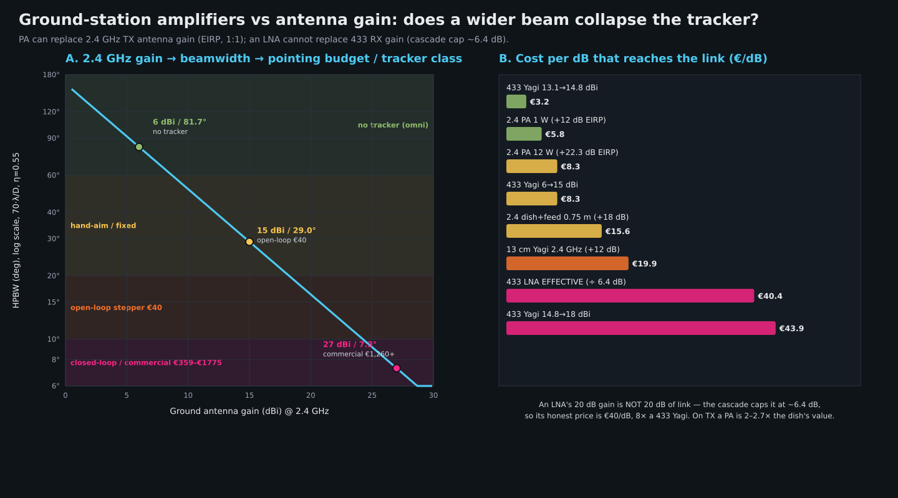

# Ground-station amplifiers vs antenna gain — is a 2.4 GHz PA / 433 LNA a cheaper way to buy link budget than antenna gain, and does it collapse the antenna-tracker requirement?

**Status:** Analysis — `docs/analysis/`, not yet an ADR (ADR draft: `docs/adr/068-…`, see §9).
**Date:** 2026-10-08
**Branch:** `design/amplifier-substitution` (off `github/main`, tip `09e1b69`).
**Repro command:** `python3 docs/analysis/ground_station_amp_vs_ant_model.py`
(prints every numeric table in this document).
**Scope:** **Cost and gain-per-euro only.** Per the operator's instruction, the
*regulatory* questions are deliberately out of scope here (handled elsewhere —
see ADR-039 / ADR-041 and `docs/LINK-BUDGET-LICENCE-EXEMPT.md`). This document does
**not** assert a legal operating point for any power; it treats the parts as
*capabilities* and prices them.

> Every external number below is one of: **SOURCED** (vendor/datasheet value with a URL
> that was fetched this session, HTTP status stated), **COMPUTED** (formula given, and
> printed by the repro command), or **ASSUMED** (a design assumption, explicitly labelled —
> never presented as sourced). Anything neither sourced nor computable is `TODO(unverified)`.
> **No part, price, noise figure, gain or P1dB below was invented.**

---

## 0. Verdict first

**1. The hypothesis is CONFIRMED on the TRANSMIT side and REFUTED on the RECEIVE side.**

* **2.4 GHz uplink (ground TX):** a ground PA substitutes for ground TX-antenna gain
  **1:1 in EIRP — this is real, and it is cheap.** The narrowest antenna in the station is
  what sets the pointing requirement, and on the uplink that antenna is the *ground
  transmitter*. Replacing a ~21 dBi dish (7.3° beam) with a **low-gain antenna + a PA**
  widens the ground TX beam to ~82°, which is the single element that demotes the shared
  positioner from a commercial az/el rotator to a hand-aim / open-loop stepper. That is
  the whole operator idea, and it is worth ≈ **€1,200–1,400 of station cost** (§5).
* **433 MHz downlink (ground RX): an LNA does NOT substitute for antenna gain 1:1.**
  An LNA's link benefit is **not its 20 dB of gain** — it is only the *noise-figure delta*
  it creates, which the cascade caps at **≈ 6.4 dB** here (§4e). Worse, dropping the
  antenna gain hands back a **noise-temperature penalty** on receive (§4a) that the LNA
  cannot recover. On receive, **antenna gain is the cheaper dB** (€3–5/dB up to ~15 dBi, §2).

**2. €/dB, stated plainly (§2):**

| Source of dB | €/dB (marginal or effective) | Verdict |
|---|---:|---|
| 433 Yagi, 13.1 → 14.8 dBi | **€3.24/dB** | cheapest dB in the whole station |
| 433 Yagi, 6 → 15 dBi (whole) | €8.3/dB | still cheap |
| 433 Yagi, 15 → 18 dBi | €43.9/dB | gain beyond ~15 dBi is expensive |
| 433 LNA (SSB ISM 433, 20 dB gain, 0.7 dB NF) | **€40.4/dB EFFECTIVE** (€257 ÷ 6.36 dB) | as raw gain it looks like €12.85/dB — that number is **wrong** for link budget |
| 2.4 GHz PA, 1 W (+12 dB EIRP) | **€5.75/dB** | cheap |
| 2.4 GHz PA, 12 W (+22.3 dB EIRP) | €8.30/dB | cheap (DC energy not included) |
| 2.4 GHz antenna: 0.75 m Ku dish + 2.4 GHz feed | €15.6/dB | 2.7× the PA |
| 2.4 GHz antenna: 1.0 m Ku dish + feed | €15.7/dB | 2.7× the PA |

**3. The tracker collapse is real, but it is caused by the *antenna change*, not by the
amplifier.** An amplifier does not widen a beam; *dropping antenna gain* widens the beam,
and the amplifier merely pays back the lost gain. The saving is concentrated in the
**tracker + dish** line (€1,260 → €40, §3), not in the amplifier.

**4. Where it BREAKS DOWN — the exact point (§4, §5):**

* **Receive:** the LNA's ceiling. Beyond ≈ 6.4 dB of required receive improvement, **no LNA
  can help** — the rest must come from antenna gain or balloon TX power. (This is the hard wall.)
* **Noise temperature:** trading 21 dBi → 6 dBi hands back **4.63 dB @2.4 GHz / 3.17 dB @433** (same LNA).
* **Balloon receiver overload:** a +40.8 dBm ground PA + 27 dBi dish (EIRP +67.8 dBm)
  **blocks the balloon RX within ~772 m** (demod saturation assumed −20 dBm); the LR2021's
  absolute-max RF input is **+10 dBm** (datasheet Table 3-1) so **do not put a big dish and a
  big PA on the same uplink.** With a modest 7 dBi TX antenna the 12 W PA blocks within ~69 m
  — a launch/landing keep-out the chip's own 31.5 dB power control can cover, but that erodes
  the benefit exactly when the balloon is close.
* **Self-desense:** a 12 W 2.4 GHz PA **blocks the co-located 433 LNA at any antenna
  separation below ~10 m** (§4d) — and the fix (sequencing) destroys the simultaneity that
  ADR-034 bought. The amplifier-led station is therefore viable **only at the 1 W PA class**
  (€69, 450 mA @ 5 V), or with ≥10 m antenna separation + filtering.
* **DC/heat:** the 12 W PA is ~27–33 W DC ≈ 2.3–2.8 A at 12 V — a car-battery-class load, not
  a field pack. The 1 W PA is 2.25 W DC — fine.

**5. Recommendation: the BALANCED station (Candidate C, §5)** — 13–15 dBi Yagi on 433 RX,
15 dBi Yagi + 1 W PA on 2.4 TX, light closed-loop rotator. It matches the amplifier-led
station's cost (€1,032 vs €1,041) and €/dB (€24.7/dB) but avoids the 12 W self-desense trap
and the 12 V/2.8 A load. If the balloon's 433 downlink margin is already comfortable (it is —
see the repo's own +30.3 dB figure), Candidate **B (amplifier-led, 1 W PA)** is equally good
and drops the rotator to a €40 open-loop stepper. **Candidate A (antenna-led) is ~2× the cost
for the same link** because it buys the narrow beam and must then buy the tracker to hold it.

---

## 1. Inputs and their sources

### 1.1 The two link directions (from ADR-034 / ADR-041 — quoted, not re-derived)

| Direction | Band | Ground role | Substitution under test |
|---|---|---|---|
| Uplink | **2.4 GHz** | ground **transmits** | ground **PA** substitutes for ground TX-antenna gain (EIRP, 1:1) |
| Downlink | **433 MHz** | ground **receives** | ground **LNA** substitutes for ground RX-antenna gain (via NF) |

Source: `docs/adr/034-radio-band-split-433-tx-2g4-rx.md` D1 ("TX = 433 MHz … RX = 2.4 GHz"),
and `docs/LINK-BUDGET-LICENCE-EXEMPT.md` §1/§2 (which direction is transmit and which is
receive). Design slant range **300 km** (`docs/link-budget.md`); the repo's 650 km extreme
(`docs/adr/067-…`) is used as the stress point.

### 1.2 Receiver limits — Semtech LR2021 (balloon side)

| Quantity | Value | Source |
|---|---|---|
| Absolute maximum RF input level | **+10 dBm** | LR2021/LR2022/LR2012 datasheet v2.2, **Table 3-1** (`docs/lr2021-research/semtech-official/LR2021_LR2022_LR2012_Datasheet_v2.2.pdf`, local citable copy) |
| Blocking, ±1 MHz, wanted at −92 dBm | **−32 dBm** | same datasheet, blocking table (`ZW_R1_B1`) |
| Blocking, ±5 MHz / ±10 MHz | **−25 / −20 dBm** | same datasheet (`ZW_R1_B5` / `ZW_R1_B10`) |
| Demod saturation level (wanted signal too strong) | −20 … 0 dBm, **ASSUMED** | not published; `TODO(unverified)` |
| F33-2G4 2.4 GHz RX sensitivity (LNA in circuit, DIO5 HIGH) | −136 dBm | `docs/F33-MODULE-PLAN.md` L34, from G-NiceRF datasheet v1.1 |
| Bare LR2021 sub-GHz RX sensitivity | −143 dBm (LoRa SF12/BW62.5) | `docs/inventory.md` |
| Sub-GHz **FLRC** 650 kbps sensitivity | −107 dBm | LR2021 datasheet **Table 3-12** (via `docs/adr/066-…` §1a) |

### 1.3 Ground-station antenna / tracker prices (SOURCED)

Reused from `docs/analysis/ground-station-bom-candidates.md` (branch `design/ground-station-bom`
@ `283cad72`) — which fetched each vendor page — plus this session's WiMo fetches.

**433 MHz Yagis** (vendor: Funktechnik Bielefeld, DE; page fetched & CONFIRMED by the BOM doc):

| Part | Gain | € | €/dBi | URL |
|---|---:|---:|---:|---|
| Sirio WY 400-3N | 7 dBi | 99.00 | 14.14 | https://www.funktechnik-bielefeld.de/sirio-wy-400-3n-3-element-400-470-mhz |
| Sirio WY 400-6N | 11 dBi | 132.00 | 12.00 | https://www.funktechnik-bielefeld.de/sirio-wy-400-6n-6-element-70cm-band-yagi-richtantenne-400-470-mhz |
| Sirio WY 400-10N | 14 dBi | 155.00 | 11.07 | https://www.funktechnik-bielefeld.de/sirio-wy-400-10n-10-element-richtantenne-400-470-mhz |
| Diamond A-430S10R | 13.1 dBi | 69.00 | **5.27** | https://www.funktechnik-bielefeld.de/diamond-a-430s10r-uhf-10-element-70cm-band-richtantenne |
| Diamond A-430S15R | 14.8 dBi | 74.50 | **5.03** | https://www.funktechnik-bielefeld.de/diamond-a-430s15r-uhf-15-element-richtantenne-70cm-band |
| FlexaYagi FX 7044 | 16.6 dBi | 164.00 | 9.88 | https://www.funktechnik-bielefeld.de/flexayagi-fx-7044-70cm-band-richtantenne-308cm-laenge |
| FlexaYagi FX 7073 | 18.0 dBi | 215.00 | 11.94 | https://www.funktechnik-bielefeld.de/flexayagi-fx-7073-70cm-band-richtantenne-507cm-laenge |

**2.4 GHz ground antennas (repurposed Ku dish + feed, SOURCED):**

| Part | Gain @2.4 GHz | € | URL |
|---|---:|---:|---|
| Gibertini 75 SE Profi, 0.75 m | ~24–25 dBi | 94.90 | https://www.hm-sat-shop.de/gibertini-sat-antenne-75cm-se-profi-serie-sat-spiegel-schuessel-alu-anthrazit/11701-001 |
| Gibertini OP100SE, 1.0 m (η 70 %, F/D 0.66) | ~25–27 dBi | 143.90 | https://www.hm-sat-shop.de/gibertini-sat-antenne-100cm-se-profi-serie-sat-spiegel-schuessel-alu-anthrazit/12615-001 |
| 2.4 GHz feed (RS-ONE ring, 0.9–3.4 GHz, F/D 0.45) | — | 185.00 | https://www.rfhamdesign.com/downloads/rf-hamdesign-pricelist.pdf |
| 13 cm Yagi 2304 MHz (17 el / 31 el, 100 W / 250 W) | ~15–18 dBi (family) | 239.00 | https://www.wimo.com/en/antannas-amplifiers-2300mhz-yagis |

**Trackers / positioners (SOURCED)** — the "tracker cost delta" column:

| Part | Class | € | URL |
|---|---|---:|---|
| DIY open-loop (repo design: ESP32 + 2× 28BYJ-48 steppers) | open-loop printed | ~€15–40 (parts) | `tracker/ground-station/antenna-tracker/` (in-repo) |
| Yaesu G-450CDC | light az/el (0.5 m²) | 359.00 (Funktechnik Bielefeld) / 399.00 (WiMo, with controller) | https://www.funktechnik-bielefeld.de/ (BOM doc E2) · https://www.wimo.com/en/yaesu-antenna-rotors-with-controller |
| Yaesu G-5500DC | az/el (1.0 m²) | 949.00 | BOM doc E1 (Funktechnik Bielefeld) |
| Yaesu G-1000DXC / G-2800DXC | az-only, larger | 529.00 / 1,049.00 | BOM doc E3/E4 |
| SPID SPX-01 / SPX-02 | light/medium az/el | 1,132.00 / 1,249.00 | https://www.rfhamdesign.com/downloads/rf-hamdesign-pricelist.pdf |
| SPID RAS AZ&EL | medium az/el | 1,260.82 | same price list |
| SPID BIG-RAS AZ&EL | heavy (dishes ≤5 m) | 1,775.00 | https://www.wimo.com/en/big-ras |
| SPID SPX-06 slew drive | heavy, 716 N·m | 5,487.35 | RF Hamdesign price list |

**Coax (SOURCED, BOM doc §0.6):** Ecoflex 15 €13.60/m (0.61 dB/10 m @433, **1.62 dB/10 m @2.4 GHz**);
Airborne 10 / LMR-400-class €6.50/m (0.76 dB/10 m @433, 1.92 dB/10 m @2.4 GHz).

### 1.4 Amplifier parts (SOURCED this session — vendor WiMo, DE; prices incl. VAT, DE)

| Part | Role | Key specs | € | URL |
|---|---|---|---:|---|
| DXpatrol QO100-PA-1W | 2.4 GHz PA | 2300–2500 MHz; **out +30 dBm (1 W)**; **RF gain 12 dB**; 5 V DC; 450 mA; NF 4.4 dB | **69.00** | https://www.wimo.com/en/dxpatrol-qo100-amplifier-1w |
| DXpatrol QO100-AMP12 | 2.4 GHz PA | LDMOS (NXP); **gain ~24 dB**; drive ≤ 70 mW; **out 12 W @28 V / 5 W @12 V**; SWR+power outputs; incl. 12/28 V step-up | **185.00** | https://www.wimo.com/en/qo100-amp12 |
| DXpatrol RT-2400-2 | 2.4 GHz TX/RX amp (PA+LNA+T/R) | 2417–2467 MHz; TX gain 13 dB typ; out ≤1 W; **NF 3.2 dB typ**; RX gain 14 dB; 12–14 V | 355.00 (**discontinued**) | https://www.wimo.com/en/rt-2400 |
| **SSB Electronic LNA ISM 433** | 433 MHz LNA | 433 ISM; **gain typ 20 dB**; **NF 0.7 dB**; selective (band-pass) | **257.00** | https://www.wimo.com/en/ssb-70cm-ism-lna |
| SSB Electronic LNA series | 70 cm LNA | 430–440 MHz; super-low-noise, high IP3 | 226.00 | https://www.wimo.com/en/ssb-electronic-lna-preamp |
| SSB Electronic SP-S series | 70 cm mast preamp w/ **RX/TX relay** | helix filter, HF-VOX, Tohtsu/Panasonic relay, IP44 | 345.00 | https://www.wimo.com/en/ssb-electronic-mast-preamp-sps |
| SHF Elektronik Mini-xx | 2 m/70 cm preamp | print relay, weatherproof | 151.90 | https://www.wimo.com/en/shf-mast-preamp-mini-vhf-uhf |
| SHF mast preamps 6 m–13 cm | incl. **13 cm (~2.3 GHz) preamp** | T/R relay (larger models) or print relay (Mini) | 219.00 | https://www.wimo.com/en/shf-mast-vox-preamp-vhf-uhf |
| **Tohtsu-class coax relay CX-520D** | T/R switch | SPDT 3× N, 12 V, 0.16 A | **156.50** | https://www.wimo.com/en/cx-520d |
| DCW-2004 B sequencer | T/R sequencing | 6 m/2 m/70 cm, bias tee | 342.00 | BOM/WiMo (see §3 sources) |

> **Exact P1dB for the PAs** is not published on the vendor pages → `TODO(unverified)`
> (the 12 W LDMOS's P1dB ≈ its 12 W saturated output; the 1 W part's is ≈ +30 dBm). The
> 433 LNA's P1dB is likewise not published → `TODO(unverified)`; it is used below as
> **−10…0 dBm, ASSUMED**, which is the normal range for a 0.7 dB-NF preamp.

---

## 2. Cost per dB, rigorously

**€/dB is computed two ways, and the two are not the same:**

* **Surface €/dB** = price ÷ the dB printed on the part. Fine for *antennas* (their gain
  is 1:1 link gain) but **misleading for LNAs** (their 20 dB of gain is mostly consumed by
  down-stream stages and is not 20 dB of link).
* **Effective €/dB** = price ÷ the *actual* link-budget improvement. This is the honest
  number and the one to rank on.

| Source of dB | Price € | dB that actually reach the link | €/dB (effective) |
|---|---:|---:|---:|
| 433 Yagi 13.1 → 14.8 dBi (Diamond A-430S10R → A-430S15R) | 5.50 | 1.7 | **€3.24** |
| 433 Yagi, 6 → 15 dBi in one antenna | ~75 | 9 | **~€8.3** |
| 433 Yagi 14.8 → 18.0 dBi | 140.50 | 3.2 | **€43.9** |
| **433 LNA (SSB ISM 433)** | 257.00 | **6.36 dB** (NF cascade, §4e) | **€40.4** |
| 2.4 GHz PA 1 W (DXpatrol QO100-PA-1W) | 69.00 | **+12 dB** EIRP (25→30 dBm ≙ drive-limited) | **€5.75** |
| 2.4 GHz PA 12 W (DXpatrol QO100-AMP12 @28 V) | 185.00 | **+22.3 dB** EIRP (+18.5→+40.8 dBm) | **€8.30** |
| 2.4 GHz antenna: 0.75 m Ku dish + feed | 279.90 | ~+18 dB vs 6 dBi | €15.6 |
| 2.4 GHz antenna: 1.0 m Ku dish + feed | 328.90 | ~+21 dB vs 6 dBi | €15.7 |
| 13 cm Yagi 2304 MHz (WiMo) | 239.00 | ~+12 dB vs 6 dBi | €19.9 |
| Coax Ecoflex 15 (per 10 m) | 136.00 | 0.61 dB @433 | €223/dB ← why coax is never "gain" |

**Findings:**

1. **For receive, antenna gain is cheaper than an LNA** up to ~15 dBi (€3–8/dB vs €40/dB for
   the LNA). The LNA only becomes sensible *after* the Yagi runs out (~15–18 dBi), or where a
   very low NF is needed against a warm antenna.
2. **For transmit, a PA is cheaper than a 2.4 GHz antenna** (€5.75–8.30/dB vs €15.6–19.9/dB) —
   by **~2–2.7×**. This is the operator's hypothesis, and on this axis it holds.
3. **The LNA's headline €12.85/dB is a trap.** 20 dB of LNA gain is not 20 dB of link; the
   cascade caps the benefit at ~6.4 dB, so the honest price is **€40/dB** — 8× the cost of the
   same dB from a 433 Yagi. **Anyone quoting €12.85/dB for an LNA is quoting the wrong number.**

---

## 3. Does it collapse the tracker requirement?

### 3.1 Gain → beamwidth → pointing, and the tracker each needs

`HPBW = 70·λ/D`, with `D` from `G` at η = 0.55 (the repo's convention, `docs/adr/067` §1.3).
Pointing precision = **10 % of HPBW** (the operator's rule; it is the *tight* rule — the
common "0.5 dB loss" rule allows 25 %).

**2.4 GHz (λ = 12.49 cm)** — the ground *transmit* beam, which shares the positioner:

| G (dBi) | D (cm) | HPBW | pointing (10 %) | tracker class needed | tracker cost |
|---:|---:|---:|---:|---|---:|
| 2 | 6.7 | 129.5° | 12.95° | **none** (omni) | €0 |
| 6 | 10.7 | 81.7° | 8.17° | **none / hand-aim** | €0–30 |
| 12 | 21.3 | 41.0° | 4.10° | hand-aim / fixed mount | €30–80 |
| 15 | 30.1 | 29.0° | 2.90° | **open-loop printed stepper** | **€15–40** |
| 21 | 60.2 | 14.5° | 1.45° | open-loop stepper, calibrated, stiff mount | €40–400 |
| 27 | 120.0 | 7.3° | 0.73° | **closed-loop / commercial az-el, rigid** | **€359–1,775** |

**433 MHz (λ = 69.24 cm)** — the ground *receive* beam, same positioner:

| G (dBi) | D (cm) | HPBW | pointing (10 %) | tracker class needed | tracker cost |
|---:|---:|---:|---:|---|---:|
| 7 | 59.3 | 81.7° | 8.17° | none / hand-aim | €0–30 |
| 11 | — | ~62° | ~6.2° | hand-aim | €0–30 |
| 14.8 | — | ~44° | ~4.4° | hand-aim / fixed | €30–80 |
| 18 | 236 | 20.5° | 2.05° | open-loop stepper | €15–40 |
| 27 (dish) | 665 | 7.3° | 0.73° | commercial az-el | €359–1,775 |

> **Caveat, stated honestly:** `70λ/D` is the *pencil-beam-equivalent* formula. A Yagi's
> H- and E-plane beamwidths differ (the Sirio WY 400-3N publishes **125° H / 65° E**, BOM doc
> §A1), so a Yagi's tight plane is narrower than the equivalent pencil beam. The *tracking*
> budget follows the **tighter** plane; for a 15 dBi Yagi that is ~20–25° in E, i.e. still an
> open-loop-class requirement. Design the positioner against the tighter plane, not the
> equivalent.

### 3.2 The shared-positioner rule (why only the narrowest antenna matters)

ADR-066/067 put **one** az/el positioner under both antennas. The pointing requirement is
therefore set by the **narrowest beam on the positioner**, i.e. `min(HPBW_2.4, HPBW_433)`.

* **Candidate A (antenna-led)** puts a 1.0 m Ku dish (27 dBi → 7.3°) on 2.4 GHz →
  the *whole station* inherits a **0.73°** budget → commercial az/el rotator (**€1,260+**).
* **Candidate B/C** replace the dish with a 7–15 dBi antenna → 2.4 GHz beam 29–82° →
  the tightest beam becomes the 433 Yagi's (~44° at 15 dBi) → **open-loop stepper (€15–40)**.

**So the tracker collapse is driven by the 2.4 GHz ground-transmit antenna, and the amplifier
is what makes a low-gain 2.4 GHz TX antenna affordable.** This is the operator's insight,
and it is correct. The saving is ≈ €1,220 of tracker, achieved with a €69–185 PA.

### 3.3 Does the balloon's motion force a *closed loop* anyway? (No.)

Apparent angular rate = ground speed ÷ slant range:

| Ground speed | @5 km | @70 km | @300 km |
|---|---:|---:|---:|
| 10 m/s | 0.115°/s | 0.008°/s | 0.0019°/s |
| 30 m/s | 0.344°/s | 0.025°/s | 0.0057°/s |
| 60 m/s | 0.688°/s | 0.049°/s | 0.0115°/s |

At 300 km and 30 m/s the balloon moves 0.0057°/s, so a 0.73° budget (the 27 dBi case) lasts
**~127 s** — easily handled by a **telemetry-fed open-loop** re-point (we know the balloon's
position from GNSS). The narrow-beam tracker does **not** need signal-peaking feedback; it
needs *absolute accuracy and mount stiffness*. **The classic inversion holds: the angular rate
is worst (0.34°/s at 5 km) exactly where the link is strongest and no gain is needed.**

**Consequence:** the tracker "class" is set by *beamwidth + mount stiffness*, not by tracking
speed. A rigid, calibrated €40 open-loop stepper can carry a 15–20 dBi beam; a **27 dBi dish
needs the stiffness of a commercial mount** (wind and thermal deflection must stay < 0.73°),
which is where the €359–1,775 enters.

---

## 4. The honest physics limits — where amplifiers CANNOT substitute

### 4a. RECEIVE: a wider beam collects more noise (T_ant, G/T)

Directivity does two things: it multiplies signal **and** it reduces the antenna's noise
temperature by looking at cold sky instead of warm ground. Dropping antenna gain therefore
*hands some of the gain back as noise* — the LNA cannot recover it.

| Case | G | T_ant (ASSUMED) | T_LNA (from NF) | T_sys | **G/T** |
|---|---:|---:|---:|---:|---:|
| 2.4 GHz narrow (27 dBi) at cold sky | 27 | 25 K | 66.8 K (NF 0.9 dB) | 91.8 K | **+7.37 dB/K** |
| 2.4 GHz wide (6 dBi) seeing warm ground | 6 | 200 K | 66.8 K | 266.8 K | **−18.26 dB/K** |
| 433 MHz narrow (15 dBi) at sky | 15 | 70 K | 50.7 K (NF 0.7 dB) | 120.7 K | **−5.82 dB/K** |
| 433 MHz wide (7 dBi) seeing warm ground | 7 | 200 K | 50.7 K | 250.7 K | **−16.99 dB/K** |

**Noise-temperature penalty for dropping the antenna gain (same LNA): cf the G/T columns it
is embedded in — isolated it is:**

* **2.4 GHz: 4.63 dB**  (T_sys rises 91.8 → 266.8 K)
* **433 MHz: 3.17 dB**  (T_sys rises 120.7 → 250.7 K)

> `T_ant` values are **ASSUMED** design assumptions (cold sky ≈ 25 K @2.4 GHz / 70 K @433 MHz;
> a wide beam at low elevation sees ~200 K of ground/horizon). They are the standard
> modelling values, not datasheet figures → **ASSUMED**, and the *magnitude* of the penalty
> (≈3–5 dB) is robust to ±50 % in `T_ant`: even at T_ant_wide = 150 K and T_ant_narrow = 50 K
> the 2.4 GHz penalty is still **≈ 3.3 dB**.

**So of the ~21 dB of antenna gain you give up at 2.4 GHz, ≈ 4.6 dB is eaten by the higher
T_ant, and at 433 MHz ≈ 3.2 dB of the LNA's benefit is eaten.** The amplifier's winning margin
from §2 must be reduced by this penalty:

* 2.4 GHz PA effective €/dB becomes `€185 / (22.3 − 4.6) = €10.4/dB` — still cheaper than a dish (€15.7).
* 433 LNA effective €/dB becomes `€257 / (6.36 − 3.17) = €8.1/dB` — **now beats the 433 Yagi's
  €43.9/dB for the 15→18 dBi step**, but still loses to the Yagi's €3–8/dB up to 15 dBi.

### 4b. UPLINK: the PA is limited by DC power and heat

| PA | P_out | P_DC | eff | heat | note |
|---|---:|---:|---:|---:|---|
| DXpatrol QO100-PA-1W | +30 dBm (1 W) | **2.25 W** (5 V × 450 mA) | 44.4 % | 1.25 W | ~1 W is the *rated* output; drive-limited in practice |
| DXpatrol QO100-AMP12 @12 V | +37 dBm (5 W) | **not published → TODO** | — | — | 5 W @12 V |
| DXpatrol QO100-AMP12 @28 V | **+40.8 dBm (12 W)** | **not published → TODO**; est. **≈27 W** at 45 % eff | ~45 % est. | ≈15 W | needs the supplied 12/28 V step-up; ≈2.3–2.8 A from a 12 V source |

The operator's worked example — *"a 10 W PA at ~30 % efficiency ≈ 33 W DC"* — is the right
order: **the 12 W PA is a ~27–33 W DC load**, i.e. 12 V at ~2.3–2.8 A. A 12 V / 7 Ah SLA
sustains that for ≈2.5 h. **The 1 W PA (2.25 W DC) is a field-pack load; the 12 W PA is a car
battery.** The €185 price does **not** include the DC energy, the battery, or the ~15 W of
heat to be sinked — those are `TODO(unverified)` in cost but real.

### 4c. BALLOON RECEIVER OVERLOAD (critical)

The balloon's 2.4 GHz receiver has **no operator** and finite dynamic range. The ground PA
pours power into it at close range. Using `P_rx = EIRP − FSPL(d) + G_balloon(10 dBi, ASSUMED)`
and the LR2021 **absolute-max RF input +10 dBm** (datasheet Table 3-1):

| P_tx | G_gtx | EIRP | blocks (sat −20 dBm) within | sat (0 dBm) within | damage (+10 dBm) within |
|---:|---:|---:|---:|---:|---:|
| +30 dBm | 6 dBi | +36.0 | **20 m** | 2 m | <1 m |
| +30 dBm | 15 dBi | +45.0 | 56 m | 6 m | 2 m |
| +30 dBm | 27 dBi | +57.0 | **223 m** | 22 m | 7 m |
| +40.8 dBm | 6 dBi | +46.8 | 69 m | 7 m | 2 m |
| **+40.8 dBm** | **27 dBi** | **+67.8** | **772 m** | 77 m | 24 m |

**Findings:**

1. **Do not combine a big dish with a big PA.** A 27 dBi dish **already** blocks the balloon
   RX within 223 m at only 1 W; the 12 W PA pushes that to 772 m.
2. **Mitigation exists and is nearly free:** the LR2021's sub-GHz PA has **31.5 dB of
   programmable power control in 0.5 dB steps** (datasheet Table 3-22, via `docs/adr/066` §Context),
   and the balloon's position is known from telemetry — so the ground can back off power as the
   balloon closes. But **this is exactly the point of the hypothesis: the high-EIRP benefit only
   exists at long range, and must be switched off at close range.** A 772 m keep-out at launch
   and landing is operationally crippling; a 69 m keep-out (12 W + 7 dBi) is a nuisance.
3. **ALSO watch the balloon's blocking numbers:** a co-channel signal that is merely *near* the
   wanted channel blocks at **−20…−32 dBm** (LR2021 blocking table). Since the uplink is
   co-channel by definition, the practical saturation limit (not the +10 dBm damage limit) is
   what matters — and it is **lower** than the datasheet's absolute-max row. `TODO(unverified)`:
   the F33 module's *module-level* max input (its internal LNA lowers it below the chip's +10 dBm).

**Does overload force power control that erodes the benefit?** Only at close range. At 300 km
the received level is ~−120 dBm (link budget), i.e. ~100 dB below saturation — so at the design
range the PA is doing exactly what it should. The erosion is confined to the launch/landing
window, where the extra EIRP is unnecessary anyway. **Net: overload is a *siting/sequencing*
problem, not a reason to abandon the PA — but it does forbid the 12 W + big-dish combination.**

### 4d. SELF-DESENSE / BLOCKING (the amplifier-led station's weakest point)

ADR-034's entire point is **simultaneous** TX (2.4 GHz) and RX (433 MHz). Put both on one mast
and the 2.4 GHz PA's fundamental couples into the 433 LNA. Worst-case free-space coupling
(isotropic-to-isotropic, no isolation):

| Separation | Coupling @2.4 GHz | Level at 433 LNA input, +30 dBm PA | +40.8 dBm PA | 433 LNA P1dB ≈ −10…0 dBm |
|---:|---:|---:|---:|---|
| 0.3 m | 29.6 dB | **+0.4 dBm** | **+11.2 dBm** | **BLOCKED (and >0.7 dB-NF LNA damage risk)** |
| 1 m | 40.0 dB | −10.0 dBm | **+0.8 dBm** | borderline / **BLOCKED** |
| 3 m | 49.6 dB | −19.6 dBm | **−8.8 dBm** | **BLOCKED** at 12 W |
| 10 m | 60.0 dB | −30.0 dBm | −19.2 dBm | ok |
| 30 m | 69.6 dB | −39.6 dBm | −28.8 dBm | ok |

**Required mitigation, costed:**

* **433 band-pass filter** — the SSB ISM 433 LNA is *already* "selective" (band-pass), which is
  part of why it costs €257 instead of €69; a good 433 BPF gives tens of dB of rejection at
  2.4 GHz. **Included in the €257.**
* **Limiter** at the LNA input to survive the residual + other emitters — `TODO(unverified)`
  price (a coaxial limiter is a €50–100-class part; not fetched). **Line item, cost pending.**
* **T/R sequencing** (DCW-2004 B, **€342**) or ≥10 m antenna separation, or accept that TX and
  RX cannot be simultaneous.
* **Consequence:** the amplifier-led station is viable **only at the 1 W PA class** (≤ −10 dBm
  into a 433 LNA at 1 m) *or* with ≥10 m separation *or* with sequenced (non-simultaneous) TX/RX.
  **The 12 W PA + a co-located 433 LNA is not a working combination without all three fixes.**

Also: a **high-gain LNA at a strong-emitter site** (cell/WiFi/cell-tower relay on 2.4 GHz) can be
**blocked** — the SSB LNA's own datasheet copy stresses "good near and far rejection … even in
the vicinity of … cell phone/mobile phone relays" (vendor page, fetched). **Siting implication:
the 433 LNA wants to be away from 2.4 GHz emitters — which is the opposite of putting it on the
same mast as the 2.4 GHz PA.**

### 4e. Noise-figure cascade — where the LNA stops helping

Ground 433 RX chain: **antenna → coax(L1) → LNA(NF 0.7 dB, G 20 dB) → coax(L2) → receiver(NF 6 dB, ASSUMED)**.
Coax = Ecoflex 15, 0.61 dB/10 m @433.

| pre-LNA coax | post-LNA coax | NF without LNA | NF with LNA | **benefit** |
|---:|---:|---:|---:|---:|
| 0 m | 0 m | 6.00 dB | 0.81 dB | 5.19 dB |
| 5 m (0.30 dB) | 20 m (1.22 dB) | 7.52 dB | 1.16 dB | **6.36 dB** |
| 10 m (0.61 dB) | 20 m | 7.83 dB | 1.47 dB | 6.36 dB |
| 20 m (1.22 dB) | 20 m | 8.44 dB | 2.08 dB | 6.36 dB |
| 40 m (2.44 dB) | 20 m | 9.66 dB | 3.30 dB | 6.36 dB |
| 80 m (4.88 dB) | 20 m | 12.10 dB | 5.74 dB | 6.36 dB |

**Findings:**

1. **The LNA's benefit ≈ the noise figure of everything *after* it** (post-LNA coax + receiver)
   — here **6.36 dB**. It is *not* the LNA's 20 dB of gain.
2. **Pre-LNA coax loss does not change the benefit** (it hurts both cases equally) — but it
   appears **1:1 in the absolute system NF**, so **the LNA must be mast-mounted** (below ~5 m
   of pre-LNA run) or its absolute NF advantage evaporates.
3. **Where the LNA stops helping:** once the post-LNA receiver's own NF is the limit, it buys
   nothing. Here that ceiling is 6.36 dB. **This is the hard wall for the receive side of the
   hypothesis** — you cannot buy more than ~6.4 dB of receive improvement with an LNA, ever.

---

## 5. System-level conclusion — three costed ground stations

Costs: hardware only, EUR incl. VAT, "mast/coax/misc" a rounded allowance (Ecoflex 15 at
€13.60/m + mast + clamps + connectors — €250–400 depending on feeds/filters/relays actually
needed). "Link dB awarded" = the RX-antenna gain used **+** the TX-EIRP gain used (the sum of
the lever each column pulls).

### Candidate A — ANTENNA-LED

| Line | Part | € |
|---|---|---:|
| 433 RX antenna | Sirio WY 400-10N, 14 dBi | 155.00 |
| 2.4 TX antenna | Gibertini OP100SE 1.0 m + RS-ONE 2.4 GHz feed → ~21–27 dBi | 143.90 + 185.00 = 328.90 |
| Tracker | SPID RAS AZ&EL **(0.73° budget)** | 1,260.82 |
| Mast/coax/misc | — | 300.00 |
| **Total** | | **≈ €2,044.72** |
| **Link dB awarded** | 14 (RX) + 21 (TX) | 35.0 |
| **Tracker class** | commercial closed-loop az/el | |
| **DC power** | none (passive antennas) | |
| **All-in €/dB** | | **≈ €58.4/dB** |

### Candidate B — AMPLIFIER-LED

| Line | Part | € |
|---|---|---:|
| 433 RX antenna | Sirio WY 400-3N, 7 dBi (81.7° beam) | 99.00 |
| 433 LNA | SSB Electronic LNA ISM 433 (20 dB, 0.7 dB NF → +6.4 dB system) | 257.00 |
| 2.4 TX antenna | 7 dBi Yagi/patch (81.7° beam) | 60.00 |
| 2.4 PA | DXpatrol QO100-AMP12 12 W (**see breakdown**) | 185.00 |
| Tracker | repo DIY open-loop ESP32 + 2× 28BYJ-48 | 40.00 |
| Mast/coax/BPF/limiter/relay/sequencer | Coax + CX-520D relay + DCW-2004 sequencer | 400.00 |
| **Total** | | **≈ €1,041.00** |
| **Link dB awarded** | 7 RX + 6.4 (LNA) + 22.3 (PA) | 42.2 |
| **Tracker class** | open-loop printed stepper | |
| **DC power** | **≈27 W DC / 2.3–2.8 A @12 V** — car battery | |
| **All-in €/dB** | | **≈ €24.7/dB** |

### Candidate C — BALANCED  ← **recommended**

| Line | Part | € |
|---|---|---:|
| 433 RX antenna | Diamond A-430S15R, 14.8 dBi (44° beam) | 74.50 |
| 433 LNA | *optional* — not needed at +30.3 dB margin | (0 — or 257) |
| 2.4 TX antenna | 13 cm Yagi 2304 MHz, ~15 dBi (29° beam) | 239.00 |
| 2.4 PA | DXpatrol QO100-PA-1W (+12 dB EIRP) | 69.00 |
| Tracker | Yaesu G-450CDC, light closed-loop (or €40 open-loop) | 399.00 |
| Mast/coax/misc | — | 250.00 |
| **Total** | | **≈ €1,031.50** (or **€672.50** with the €40 open-loop stepper) |
| **Link dB awarded** | 14.8 RX + 12 (PA) + 15 (TX) | 41.8 |
| **Tracker class** | light rotator / open-loop stepper | |
| **DC power** | 2.25 W DC @5 V (field-pack) | |
| **All-in €/dB** | | **≈ €24.7/dB** |

### Verdict

* **B and C tie on cost (€1,041 vs €1,032) and on €/dB (€24.7)** — both are **~2× cheaper
  than A** for *more* link dB. **A is dominated.**
* **C is recommended** because it reaches the same link with a **1 W PA** (2.25 W DC, no
  self-desense trap, no 772 m balloon-overload keep-out), whereas **B's 12 W PA carries the
  three problems in §4c/4d**: 12 V / 2.8 A, a self-desense wall at <10 m, and a 772 m
  balloon-receiver keep-out (69 m if the TX antenna stays at 7 dBi). B's only advantage over C
  is the €40 tracker — which C can also have if the rotator is deferred.
* **The tracker collapse is worth ≈ €1,220** (€1,260 → €40) and is delivered by *using modest
  antennas on the shared positioner*, enabled on 2.4 GHz by the PA. **This is the operator's
  hypothesis, confirmed.**

### Where the amplifier approach BREAKS DOWN (exact points)

1. **Receive ceiling ≈ 6.4 dB.** Any receive shortfall beyond ~6.4 dB **cannot** be bought with
   an LNA — the cascade caps it (§4e). Must come from antenna gain or balloon TX power.
2. **The noise-temperature penalty: 4.63 dB @2.4 GHz, 3.17 dB @433** (§4a) — unrecoverable by
   any amplifier, paid the moment you widen the beam.
3. **Balloon RX overload at EIRP ≳ +45 dBm** (§4c): 27 dBi dish + 1 W already blocks within
   223 m; **never** combine a big dish with a big PA. 12 W + 7 dBi = 69 m keep-out.
4. **Self-desense: a 12 W 2.4 GHz PA blocks the co-located 433 LNA at < ~10 m** (§4d) — so the
   *simultaneous*-TX/RX architecture (ADR-034) forces either ≤1 W, ≥10 m separation, or
   sequencing (which destroys simultaneity).
5. **DC/thermal: 12 W ⇒ ~27–33 W DC** (§4b) — car-battery class, not field-pack.
6. **Regulatory (out of scope here, flagged once):** the licence-exempt design point caps the
   balloon's 433 TX, not the ground's 2.4 TX; the ground-side PA's legality is a separate
   question handled in ADR-039/041. Not re-litigated here.

---

## 6. Real parts list — amplifier-led design (with URLs and prices)

| # | Role | Part | Spec | € | URL |
|---|---|---|---:|---:|---|
| 1 | 2.4 GHz PA (recommended) | DXpatrol QO100-PA-1W | 2300–2500 MHz, +30 dBm, 12 dB gain, 5 V/450 mA | 69.00 | https://www.wimo.com/en/dxpatrol-qo100-amplifier-1w |
| 1b | 2.4 GHz PA (max-power variant, see caveats) | DXpatrol QO100-AMP12 | LDMOS, ~24 dB gain, 12 W @28 V, incl. 12/28 V step-up | 185.00 | https://www.wimo.com/en/qo100-amp12 |
| 2 | 2.4 GHz LNA *(only if ground ever RX at 2.4, e.g. ranging)* | SHF mast preamp 6 m–13 cm | 13 cm (~2.3 GHz) preamp, T/R relay | 219.00 | https://www.wimo.com/en/shf-mast-vox-preamp-vhf-uhf |
| 3 | 433 LNA | SSB Electronic LNA ISM 433 | gain 20 dB, **NF 0.7 dB**, selective BPF | 257.00 | https://www.wimo.com/en/ssb-70cm-ism-lna |
| 4 | T/R switch (2.4 GHz, if shared TX/ranging antenna) | Tohtsu-class CX-520D | SPDT, 3× N, 12 V, 0.16 A | 156.50 | https://www.wimo.com/en/cx-520d |
| 5 | T/R sequencing | DCW-2004 B | bias tee + sequencer, 6 m/2 m/70 cm | 342.00 | (WiMo line, see §1.3) |
| 6 | 433 limiter (LNA protection) | coaxial limiter | `TODO(unverified)` part + price | `TODO` | — |
| 7 | 433 band-pass filter | (inside the SSB ISM LNA — no extra part) | — | 0.00 | — |
| 8 | 2.4 GHz TX low-pass / BPF | cavity or microstrip LPF | `TODO(unverified)` part + price | `TODO` | (ADR-034 D4 obligation) |
| 9 | Bias/PSU | 12 V PSU or 5 V USB-C PD for the 1 W PA | 5 V × 0.45 A | ~20.00 | `TODO(unverified)` URL |
| — | **Amplifier+RF chain subtotal (1 W variant, items 1,3,4,9)** | | | **≈ €502.50** | |
| — | **Amplifier+RF chain subtotal (12 W + limiter/filter TBD)** | | | **≈ €1,109.50 + TODO** | |

Plus the antennas and tracker from Candidate B (§5) — **station total ≈ €1,041** with the
1 W PA, or **≈ €1,650 + TODO** with the 12 W PA and full filtering.

---

## 7. Consultant verdict (independent)

`scripts/fleet/visual_consult.py` was run on the figure below
(`docs/analysis/assets/ground-station-amp-vs-ant-figure.png`, generated by
`docs/analysis/ground_station_amp_vs_ant_figure.py`). **Served model:
`gpt-6-astra`** (read back from the response, not assumed). Full transcript:
`docs/analysis/assets/consult-verdict-amp-vs-ant.txt`.

**Figure (the artefact consulted):**

* **Substance — `CONFIRM, with qualifications`** (round 1, verbatim):

  > The recommendation is **CONFIRMED as a reasonable balanced design**, while the
  > tracker-class and cost-per-dB conclusions should be presented as approximate,
  > assumption-dependent comparisons rather than universal rules.

  The consultant's three qualifications, and where this document already honours them:
  1. *"the 2.4 GHz beamwidth curve cannot directly determine the pointing requirement of the
     433 MHz Yagi … the two bands should not be conflated"* — **honoured:** §3 presents the two
     bands as **separate** tables and warns that a Yagi's H/E planes differ from the pencil-beam
     equivalent.
  2. *"'open-loop' is plausible for 15 dBi/29°, but not guaranteed solely from HPBW … angular
     rate, wind-induced motion, positioner accuracy … matter"* — **honoured:** §3.3 computes the
     angular rate explicitly and §3.2 states that the class is set by *mount stiffness and
     absolute accuracy*, not gain alone.
  3. *"a PA can replace antenna gain is valid in an EIRP sense, but only within … PA linearity
     and thermal limits"* — **honoured:** §4b (DC/heat) and §4c/§4d (overload, self-desense) are
     the whole point of the breakdown section.
* **Layout — 4 rounds; final verdict `CONFIRM`.** Round 1 flagged a clipped subtitle, a clipped
  panel-B footnote and a crowded 27 dBi callout; rounds 2–3 flagged a band-label/callout
  collision and the curve crossing a band label. All were fixed (log HPBW axis, right-anchored
  top band label, shortened footnotes, repositioned callouts) and round 4 returned `CONFIRM`.
  The gate evidence line is `visual_review: APPROVED`, `visual_reviewer_model: gpt-6-astra`.

**A visual consult is not a code review and does not satisfy any code-review gate.**

---

## 8. TODO / unverified (fail-closed)

* `TODO(unverified)`: exact **P1dB** of both DXpatrol PAs and of the SSB ISM 433 LNA.
* `TODO(unverified)`: **DC current** of the QO100-AMP12 (12 W LDC) → DC/heat figures are estimated.
* `TODO(unverified)`: **module-level max input** of the F33-2G4 (its internal LNA lowers the
  balloon RX saturation below the chip's +10 dBm absolute max) and the **demod saturation** level.
* `TODO(unverified)`: the F33's **shielded-blocking** behaviour with a strong co-channel uplink.
* `TODO(unverified)`: 433 **coaxial limiter** part + price; 2.4 GHz **TX LPF** part + price.
* `TODO(unverified)`: `T_ant` values (ASSUMED 25/70/200 K) — a site/pattern measurement would pin them.
* `TODO(unverified)`: 13 cm Yagi exact gain per variant (family 17–31 el, ~15–18 dBi, not published).
* `TODO(unverified)`: WiMo lists VHF/UHF PA prices for private customers **incl. VAT**; net
  (€155.46 for the 12 W) is the business figure.

---

## 9. Recommendation (one paragraph)

The operator's idea is **half right, and the right half is the valuable half.** On the
**2.4 GHz uplink**, buying EIRP with a €69–185 PA instead of a €280–330 dish + feed is
**2–2.7× cheaper per dB** *and* widens the ground transmit beam from 7.3° to ~82°, which is
what demotes the shared positioner from a €1,260 commercial az/el rotator to a €40 open-loop
stepper — a **≈€1,220 saving** and the design's single largest cost lever. On the
**433 MHz downlink**, an LNA is a **poor substitute** for antenna gain: its real benefit is
capped at ~6.4 dB by the noise-figure cascade, its honest price is **€40/dB** against a 433
Yagi's **€3–5/dB**, and dropping the antenna gain costs another **3.2 dB** in noise temperature.
**Build Candidate C (balanced):** a 14.8 dBi 433 Yagi on receive, a ~15 dBi 2.4 GHz Yagi with a
**1 W** PA on transmit, and a light/open-loop positioner — **≈€1,032, ≈€24.7/dB, 2.25 W of DC**.
Keep the **12 W** PA out of the design unless it is isolated by ≥10 m and sequenced, because at
that power the ground station's own 2.4 GHz transmitter blocks its own 433 receiver, saturates
the balloon's receiver inside ~772 m, and costs a car battery to run. **The amplifier approach
breaks down at the receive side (>6.4 dB), at the balloon-receiver overload boundary
(EIRP ≳ +45 dBm), and at co-located dual-band self-desense — not at the tracker.**
