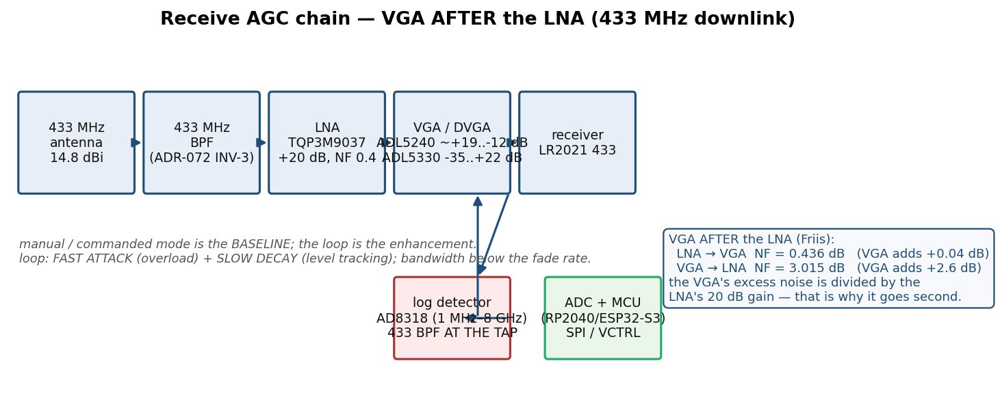

# Automated level control for the pico-balloon ground station

> **STATUS: `docs/analysis/` FINDINGS + OPERATOR-AUTHORISED DESIGN. NOT AN ADR.**
> This document *designs* the level-control architecture the operator asked for
> ("yes this is what we want" — an AGC loop on RECEIVE, telemetry-driven level control
> on TRANSMIT). The one **decision** it reaches is carried into **ADR-084**.
> Every external number (price, NF, gain, bandwidth, frequency) carries a URL or is
> marked **`TODO(unverified)`**. Nothing here is a KiCad layout and nothing is ordered.

| | |
|---|---|
| Date | 2026-10-08 |
| Branch | `design/level-control-architecture` |
| Base commit | `github/main` @ `09e1b69` |
| Author | Hermes agent (worker), for Felix (operator) |
| Lens | Level control (receive AGC + transmit range→attenuation) and the base-station board checklist. **Not** re-deriving the link budget, the positioner, the antenna sizing or the cost metric — those live on sibling branches (see *Read first*). |
| Repro | `python3 docs/analysis/level_control_model.py` (every numeric table below) and `/opt/miniconda/bin/python3 docs/analysis/render_level_control_figures.py` (both figures) |
| Figures | `docs/analysis/assets/level-control/receive-agc-chain.{png,svg}`, `…/dynamic-range-budget.{png,svg}` |
| Checklist | `docs/BASE-STATION-BOARD-CHECKLIST.md` |
| Access date | **2026-10-08** for every URL |

**Read first (sibling work this analysis consumes and does not re-derive):**

- `design/rf-shopping-list` @ `eea1cbc00702` — `docs/analysis/rf-shopping-list-and-duplex-architecture.md`:
  the shopping list with the **OWNED** parts, the T/R and duplex findings, and **the DSA row this
  document extends**. **EXTENDED, not duplicated.**
- `design/amplifier-hypothesis-check` @ `148578c` — `docs/analysis/ground-station-amplifier-hypothesis-check.md`:
  DO-NOT-BUILD on the amplifier-led station; the LNA/coax/noise-temperature ledger (Friis used here).
- `design/rf-gaps-harmonics-diy` @ `3dbcdb8c0224` — `docs/analysis/rf-harmonics-and-diy-dish.md`
  (Part A harmonics NON-ISSUE, Part B Ruze, **Part C masthead LNA mandatory**) + **ADR-083**.
- `design/adr-set-groundstation` @ `c07bd868776a` — **ADR-071…082** + `docs/analysis/plan-review-consultant.md`.
- `design/gain-per-dollar` @ `f0f1e08a`, `design/gain-per-dollar-cliff` @ `dd4104ade8f1`,
  `design/tier0-accessible` @ `9fb023e6` (ADR-069), `design/positioner-lowcost` @ `b74bf5f6`,
  `design/ground-station-flrc-max` @ `4ecbf5ca`.
- In-repo: `docs/adr/034-radio-band-split-433-tx-2g4-rx.md`, `docs/2G4-LINK-BUDGET-ANALYSIS.md`,
  `docs/FLRC-512B-THROUGHPUT-AUDIT-2026-10-06.md` (frame air-times), `docs/RANGE-THROUGHPUT-PLAN.md`.

---

## 0. Bottom line (answer first)

1. **Receive AGC: VGA goes SECOND, after the LNA.** Friis decides it, not preference. With the
   owned **TQP3M9037** LNA (+20 dB, NF 0.4 dB) ahead of a VGA whose own NF is 2.8–8 dB, the VGA's
   excess noise is divided by 100: the cascade NF rises from 0.400 dB to **0.436 dB** (VGA NF
   2.8 dB, ADL5240) or **0.605 dB** (VGA NF 8 dB, ADL5330) — i.e. the VGA costs **+0.04 … +0.20 dB**.
   Put the same VGA *first* and the system NF becomes **3.015 dB / 8.066 dB** — it costs **+2.6 …
   +7.7 dB**. That single comparison is the whole reason for the chain order.
   *(The brief's "~0.04 dB" is the ADL5240 case exactly; with the ADL5330 it is +0.20 dB. Both are
   negligible against a +2.6 dB penalty for the wrong order — `docs/analysis/level_control_model.py` §1.)*
2. **Real parts exist, all verified by datasheet this session.** ADL5240, ADL5243 (100 MHz–4 GHz
   digital VGA, 6-bit DSA 0.5 dB steps, 31.5 dB range) and ADL5330 (10 MHz–3 GHz analog VGA,
   **−35 … +22 dB**, 57 dB range). All three span **both** 433 MHz and 2.45 GHz and all three reach
   **negative dB** — this is the operator's "can we use something like this?" answered with part
   numbers (§2).
3. **Digital AGC beats an analog loop for this station** on *settability* and *reproducibility*
   (the gateway serves a fleet and must be repeatable); the analog loop is simpler and cheaper and
   is the fallback (§2.4). Either way the **manual/commanded mode is the baseline and the loop is
   the enhancement** — automation is not a first-flight dependency (operator decision).
4. **Transmit: a range→attenuation LUT, not a loop.** GNSS range is slow and known; a table kills
   the stability question entirely (no feedback path to oscillate). The honest finding is that
   **under the ISM ceiling the DSA sits near 0 dB for the whole flight** (the LR2021 HF PA is only
   +12 dBm and an 11.1 dBi antenna already over-shoots the 14.26 dBm EIRP ceiling by 8.8 dB —
   `docs/analysis/level_control_model.py` §5–6); the LUT earns its keep **only at metres-range or
   with a PA on a higher legal footing**. That is stated plainly rather than dressed up (§3).
5. **Level control BUYS dynamic range, not SNR.** It cannot manufacture signal. Quantitatively it
   recentres the receiver's usable window on a signal that swings **56.26 dB** across 1→650 km
   (plus a 15 dB fade allowance → 71.3 dB of mission span). A fixed gain accepts only the
   **35 dB** window it is centred on (≈ **49 %** of the mission's **dB span**); a 31.5 dB DSA raises
   that to
   **66.5 dB (93 %)** and a 57 dB VGA to **92 dB (100 %)** (§4). These percentages are fractions
   of the mission's **level span** — **not** delivered-service availability or fraction of distance;
   an availability figure needs an absolute link budget and a fade/outage model (consult F7). The top FLRC rate has the **worst**
   sensitivity, so it is the **first casualty** of a mis-set level — level control is worth up to
   **4×** the data rate at the far edge (2600 vs 650 kbps) and the whole link during the overhead pass.
6. **Failure modes do NOT endanger the band-split duplex.** The AGC lives entirely in the **433 MHz
   RX** path; the TX is **2.45 GHz** on a separate antenna (ADR-072). No AGC fault can move the TX
   level or violate ADR-072's INV-1…5. The real risk is **availability of the downlink** — the
   binding direction (ADR-073) — and it is mitigated by a **manual bypass** and a **latch-to-fixed**
   fallback, both of which exist *because* the operator's baseline is manual (§6).

---

## 1. Why level control at all — and why it is a throughput argument

The gateway has to close a link whose received level moves by tens of dB over the flight. On the
433 MHz downlink with the **F33 high-power flight variant** (+33 dBm, ADR-075), a 2 dBi balloon stub
and the **14.8 dBi** Diamond A-430S15R ground antenna
(`funktechnik-bielefeld.de/diamond-a-430s15r-uhf-15-element-richtantenne-70cm-band`, CONFIRMED),
`docs/analysis/level_control_model.py` §2 gives:

| range | FSPL @433 MHz | P_rx at ground | vs the 650 km level |
|---:|---:|---:|---:|
| 10 m | 45.2 dB | **+4.6 dBm** | +96.3 dB |
| 100 m | 65.2 dB | −15.4 dBm | +76.3 dB |
| 1 km | 85.2 dB | −35.4 dBm | +56.3 dB |
| 10 km | 105.2 dB | −55.4 dBm | +36.3 dB |
| 100 km | 125.2 dB | −75.4 dBm | +16.3 dB |
| **650 km** | 141.4 dB | **−91.6 dBm** | 0.0 dB |

The **1 → 650 km path-loss swing is 56.26 dB** — the brief's "~56 dB", reproduced exactly. Add a
slow fade/pointing allowance and the receiver must cope with **~71 dB** of level change.

**A fixed gain can be centred on one range only.** The receiver's usable window at the top FLRC rate
is set by (a) the top rate's sensitivity, **−99 dBm** (LR2021 datasheet Table 3-13 "FLRC 2.4 GHz
1 % PER", used as the band-agnostic proxy — the 433-specific row is `TODO(unverified)`, ADR-082
open item), and (b) the onset of compression. Call that window **W ≈ 35 dB** (an *assumption*; the
LR2021 maximum-input figure is `TODO(unverified)` — see §7). Then:

- **Fixed gain:** acceptance span = **35 dB** = a **56×** distance ratio = **49 %** of the 71 dB
  level span (a *span* statistic — not a fraction of distance, time or availability). At one end of the flight the front end is driven toward compression; at the other the
  signal is at/below the top rate's sensitivity. You cannot have both.
- **Fixed gain + 31.5 dB DSA (ADL5240 / PE43711):** span **66.5 dB** = **2113×** = **93 %** of the
  mission.
- **Fixed gain + 57 dB VGA (ADL5330):** span **92 dB** = **39 811×** = **100 %** of the level span,
  with ~20 dB left for fades.

**This is the throughput argument, made numeric.** The top rung of the rate ladder is **4.00×** the
bottom rung (2600 vs 650 kbps). Because the top rung also has the **worst** sensitivity, it is the
first thing a mis-set level destroys:

- *Too much gain (no attenuation):* the front end compresses near the balloon (the overhead pass at
  the start and end of every flight is the **common** case, not the rare one). Compression is a
  **desense that fails every rate at once** — the gateway goes deaf exactly when it must serve the
  largest user population, and during the launch/recovery window.
- *Too little gain:* the far-field level falls below the top rate's sensitivity early, and the
  station is forced down the ladder while the antenna could still have carried the top rung. The
  recovery value is the **rate ratio**: up to **+4× at the far edge** (2600/650).

Level control makes the receiver run at its optimum operating point at **every** range, so the top
rung is available for as long as the antenna actually supports it, and the front end never
compresses. It does not and cannot add SNR.

---

## 2. Receive AGC — VGA after the LNA

### 2.1 The chain, stated

```
433 MHz antenna (14.8 dBi)
   → 433 MHz BPF            (ADR-072 INV-3; protects the wideband LNA)
   → LNA  TQP3M9037         (+20 dB, NF 0.4 dB   — OWNED)
   → VGA / DVGA             (the level-control element; −…+ dB, SPI or analog)
   → receiver   LR2021 433
        ▲
        └── coupler/tap → log detector → ADC + MCU → VGA control   (the loop)
```



### 2.2 Why the VGA goes SECOND — Friis, with numbers

Cascade noise factor is `F = F1 + (F2−1)/G1 + …`. The second stage's **excess** noise
(`F2 − 1`) is divided by the **first stage's gain**. With the LNA first (gain 20 dB = 100×):

| VGA | LNA → VGA (as designed) | VGA → LNA (wrong order) | penalty of the wrong order |
|---|---:|---:|---:|
| **ADL5240** (amp NF 2.8 dB @450 MHz) | **0.436 dB** (VGA adds **+0.036 dB**) | 3.015 dB (adds +2.615 dB) | **+2.58 dB** |
| **ADL5330** (NF 8.0 dB @450 MHz) | **0.605 dB** (VGA adds **+0.205 dB**) | 8.066 dB (adds +7.666 dB) | **+7.46 dB** |

(`docs/analysis/level_control_model.py` §1. Noise figures: TQP3M9037 gain/NF from
`qorvo.com/products/p/TQP3M9037` via Wayback, carried by the sibling shopping list; ADL5240/ADL5330
from their datasheets, §2.3.)

The design point: **VGA-after-LNA costs ≤ 0.2 dB of system NF; VGA-before-LNA costs 2.6–7.5 dB.**
A 2.6 dB sensitivity loss is larger than the entire 1–2 dB per-step sensitivity improvement the rate
ladder trades on (ADR-082), so the wrong order would silently delete a rung. Note also that the
VGA-before-LNA penalty is **largest when the attenuation is used** (attenuation before the LNA
raises F1 directly), so the wrong order fails exactly when the station is at close range — the case
level control exists to handle.

**Two caveats the consultant is right to raise (F8/F12).** (a) 0.436 dB is a **two-stage** NF, not an
antenna-referenced **system** NF — the pre-LNA **433 BPF + limiter + connector** losses add *directly*
to it (a 1 dB pre-LNA loss makes the system NF ≥ 1.4 dB, dwarfing the LNA's own 0.4 dB), which
*strengthens* the case for VGA-**second**: the dominant NF term is pre-LNA, and a post-LNA VGA is not
in it. (b) The VGA-first figure assumes the VGA at **unity gain**; a real VGA's NF varies with gain, so
the comparison is a worst-point *constraint check*, not a full gain-law sweep.

**Second-order reason for the order:** putting the VGA *after* the LNA also keeps the **BPF first**
(ADR-072 INV-3) and the **LNA at the masthead** (ADR-079 INV-1), so the lossy feedline sits after
gain and the wideband LNA never sees unfiltered out-of-band energy.

### 2.3 VGA / DVGA part options — verified this session

All three candidate classes below were **fetched as datasheets on 2026-10-08** (Analog Devices
`analog.com/media/en/technical-documentation/data-sheets/*.pdf`, HTTP 200). Specs are quoted from the
datasheet text, not from memory.

| Part | Band | Gain-control range | Step / control | NF | Interface | Datasheet URL |
|---|---|---|---|---|---|---|
| **ADL5240** | **100 MHz–4000 MHz** | amp **+20.3 dB** @450 MHz **+** 6-bit DSA **0…30.7 dB** ⇒ ≈ **+18.8 … −12 dB** | **0.5 dB** steps, ±0.25 dB accuracy, 6-bit | **2.8 dB** @450 MHz (amp), 2.9 dB @2.14 GHz | **serial (3-wire) + parallel** | `https://www.analog.com/media/en/technical-documentation/data-sheets/ADL5240.pdf` |
| **ADL5243** | **100 MHz–4000 MHz** | as ADL5240 **+ a ¼ W driver amp** (14.2 dB, P1dB 26 dBm) | 0.5 dB steps, 6-bit | 2.9 dB (amp) / **3.7 dB** (driver) @2.14 GHz | serial + parallel | `https://www.analog.com/media/en/technical-documentation/data-sheets/ADL5243.pdf` |
| **ADL5330** | **10 MHz–3000 MHz** | **−35 … +22 dB** @450 MHz (span **57 dB**) | **analog**, 20.4 mV/dB, intercept 0.89 V | **8.0 dB** @450 MHz (VGAIN 1.4 V) | analog `GAIN` pin | `https://www.analog.com/media/en/technical-documentation/data-sheets/ADL5330.pdf` |

Datasheet-quoted supporting figures (same URLs):

- **ADL5240** — "Operating frequency from 100 MHz to 4000 MHz"; "6-bit, 0.5 dB digital step attenuator";
  "31.5 dB gain control range with ±0.25 dB step accuracy"; AMP @450 MHz gain **20.3 dB**, NF **2.8 dB**,
  S11 −18.3 dB, S22 −15.7 dB, gain vs temperature ±0.36 dB; DSA @450 MHz min-attenuation insertion loss
  **−1.5 dB**, attenuation range **30.7 dB**, step error ±0.14 dB, absolute error ±0.42 dB; single supply
  4.75–5.25 V, **93 mA**.
- **ADL5243** — same DSA/gain block **plus** AMP2 (¼ W driver) gain 14.2 dB, P1dB **26.0 dBm**, NF 3.7 dB
  @2140 MHz; **175 mA**. The extra driver is *not needed* here (the downlink needs gain, not PA-grade
  output) but it is the same footprint family if output headroom is ever wanted.
- **ADL5330** — "Operating frequency 10 MHz to 3 GHz"; "Wide gain control range: −34 dB to +22 dB at
  900 MHz"; "Linear in dB gain control function, 20 mV/dB"; @450 MHz: span 57 dB, max gain +22 dB
  (VGAIN 1.4 V), min gain −35 dB, NF 8.0 dB, OIP3 36 dBm, input compression 1.2–3.3 dBm, output noise
  floor −146 dBm/Hz. **Differential** RF ports (needs baluns) — a real board-level cost.

**Both-band coverage.** All three cover **433 MHz and 2450 MHz** (min band edge 10 or 100 MHz, max
3 or 4 GHz). The ADL5330's 3 GHz top edge still clears 2.45 GHz comfortably.

**Negative dB.** This is the operator's explicit ask (a controllable element that can *both* attenuate
*and* amplify). **ADL5330: −35 … +22 dB** (clearly bipolar). **ADL5240/ADL5243: ≈ +18.8 … −12 dB**
(the +20 dB amp minus the 0…30.7 dB DSA, minus the 1.5 dB DSA insertion loss) — also bipolar, with the
bonus that the **DSA half can be used alone** as a pure attenuator (ADS's "either block first" pinout).

**Prices** (AliExpress, German storefront, "from" prices read 2026-10-08; exact per-item checkout
prices are `TODO(unverified)` — item pages are JS-rendered, same caveat as the sibling shopping list):

| Part | Listing | "from" price | URL |
|---|---|---:|---|
| ADL5240ACPZ | `ADL5240ACPZ-R7 … LFCSP-32` | **≈ €2.09** | `aliexpress.com` item `1005006722641749` (search `ADL5240`) |
| ADL5330ACPZ | `1-20PCS ADL5330ACPZ …` | **≈ €15.59** | `aliexpress.com` (search `ADL5330`) |
| ADL5243ACPZ | — | **TODO(unverified)** (search shows a €29.79 top listing) | `aliexpress.com` (search `ADL5243`) |

**DSA range, stated precisely (consult F3):** the **ADL5240/ADL5243** digital step attenuator's own range is **31.5 dB** (datasheet: "31.5 dB gain control range"), while the **pSemi PE43711** is **0–31.75 dB**. They are **different parts**, not a contradiction; the 0.25 dB difference is immaterial (with 31.75 dB the acceptance span is 66.75 dB, versus 66.5 dB).

The companion **DSA in the sibling list** — the ready-made SMA module "9 kHz–6 GHz, 0–31.75 dB,
0.25 dB step" at **€18.89** (`aliexpress.com` item `1005012321787574`, title CONFIRMED on
`design/rf-shopping-list`) — is the cheapest route to the level-control element if the ADL5240's SPI
integration is not wanted. Its DSA silicon is the **pSemi PE43711** class: "9 kHz – 6 GHz", "0.25 dB
LSB → 31.75 dB", glitch-less, 1.8 V control, 50 Ω
(`psemi.com/products/digital-step-attenuators/pe43711`, re-fetched 2026-10-08, HTTP 200 → redirects
to `psemi.com/products/rf-attenuators/glitch-less-rf-digital-step-attenuators/pe43711/`; specs CONFIRMED).

### 2.4 Digital AGC vs analog AGC loop — the comparison the brief asked for

The two ways to close a *receive* loop around the VGA:

| | **DIGITAL AGC** | **ANALOG AGC** |
|---|---|---|
| Block set | VGA + **log detector** + **ADC** + **MCU** (PWM/DAC or SPI to the VGA) | VGA (analog `GAIN` pin) + detector + **RC loop filter** → VGA `GAIN` |
| Parts (verified) | ADL5240 (SPI) **or** PE43711 DSA; detector **AD8318** (1 MHz–8 GHz, 70 dB, ±1.0 dB over 55 dB, 10/12 ns); ADC/MCU: RP2040 or ESP32-S3 (ADC + SPI) | ADL5330 (analog `GAIN` pin); detector **AD8318** or **ADL5513** (1 MHz–4 GHz, 80 dB, −70 dBm sensitivity, 20/21 ns); loop filter: R + C |
| Loop timing | Driven by the **MCU/frame rate**; update once per FLRC frame is natural | Continuous (RC pole) — no sampling, no aliasing |
| **Cost** | Higher: VGA + detector + **ADC + MCU** (the MCU is likely present anyway for TX LUT/GNSS) | Lower: VGA + detector + 2 passives; **no ADC, no code** |
| **Complexity** | Firmware: calibration table, deadband, hysteresis, mode state machine, manual override | Hardware: set R/C for the pole; **no software** to get wrong |
| **Settability / repeatability** | **Exact and repeatable** — the gain lives in a **register**; every unit behaves identically; the level window is a *calibration constant*, not a component tolerance | Set by component tolerances (detector slope, VGA gain law, RC spread). Repeatable only to the passives' tolerance |
| **Diagnosability** | The MCU *knows* the gain (a number to log/telemetry) and can **hold/bypass** it deterministically | The loop state is an analog voltage — harder to observe, harder to freeze |
| **Risk if it fails** | Firmware bug can latch a register → mitigated by a **manual/commanded override** and a reset-to-fixed default | Component drift/oscillation → mitigated by loop-filter design and a bypass relay |
| Verdict | **RECOMMENDED** — the gateway serves a **fleet** and must be **repeatable and loggable**; the MCU is already in the design (TX LUT + GNSS + housekeeping). | **Fallback** — simplest and cheapest; choose it if firmware scope is the binding constraint. Its continuous nature also sidesteps sampled-loop stability. |

Detector datasheets (all fetched 2026-10-08, HTTP 200):

- **AD8318** — "1 MHz to 8 GHz, 70 dB Logarithmic Detector/Controller"; ±1.0 dB over 55 dB (< 5.8 GHz);
  10 ns/12 ns pulse response — `https://www.analog.com/media/en/technical-documentation/data-sheets/AD8318.pdf`
- **AD8317** — 1 MHz to 10 GHz, 55 dB, 6/10 ns — `…/AD8317.pdf`
- **ADL5513** — 1 MHz to 4 GHz, 80 dB (±3 dB), sensitivity −70 dBm, 20/21 ns — `…/ADL5513.pdf`

> **Detector choice note.** The **AD8318** (70 dB, <5.8 GHz) is preferred: its dynamic range matches
> the ~71 dB mission span and its band covers 433 MHz and 2.45 GHz, so *one* part works for both a
> receive loop and a transmit-power monitor. ADL5513 is a cheaper/narrower alternative if only
> 433 MHz is monitored.

---

## 3. Transmit level control — a telemetry-driven range→attenuation LUT

### 3.1 The mechanism

The operator's decision: the ground's **transmit** level is set from the **balloon's own GNSS range**,
via a **precomputed lookup table** — **not** a control loop. That choice is deliberate and removes the
entire TX stability question: the input (range) is *slow and known*, so there is nothing to oscillate
against. The table is monotone in range, has no feedback path, and can be verified offline.

```
   balloon GNSS  ──(433 downlink telemetry)──►  ground MCU
                                                   │  range → atten  (one table)
                                                   ▼
   LR2021 HF PA (+12 dBm) → 2.4 GHz BPF → DSA (0–31.75 dB, 0.25 dB step) → 2.4 GHz BPF → antenna
```

The **DSA** is the PE43711-class part already in the sibling shopping list: **0–31.75 dB, 0.25 dB
step**, €18.89 (`aliexpress.com` item `1005012321787574`; silicon spec
`psemi.com/products/digital-step-attenuators/pe43711` — "9 kHz – 6 GHz", "0.25 dB LSB → 31.75 dB").
The **ADL5240/ADL5243** DSA half can serve the same role if a single part family is preferred.

### 3.2 The drive-level target

The target is a **constant level presented to the balloon's 2.4 GHz receiver**, so the balloon stays in
its optimum operating window regardless of range. Concretely:

```
  atten_dB(d) = clamp( 0 , 31.75 ,  [ P_tx_ant(d) ] − P_target_balloon )
  P_balloon_rx(d) = P_tx_ant − G_ground − G_balloon + FSPL(2450, d)
```

**Honest result** (`docs/analysis/level_control_model.py` §5), with the **LR2021 HF PA (+12 dBm)**,
an **11.1 dBi** Sirio SLP-17 and a 0 dBi balloon stub, targeting a **constant level near the balloon
RX's linear ceiling** (model uses −40 dBm as the target; the balloon's exact max-input is
`TODO(unverified)`):

| range | P at balloon RX | DSA attenuation needed |
|---:|---:|---:|
| 10 m | −37.1 dBm | **2.9 dB** |
| 50 m | −51.1 dBm | 0.0 dB |
| 1 km | −77.1 dBm | 0.0 dB |
| 650 km | −133.4 dBm | 0.0 dB |

So **under the ISM ceiling the LUT sits at ~0 dB for essentially the whole flight** and only engages
at tens of metres. Two consequences, stated plainly:

1. **This is the correct result, not a null result.** The DSA is what makes the station *compliant*
   (the sibling shopping list §2.1 computes a **14.26 dBm EIRP** ceiling at FLRC-max bandwidth, i.e.
   only **+3.2 dBm conducted** at 11.1 dBi, so the +12 dBm HF PA must be turned **down 8.8 dB** —
   `level_control_model.py` §6). In practice a **4 dB fixed pad** does the compliance trim and the LUT handles
   the metres-range case. The operator's decision to set the regulatory ceiling aside for this task
   does not change the mechanism.
2. **The LUT becomes a *throughput* device as soon as a PA is added.** With a +30 dBm ground PA the
   LUT pulls 20.9 dB at 10 m and ~7 dB at 50 m (`level_control_model.py` §5), i.e. it protects the
   balloon receiver from close-range overdrive while the far field gets full power — exactly the
   dynamic-range argument of §1, mirrored on the uplink.

**Drive-level target, stated as a number:** hold the balloon RX input at **≈ −40 dBm nominal**
(the ballon's linear ceiling minus margin; `TODO(unverified)` pending the LR2021 max-input figure),
never exceeding it. The table is a *level-holding* profile, so the balloon's receiver sees a roughly
constant drive from 10 m to the range where the LUT reaches 0 dB, and then a monotonically falling
level beyond it (which is where the rate ladder, ADR-082, takes over). **The residual is explicit** (consult F10): a
**31.75 dB** DSA cannot flatten the full **56.26 dB** range loss by itself — it leaves **24.5 dB**
uncompensated over 1→650 km. That is by design: the LUT holds a *constant* level only within its
authority; beyond that range the level falls and the **rate ladder** carries the link (ADR-082).

---

## 4. Loop dynamics — attack/decay vs frame rate and the balloon's geometry rate

`docs/analysis/level_control_model.py` §7 fixes the three timescales from the repo's own frame data
(`docs/FLRC-512B-THROUGHPUT-AUDIT-2026-10-06.md`: FLRC-2600, 511 B = **2.140 ms** air time, fw CR 3/4):

| timescale | value | source |
|---|---|---|
| FLRC frame rate (max rate, 511 B) | **24 – 379 frames/s** for GAP 40 ms → 0.5 ms (frame period 2.6 – 42 ms) | FLRC-512B throughput audit + the repo's GAP range (min 100 µs, bench-typical 5000 µs) |
| Fastest physical fade (multipath, 2v/λ, v = 25 m/s @433 MHz) | **≈ 72 Hz** | λ = 0.692 m; classical multipath-null rate |
| Slow geometry / range change | **≈ 0.01 – 1 Hz** | km-scale balloon motion at 10–30 m/s; yaw of a few °/s |

### 4.1 Slow AGC (< the fade rate) is correct — and why

**A fast AGC is wrong here.** Three reasons, each independent:

1. **The AGC cannot remove a fade.** FLRC is **GMSK + proprietary convolutional FEC + interleaving**
   (LR2021 datasheet §18.1, quoted on the sibling shopping list §4.2). GMSK is near-constant-envelope,
   but a fade drops the signal power at the *antenna* — no gain applied downstream recovers the lost
   SNR. A fast loop that chases a 72 Hz fade would only **track the fade with gain**, adding its own
   amplitude modulation on top of the already-degraded signal and perturbing the demodulator's
   timing/AGC. The receiver's *internal* AGC already handles the fast within-frame amplitude; the
   station's loop must not fight it.
2. **The loop's job is level *management*, not fade mitigation.** What it must track is the **slow**
   path-loss change (the 56 dB over the flight) so the demodulator sits in its window. That rate is
   ≈ 0.01–1 Hz. A loop with a time constant of **tens of milliseconds to ~1 s** (bandwidth ≈ 0.2–20 Hz)
   tracks the geometry while ignoring fades and the frame rate.
3. **Fades are handled by the rate ladder, not the AGC.** ADR-082 already makes rate adaptation the
   formal deep-fade mechanism (2600 → 1300 → 650 kbps). A slow AGC and a rate ladder are complementary:
   the AGC keeps the level in-window; the ladder trades rate for the SNR that is irrecoverable.

**Recommended dynamics — ASYMMETRIC (attack ≠ decay), because a single slow time constant is not
sufficient** (consult F4: a 100 ms *attack* leaves several frames exposed to a sudden overload):

- **FAST attack** (overload guard): when the detected level exceeds the window top by more than the
  deadband, step the gain **down within one frame** (≤ ~3 ms at the top rate).
- **SLOW decay** (level tracking): release the gain with **τ ≈ 10–100 ms** (≈ 1.6–16 Hz) — **below the
  ~72 Hz fade rate** so the loop does not pump on fades, and **above the ~0.01–1 Hz geometry rate** so
  it tracks the slow path-loss change.

For the analog loop, make the detector's output RC pole dominant and **decouple the loop from the
frame rate** by low-passing the detector output over several frames (an asymmetric fast-attack /
slow-decay pair is two diodes + two RC legs).
(≈ 1.6–16 Hz bandwidth; a few frames to tens of frames), i.e. **below the fade rate, above the
geometry rate**. For the analog loop, make the detector's output RC pole the dominant one; also
**decouple the loop from the frame rate** by low-passing the detector output over several frames.

> **The trap to avoid:** a *continuously-tracking* fast loop **hunts** — hunting is a **loop-design**
failure, not a *speed* (consult F4): a well-designed fast loop can be stable, and the **fast-attack /
slow-decay** pair above is stable because the attack only ever commands *reduction* while the decay is
the slow, filtered path. It converts fast amplitude
> variation into gain variation, which is noise on the demodulator's decision variable — it *lowers*
> throughput while looking "responsive".

### 4.2 Stability / oscillation risks and how to avoid them

| Risk | Mechanism | Mitigation |
|---|---|---|
| **Analog loop oscillation** | Any loop with a VGA (gain) + detector (log slope) + integrator has a second pole; too much loop gain rings at the loop bandwidth | Make the detector's **RC pole dominant**; keep loop gain low (the level window is wide — a 35 dB window does not need a fast loop); add a small amount of hysteresis |
| **Digital limit-cycle / hunting** | A **0.5 dB** step with a target deadband narrower than one step makes the gain bang-bang between two codes | Set the **deadband ≥ 1 step** (≥ 0.5 dB) and add **hysteresis**; only move the code when the error exceeds the deadband |
| **Sampled-loop instability** | Updating once per frame with a delay = one frame period adds phase lag | Keep loop bandwidth ≪ 1/(2·frame period); a ~10 ms τ against a 2.6–42 ms frame is safe; do not close a loop faster than the frame rate |
| **Latch / wind-up** | A detector blind (e.g. below its floor) drives the loop to full gain and latches there; the ballon then compresses the front end on the next close pass | Clamp the gain register at both ends; **blank the loop's integrator when the detector output is out of range** (standard AGC anti-windup); hold last-good gain |
| **Blocker-driven gain reduction (BIGGEST — consult F5)** | The **AD8318 is broadband (1 MHz–8 GHz)**. Leaked 2.45 GHz TX energy (or any third-party blocker) reaching the detector makes it read *strong* while the 433 downlink is weak → the loop **reduces gain and desenses the wanted downlink**. | Put a **433 MHz BPF at the detector tap** so the detector sees only in-band energy (now on the figure + checklist). Band separation at the antenna is **not** a detector-isolation budget. |
| **Wrong-band coupling** | The wideband LNA would amplify 2.4 GHz TX leakage into the loop's detector and corrupt the level reading | The **433 MHz BPF precedes the LNA** (ADR-072 INV-3); the detector is tapped **after** the BPF. This is also why the detector must be a *band-selective* tap, not a wideband one |

---

## 5. Working modes (automation is the enhancement, not the dependency)

The operator's own words: *"manual/commanded gain per flight phase gets you most of the benefit for
none of the complexity."* The design therefore has **three modes**, and a first flight can ship with
only mode 1:

| Mode | Who sets gain | When | First-flight? |
|---|---|---|---|
| **1. Manual / commanded** | Operator or per-flight-phase command (a fixed attenuation per phase: launch, cruise, recovery) | **Default.** Baseline. | ✅ **sufficient alone** |
| **2. Telemetry-driven (TX)** | Ground MCU from the balloon's GNSS range → LUT | Uplink | ✅ if GNSS telemetry is present |
| **3. Autonomous AGC (RX)** | The receive loop (digital or analog) | When the loop is trusted after bench validation | enhancement |

**Hard requirement:** mode 3 must be **defeatable at any time**, and defeating it must return the
chain to a **known fixed gain** (mode 1) — not to "wherever the loop left it". This is an
*availability* requirement (§6), not a convenience.

---

## 6. Failure modes for a FULL-DUPLEX INTERNET GATEWAY (band-split, no circulator, no relay)

**First, the reassurance, stated plainly:** the level control lives **entirely in the 433 MHz RX
path**. The TX chain is **2.45 GHz** on a **separate antenna** (ADR-072). There is **no shared
narrowband element** across the two bands (ADR-072 INV-1). Therefore **no AGC fault — hunting,
latching, or a firmware bug — can move the transmit level, add TX→RX coupling, or compromise the
band-split duplex of ADR-072.** The RX AGC's failure envelope is strictly the RX path. This is worth
saying because the concern is natural for a full-duplex box: the answer is that the duplex is by
*band*, and the AGC is only in one band. **But band separation is not *service* independence**
(consult F6): an RX-path failure still breaks the **bidirectional** gateway — the 433 downlink carries
the service's responses *and* the operator's commands — even while the 2.45 GHz TX output stays
perfectly nominal. That is why the recovery path below is **autonomous** and why mode 1 (fixed gain)
is the default.

**What the AGC *can* damage: downlink availability** — and the 433 MHz downlink is the **binding
direction** (ADR-073). Enumerated:

| Failure | Effect on the gateway | Endangers availability? |
|---|---|---|
| **Latched at max attenuation** | 433 RX gain is ~30 dB low → the far-field link falls below sensitivity → **downlink lost** | **YES** — this is the dangerous one. The gateway is useless without the downlink. |
| **Hunts / oscillates** (fast loop or too-small deadband) | The level wobbles at the loop frequency; the demod loses margin at all ranges → **throughput degradation, occasional packet loss** | Degraded, not lost — but on the *binding* direction, so throughput suffers directly |
| **Latched at min attenuation (no attenuation)** | Front end compresses at close range → **desense during the overhead pass**, all rates fail briefly | **YES, transiently** — during launch/recovery, the common close-range window |
| **Detector blind / wind-up then over-correct** | Same as latch at min attenuation on the next pass | YES, transiently |
| **Digital loop firmware fault** | Might also mis-drive the TX LUT **if the same MCU owns both** | **Avoidable by design** — see below |
| **Wrong control polarity** | Feedback becomes *positive* → runaway to a rail | Bench-verify loop **sign** before enabling mode 3 |
| **Detector / ADC failure** (open, short, saturated, stale, mis-calibrated) | Loop drives to a rail (either) | Plausibility check on the detector output; rail-clamped fallback to mode 1 |
| **Common-mode MCU / SPI / supply fault** | A shared MCU, SPI bus, reset or supply can affect RX **and** TX even with separate software state | The **TX LUT is keyed on GNSS range only**, so an RX-loop fault cannot move it |
| **Lost remote-recovery path** | A *commanded* bypass cannot arrive if the downlink (the command path) is dead | The **watchdog recovery is AUTONOMOUS** (on-board), so recovery does not depend on the downlink |
| **Watchdog misdiagnosis** | Genuine fading/interference triggers repeated resets and prevents reacquisition | Act on a *sustained* link-health collapse with hysteresis, not a single frame |

**Mitigations (all cheap, all adopted):**

1. **Manual bypass as the default** (§5): a mechanical or solid-state RF switch (or simply a DSA code
   that the operator commands) puts a **fixed, known attenuation** in the RX chain. The loop is a
   *mode*, not a hard dependency. **A first flight does not enable mode 3.**
2. **Bounded gain register + anti-windup clamp** (§4.2): the loop can never command more than its
   design range, and the integrator is blanked when the detector is out of range.
3. **Deadband ≥ one step + hysteresis** (§4.2) so a digital loop cannot limit-cycle.
4. **Separate the TX LUT from the RX loop state.** The TX is a *static table keyed on range*; it does
   not depend on the RX AGC's state. Even a total RX-loop failure leaves the TX level exactly where
   GNSS range puts it. If one MCU serves both, keep the TX code path independent of the RX loop's
   variables.
5. **Downlink-failure watchdog:** if the MCU's own link-health metric (frame error / RSSI) collapses
   while the AGC is in autonomous mode, **drop to mode 1 (fixed gain) and tell the operator**. An AGC
   that cannot be *turned off* on evidence is not safe for the binding direction.

**Does the AGC interfere with the band-split duplex design (ADR-072)?** **No.** ADR-072's invariants
are all statable without reference to the AGC:

- INV-1 (no narrowband element passes both bands) — the AGC is a 433-path-only element. ✅
- INV-2 (no half-duplex T/R switch) — the AGC introduces none. ✅
- INV-3 (433 BPF before the LNA) — the AGC sits **after** the LNA, i.e. inside the protected region. ✅
- INV-4 (no uplink PA unless a higher legal footing) — the TX level control is a **DSA**, and the LUT
  never adds gain. ✅ (A PA would be a separate, footing-gated decision.)
- INV-5 (uplink EIRP from occupied bandwidth) — unaffected; the LUT is a *level-holding* profile, and
  compliance is a separate clamp. ✅

**One residual, honest caveat:** if the operator ever adds a **co-located 2.4 GHz PA** at metre-range
output, the near-field TX→RX leakage rises, and the pre-LNA **433 BPF** (not the AGC) is what must keep
the LNA input safe (ADR-072 / ADR-079). The AGC does **not** protect against a blocker — a limiter or
the BPF does. This is stated so the AGC is not credited with a job it cannot do.

---

## 7. Assumptions and open items (`TODO(unverified)`)

1. **LR2021 maximum usable input level** (the top of the 35 dB window W). Not sourced here; the
   window is an assumption and the dynamic-range percentages in §1 scale with it. One datasheet read
   closes it. *(The sibling shopping list already carries "LR2021 receiver NF and maximum input"
   as `TODO(unverified)` — ADR-079 open items.)*
2. **LR2021 433 MHz FLRC sensitivity rows** — the 2.4 GHz table rows are used as the band-agnostic
   proxy (inherited from ADR-073/082).
3. **Balloon 433 dB gain (2 dBi) and 2.4 GHz balloon gain (0 dBi)** — assumed stub figures.
4. **`P_target_balloon = −40 dBm`** for the TX LUT — a design constant pending item 1.
5. **ADL5240/ADL5243/ADL5330 AliExpress per-item prices** — "from" prices only; item pages JS-rendered.
6. **ADL5243 price** — not confirmed this session.
7. **ADL5330 differential ports / balun cost** — not priced here.
8. **The 2.4 GHz uplink legal ceiling** — the repo-level **flagged defect** (flat 20 dBm vs ≈14.26 dBm
   PSD), inherited from ADR-072/ADR-081; not re-opened here.
9. **The measured S21 isolation / desense acceptance** for ADR-072 — unchanged by this document; the
   AGC does not substitute for it.
10. **Whether the operator wants the RX detector shared with a TX power monitor** — a design option,
    not decided here.

---

## 8. Method / reproduction

- **Datasheets fetched 2026-10-08** (browser User-Agent, `curl --compressed`, HTTP 200):
  `analog.com/media/en/technical-documentation/data-sheets/{ADL5240,ADL5243,ADL5330,AD8318,AD8317,ADL5513,HMC425A}.pdf`.
  Vendor **product** pages (`analog.com/en/products/*.html`) return HTTP 000 to this fleet; the
  **datasheet** paths work and are the quotable source. `psemi.com` PE43711 redirects and returns 200.
  AliExpress German search listings return 200 and their "from" prices are quoted as "from".
- **Reproduce every number:** `python3 docs/analysis/level_control_model.py`;
  figures: `/opt/miniconda/bin/python3 docs/analysis/render_level_control_figures.py`.
- **Independent review:** the design (with both figures) was submitted to the lane
  `scripts/fleet/visual_consult.py` (`--timeout 900`); the verdict of record, the served model and
  the verbatim answer are recorded in §9 and in `docs/analysis/assets/level-control/consult-verdict.txt`.

**This analysis orders nothing and buys nothing. It extends `design/rf-shopping-list`'s list in
`docs/BASE-STATION-BOARD-CHECKLIST.md` rather than duplicating it.**

---

## 9. Independent consultant review

**Lane:** `scripts/fleet/visual_consult.py` (`--timeout 540 --max-tokens 20000 --json`), date
**2026-10-08**, artifacts = the two figures above. Full record incl. all findings and their
disposition: `docs/analysis/assets/level-control/consult-verdict.txt`.

**Served model:** **`gpt-6-astra`** (read back from the response's `served`/`model` field, not from the
request). The CLI's structured `verdict` field returned **`UNPARSED`** because the model answered with
the **CONFIRM/REFUTE** vocabulary, which is *not* `parse_verdict`'s vocabulary — that is the parser
declining, **not** the model disagreeing and **not** an approval.

**The model's own verdict, verbatim (the opinion of record):**

> **VERDICT: REFUTE — The conditional Friis arithmetic is sound, but contradictory gain windows,
> unproven loop dynamics, insufficient TX control range and missing full-duplex self-interference
> analysis invalidate the plan's claimed coverage and safety.**

**Disposition (round 1 → fixes; full table in `consult-verdict.txt`):** twelve findings accepted and
acted on — the contradictory figure gain-window label **(F1)**, the plot band being 42 dB where 35 dB
was claimed **(F2, a real bug)**, the 31.5-vs-31.75 dB DSA distinction **(F3)**, **fast-attack /
slow-decay** loop dynamics **(F4)**, **433 MHz band-limiting of the detector** against blocker-driven
gain reduction **(F5, the most material)**, an extended failure table incl. wrong polarity, detector
failure, common-mode faults and the autonomous-recovery requirement **(F6)**, level-span-vs-availability
wording **(F7)**, the full-system-NF caveat **(F8/F12)**, the explicit 24.5 dB TX residual **(F10)** and
separate RX/TX level-element instances **(F11)**. Four findings were noted as already-stated or out of
scope, with reasons. **The corrections are in this document and in the re-rendered figures.**
