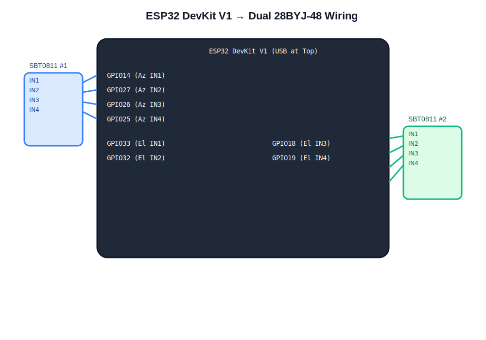

# ESP32 DevKit V1 (30‑Pin) – Pinout & Motor Wiring Reference

Board identified:

- Module: **ESP32‑WROOM‑32**
- USB‑UART: **CP2102 (Silicon Labs 10c4:ea60)**
- 15 pins per side (30‑pin layout)
- Commonly sold as **DOIT ESP32 DevKit V1**

---

# 1️⃣ Physical Pin Layout (Top View, USB at Top)

```
        ┌───────────────────────────────┐
        │           USB PORT            │
        └───────────────────────────────┘

   LEFT SIDE                        RIGHT SIDE

   3V3                               VIN (5V)
   EN                                GND
   GPIO36                            GPIO23
   GPIO39                            GPIO22
   GPIO34                            GPIO1 (TX0)
   GPIO35                            GPIO3 (RX0)
   GPIO32   ← Elevation IN2          GPIO21
   GPIO33   ← Elevation IN1          GPIO19  ← Elevation IN4
   GPIO25   ← Azimuth IN4            GPIO18  ← Elevation IN3
   GPIO26   ← Azimuth IN3            GPIO5
   GPIO27   ← Azimuth IN2            GPIO17
   GPIO14   ← Azimuth IN1            GPIO16
   GPIO12                              GPIO4
   GND                                GPIO0
   GPIO13                             GPIO2
```

---

# 2️⃣ Pins Used In Your Firmware

## ✅ Azimuth Motor (SBT0811 #1)

| ESP32 GPIO | Connect To | Driver Pin |
|-------------|------------|------------|
| GPIO14      | IN1        | OUT1 → Blue |
| GPIO27      | IN2        | OUT2 → Pink |
| GPIO26      | IN3        | OUT3 → Yellow |
| GPIO25      | IN4        | OUT4 → Orange |

---

## ✅ Elevation Motor (SBT0811 #2)

| ESP32 GPIO | Connect To | Driver Pin |
|-------------|------------|------------|
| GPIO33      | IN1        | OUT1 → Blue |
| GPIO32      | IN2        | OUT2 → Pink |
| GPIO18      | IN3        | OUT3 → Yellow |
| GPIO19      | IN4        | OUT4 → Orange |

---

# 3️⃣ Power Wiring

```
External 5V  + ───────────────┐
                              ├── SBT0811 #1 VCC
                              ├── SBT0811 #2 VCC
                              └── Motor RED wires

External 5V  GND ─────────────┐
                               ├── SBT0811 #1 GND
                               ├── SBT0811 #2 GND
                               └── ESP32 GND
```

⚠️ ESP32 GND and motor power GND MUST be connected.

⚠️ Do NOT power motors from 3V3.

---

# 4️⃣ Safe GPIO Notes

Pins you are using are safe for output:

- ✅ 14
- ✅ 27
- ✅ 26
- ✅ 25
- ✅ 33
- ✅ 32
- ✅ 18
- ✅ 19

Avoid using these for motors:

- ❌ GPIO0 (boot strap)
- ❌ GPIO2 (boot strap)
- ❌ GPIO12 (voltage strap)
- ❌ GPIO1 / GPIO3 (USB serial)

---

# 5️⃣ Quick Visual Wiring Summary

```
ESP32 GPIO14 ──> SBT0811 #1 IN1
ESP32 GPIO27 ──> SBT0811 #1 IN2
ESP32 GPIO26 ──> SBT0811 #1 IN3
ESP32 GPIO25 ──> SBT0811 #1 IN4

ESP32 GPIO33 ──> SBT0811 #2 IN1
ESP32 GPIO32 ──> SBT0811 #2 IN2
ESP32 GPIO18 ──> SBT0811 #2 IN3
ESP32 GPIO19 ──> SBT0811 #2 IN4
```

---

# 6️⃣ Testing After Wiring

After flashing firmware:

```
echo "AZ 20" > /dev/ttyUSB1
echo "EL 20" > /dev/ttyUSB1
```

If motor vibrates but does not rotate:

- Swap OUT1–OUT4 coil order
- Correct sequence is usually:

```
Blue → Pink → Yellow → Orange
```

---

✅ This wiring matches your firmware exactly.

---

# Visual Wiring Diagram (SVG)



Open the SVG directly for a scalable high‑resolution version:

```
docs/esp32_wiring_diagram.svg
```
